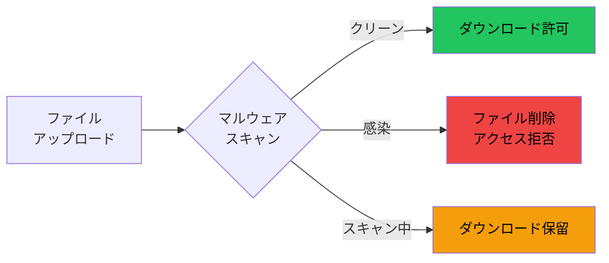
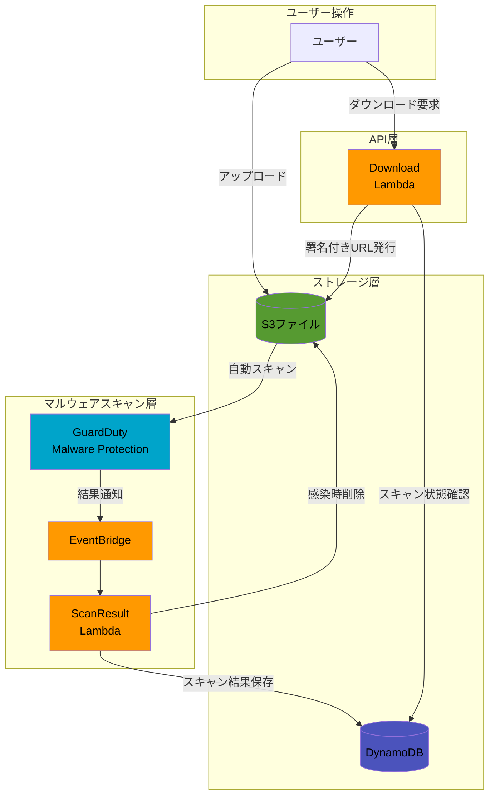
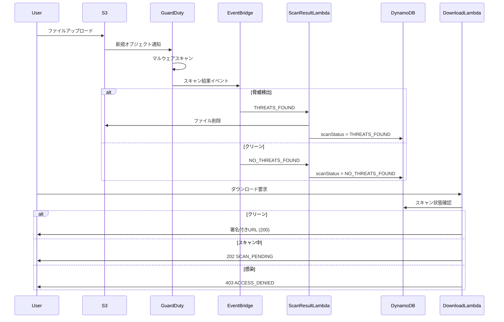

## 機能概要

### 課題

ファイル共有サービスでは、ユーザーがアップロードしたファイルにマルウェアが含まれるリスクがあります。感染ファイルが他のユーザーにダウンロードされると、被害が拡大する恐れがあります。

### 解決

Amazon GuardDuty Malware Protection for S3 を活用し、アップロードされたファイルを自動スキャンします。スキャン結果に応じてファイルへのアクセスを制御することで、安全なファイル共有を実現します。



### 主な機能

| 機能             | 説明                                                 |
| ---------------- | ---------------------------------------------------- |
| 自動スキャン     | S3へのアップロード時に自動でマルウェアスキャンを実行 |
| 感染ファイル削除 | マルウェア検出時は即座にS3から削除し、アクセスを拒否 |
| スキャン中の保護 | スキャン完了までダウンロードを保留（202レスポンス）  |
| 状態管理         | DynamoDBでスキャン状態を管理し、ダウンロード時に参照 |

## アーキテクチャ



## スキャン結果とアプリケーション動作

| scanResultStatus   | アプリケーション動作       | HTTPステータス        |
| ------------------ | -------------------------- | --------------------- |
| `NO_THREATS_FOUND` | ダウンロード許可           | 200                   |
| `THREATS_FOUND`    | ファイル削除・アクセス拒否 | 403 (`ACCESS_DENIED`) |
| `PENDING`          | ダウンロード保留           | 202 (`SCAN_PENDING`)  |
| `UNSUPPORTED`      | ダウンロード許可           | 200                   |

## データフロー



## EventBridgeルールの例

```json
{
  "source": ["aws.guardduty"],
  "detail-type": ["GuardDuty Malware Protection Object Scan Result"],
  "detail": {
    "s3ObjectDetails": { "bucketName": ["<バケット名>"] }
  }
}
```

**参考：**

### Amazon GuardDuty導入済みファイル共有アプリ

https://github.com/hanacus87/file-sharing

- [GuardDuty Malware Protection for S3](https://docs.aws.amazon.com/guardduty/latest/ug/gdu-malware-protection-s3.html)
- [Monitoring S3 object scans with Amazon EventBridge](https://docs.aws.amazon.com/guardduty/latest/ug/monitor-with-eventbridge-s3-malware-protection.html)
- [Using Amazon GuardDuty Malware Protection to scan uploads to Amazon S3 | AWS Security Blog](https://aws.amazon.com/blogs/security/using-amazon-guardduty-malware-protection-to-scan-uploads-to-amazon-s3/)
