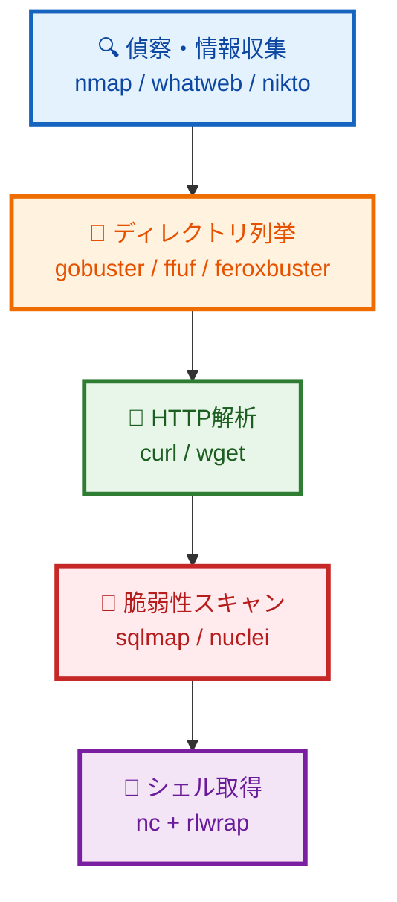

本記事は、HackTheBoxのLinuxマシンを攻略する際に使用する基礎コマンドをまとめたチートシートです。主に80番ポート(html)が空いていた場合によく使用するコマンド集です。

## 攻略フロー図



## 1. 偵察・情報収集

### nmap

ネットワーク探索およびセキュリティ監査のためのオープンソースツール。ポートスキャン、サービス検出、OS検出、スクリプトスキャンなど多機能。

**公式ドキュメント**: [https://nmap.org/book/man.html](https://nmap.org/book/man.html)

#### 主要オプション

| オプション           | 説明                                                         |
| -------------------- | ------------------------------------------------------------ |
| `-sS`                | TCP SYNスキャン（ステルススキャン、root権限時のデフォルト）  |
| `-sT`                | TCP Connectスキャン                                          |
| `-sV`                | サービス/バージョン検出                                      |
| `-sC`                | デフォルトスクリプトスキャン（`--script=default`と同等）     |
| `-O`                 | OS検出                                                       |
| `-A`                 | アグレッシブスキャン（-O -sV -sC --traceroute を有効化）     |
| `-p <port>`          | スキャンするポートを指定（例: `-p 80,443` `-p-` で全ポート） |
| `-Pn`                | ホスト発見をスキップ（pingなしでスキャン）                   |
| `-n`                 | DNS解決を行わない                                            |
| `-T<0-5>`            | タイミングテンプレート（高いほど高速、T4推奨）               |
| `-oN <file>`         | 通常形式で出力                                               |
| `-oX <file>`         | XML形式で出力                                                |
| `-oA <basename>`     | 全形式（通常、XML、grepable）で出力                          |
| `-v / -vv`           | 詳細表示（vvでより詳細）                                     |
| `--script=<scripts>` | NSEスクリプトを指定                                          |
| `--open`             | オープンポートのみ表示                                       |

#### 実践例

```bash
# 基本スキャン（SYNスキャン + サービス検出）
nmap -sS -sV -p 80,443 10.10.10.x

# アグレッシブスキャン（OS検出 + デフォルトスクリプト + バージョン検出）
nmap -A -T4 10.10.10.x

# 全ポートスキャン
nmap -p- -T4 10.10.10.x

# HTTPスクリプトスキャン
nmap -sV --script=http-enum,http-headers,http-methods -p 80 10.10.10.x

# 結果をファイル出力
nmap -sC -sV -oA scan_result 10.10.10.x
```

### whatweb

Webアプリケーションのフィンガープリンティングツール。CMS、ブログプラットフォーム、JavaScript ライブラリ、Webサーバーなどを識別。

**公式ドキュメント**: [https://github.com/urbanadventurer/WhatWeb](https://github.com/urbanadventurer/WhatWeb)

#### 主要オプション

| オプション             | 説明                                                                |
| ---------------------- | ------------------------------------------------------------------- |
| `-a <level>`           | アグレッションレベル（1: ステルス、3: アグレッシブ、デフォルト: 1） |
| `-v`                   | 詳細表示                                                            |
| `-i <file>`            | ターゲットをファイルから読み込み                                    |
| `-l`                   | 利用可能なプラグイン一覧                                            |
| `--color=never`        | カラー出力無効                                                      |
| `--log-verbose=<file>` | 詳細ログをファイル出力                                              |
| `-U <agent>`           | User-Agentを指定                                                    |
| `--proxy <host:port>`  | プロキシを使用                                                      |

#### 実践例

```bash
# 基本スキャン
whatweb http://10.10.10.x

# 詳細表示
whatweb -v http://10.10.10.x

# アグレッシブモード
whatweb -a 3 http://10.10.10.x
```

### nikto

Webサーバーの脆弱性スキャナー。7,000以上の潜在的に危険なファイルやプログラム、サーバー設定の問題、古いバージョンのソフトウェアを検出。

**公式ドキュメント**: [https://github.com/sullo/nikto/wiki](https://github.com/sullo/nikto/wiki)

#### 主要オプション

| オプション               | 説明                                 |
| ------------------------ | ------------------------------------ |
| `-h <host>`              | ターゲットホスト（必須）             |
| `-p <port>`              | ポート番号（デフォルト: 80）         |
| `-ssl`                   | SSL/TLSを強制                        |
| `-id <user:pass>`        | HTTP認証                             |
| `-root <dir>`            | スキャンのルートディレクトリを指定   |
| `-Tuning <x>`            | スキャンチューニング（下表参照）     |
| `-o <file>`              | 出力ファイル                         |
| `-Format <fmt>`          | 出力形式（csv, htm, txt, xml, json） |
| `-useproxy`              | プロキシを使用                       |
| `-timeout <sec>`         | タイムアウト秒数（デフォルト: 10）   |
| `-Cgidirs <all/none/値>` | CGIディレクトリ指定                  |
| `-evasion <technique>`   | IDS回避技術                          |

#### Tuningオプション値

| 値  | 説明                                |
| --- | ----------------------------------- |
| 1   | ログファイル関連                    |
| 2   | 設定ミス / デフォルトファイル       |
| 3   | 情報漏洩                            |
| 4   | インジェクション（XSS/Script/HTML） |
| 5   | リモートファイル取得                |
| 6   | DoS                                 |
| 7   | リモートファイル取得 - サーバー全体 |
| 8   | コマンド実行 / リモートシェル       |
| 9   | SQLインジェクション                 |
| 0   | ファイルアップロード                |
| a   | 認証バイパス                        |
| b   | ソフトウェア識別                    |
| c   | リモートソースインクルージョン      |
| x   | 指定以外を実行（逆チューニング）    |

#### 実践例

```bash
# 基本スキャン
nikto -h http://10.10.10.x

# ポート指定
nikto -h 10.10.10.x -p 8080

# 出力をファイルに保存
nikto -h http://10.10.10.x -o nikto_result.txt -Format txt

# 特定のチューニングでスキャン（情報漏洩 + インジェクション）
nikto -h http://10.10.10.x -Tuning 34
```

## 2. ディレクトリ・ファイル列挙

### gobuster

Go言語製の高速ディレクトリ/ファイル/DNS/vhostブルートフォースツール。

**公式ドキュメント**: [https://github.com/OJ/gobuster](https://github.com/OJ/gobuster)

#### モード一覧

| モード  | 説明                      |
| ------- | ------------------------- |
| `dir`   | ディレクトリ/ファイル列挙 |
| `dns`   | DNSサブドメイン列挙       |
| `vhost` | バーチャルホスト列挙      |
| `fuzz`  | カスタムファジング        |
| `s3`    | S3バケット列挙            |
| `gcs`   | Google Cloud Storage列挙  |
| `tftp`  | TFTPファイル列挙          |

#### dirモード主要オプション

| オプション               | 説明                                        |
| ------------------------ | ------------------------------------------- |
| `-u <url>`               | ターゲットURL                               |
| `-w <wordlist>`          | ワードリスト                                |
| `-x <ext>`               | 拡張子を指定（例: `-x php,html,txt`）       |
| `-t <threads>`           | スレッド数（デフォルト: 10）                |
| `-o <file>`              | 出力ファイル                                |
| `-s <codes>`             | 表示するステータスコード（許可リスト）      |
| `-b <codes>`             | 除外するステータスコード（デフォルト: 404） |
| `-r`                     | リダイレクトをフォロー                      |
| `-k`                     | SSL証明書エラーを無視                       |
| `-c <cookies>`           | Cookie設定                                  |
| `-H <header>`            | カスタムヘッダー                            |
| `-a <agent>`             | User-Agent                                  |
| `-f`                     | リクエストに `/` を追加                     |
| `-l`                     | レスポンスサイズを表示                      |
| `-n`                     | ステータスコード非表示                      |
| `-e`                     | 完全なURLを表示                             |
| `--exclude-length <len>` | 指定サイズのレスポンスを除外                |

#### vhostモード主要オプション

| オプション        | 説明                               |
| ----------------- | ---------------------------------- |
| `-u <url>`        | ターゲットURL                      |
| `-w <wordlist>`   | ワードリスト                       |
| `--append-domain` | ワードリストの項目にドメインを追加 |
| `-t <threads>`    | スレッド数                         |

#### 実践例

```bash
# 基本ディレクトリスキャン（拡張子指定）
gobuster dir -u http://10.10.10.x -w /usr/share/wordlists/dirb/common.txt -x env,bak,conf,txt,old,php

# スレッド数増加 + 出力
gobuster dir -u http://10.10.10.x -w /usr/share/wordlists/dirbuster/directory-list-2.3-medium.txt -t 50 -o gobuster.txt -x env,bak,conf,txt,old,php

# vhost列挙
gobuster vhost -u http://10.10.10.x -w /usr/share/seclists/Discovery/DNS/subdomains-top1million-5000.txt --append-domain

# DNS列挙
gobuster dns -d example.com -w /usr/share/seclists/Discovery/DNS/subdomains-top1million-5000.txt
```

### ffuf

Go言語製の高速Webファジングツール。ディレクトリ、パラメータ、ヘッダーなど柔軟なファジングが可能。

**公式ドキュメント**: [https://github.com/ffuf/ffuf](https://github.com/ffuf/ffuf)

#### 主要オプション（HTTP）

| オプション             | 説明                                                 |
| ---------------------- | ---------------------------------------------------- |
| `-u <url>`             | ターゲットURL（`FUZZ`をファジングポイントに指定）    |
| `-w <wordlist>`        | ワードリスト（`:KEYWORD`でカスタムキーワード指定可） |
| `-X <method>`          | HTTPメソッド                                         |
| `-H <header>`          | カスタムヘッダー                                     |
| `-b <cookies>`         | Cookie                                               |
| `-d <data>`            | POSTデータ                                           |
| `-r`                   | リダイレクトをフォロー                               |
| `-recursion`           | 再帰的スキャン                                       |
| `-recursion-depth <n>` | 再帰の深さ                                           |
| `-e <extensions>`      | 拡張子を追加                                         |
| `-t <threads>`         | スレッド数（デフォルト: 40）                         |
| `-timeout <sec>`       | タイムアウト（デフォルト: 10）                       |
| `-x <proxy>`           | プロキシ                                             |

#### マッチャー・フィルターオプション

| オプション    | 説明                                      |
| ------------- | ----------------------------------------- |
| `-mc <codes>` | マッチするステータスコード（`all`で全て） |
| `-ml <lines>` | マッチする行数                            |
| `-mr <regex>` | マッチする正規表現                        |
| `-ms <size>`  | マッチするレスポンスサイズ                |
| `-mw <words>` | マッチするワード数                        |
| `-fc <codes>` | フィルターするステータスコード            |
| `-fl <lines>` | フィルターする行数                        |
| `-fr <regex>` | フィルターする正規表現                    |
| `-fs <size>`  | フィルターするレスポンスサイズ            |
| `-fw <words>` | フィルターするワード数                    |

#### 出力オプション

| オプション     | 説明                                              |
| -------------- | ------------------------------------------------- |
| `-o <file>`    | 出力ファイル                                      |
| `-of <format>` | 出力形式（json, ejson, html, md, csv, ecsv, all） |
| `-c`           | カラー出力                                        |
| `-v`           | 詳細表示                                          |
| `-s`           | サイレントモード                                  |

#### 実践例

```bash
# ディレクトリファジング
ffuf -w /usr/share/wordlists/dirb/common.txt -u http://10.10.10.x/FUZZ

# 拡張子指定 + フィルター
ffuf -w /usr/share/wordlists/dirb/common.txt -u http://10.10.10.x/FUZZ -e .php,.html,.txt -fc 404

# レスポンスサイズでフィルター
ffuf -w wordlist.txt -u http://10.10.10.x/FUZZ -mc all -fs 4242

# vhost列挙
ffuf -w /usr/share/seclists/Discovery/DNS/subdomains-top1million-5000.txt -u http://10.10.10.x -H "Host: FUZZ.10.10.10.x" -mc 200

# パラメータファジング
ffuf -w /usr/share/seclists/Discovery/Web-Content/burp-parameter-names.txt -u "http://10.10.10.x/page.php?FUZZ=test" -fs 4242

# POSTデータファジング
ffuf -w wordlist.txt -u http://10.10.10.x/login -X POST -H "Content-Type: application/x-www-form-urlencoded" -d "username=admin&password=FUZZ" -fc 401
```

### feroxbuster

Rust製の高速で再帰的なディレクトリ/ファイル列挙ツール。自動再帰スキャンが特徴。

**公式ドキュメント**: [https://github.com/epi052/feroxbuster](https://github.com/epi052/feroxbuster)

#### 主要オプション

| オプション              | 説明                                   |
| ----------------------- | -------------------------------------- |
| `-u <url>`              | ターゲットURL                          |
| `-w <wordlist>`         | ワードリスト                           |
| `-x <extensions>`       | 拡張子（カンマ区切り）                 |
| `-t <threads>`          | スレッド数（デフォルト: 50）           |
| `-d <depth>`            | 再帰の深さ（デフォルト: 4）            |
| `-n`                    | 再帰スキャン無効                       |
| `-o <file>`             | 出力ファイル                           |
| `--output-format <fmt>` | 出力形式（json, csv）                  |
| `-s <codes>`            | 表示するステータスコード（許可リスト） |
| `-C <codes>`            | 除外するステータスコード（拒否リスト） |
| `-S <size>`             | 除外するレスポンスサイズ               |
| `-k`                    | SSL証明書エラーを無視                  |
| `-r`                    | リダイレクトをフォロー                 |
| `-H <header>`           | カスタムヘッダー                       |
| `-b <cookies>`          | Cookie                                 |
| `-a <agent>`            | User-Agent                             |
| `-A`                    | ランダムUser-Agent                     |
| `--burp`                | Burp Suite連携                         |
| `--proxy <url>`         | プロキシ                               |

#### 実践例

```bash
# 基本スキャン（再帰的）
feroxbuster -u http://10.10.10.x -w /usr/share/wordlists/dirb/common.txt

# 拡張子指定 + 深さ制限
feroxbuster -u http://10.10.10.x -w /usr/share/wordlists/dirbuster/directory-list-2.3-medium.txt -x php,html,txt -d 2

# 特定ステータスコードを除外
feroxbuster -u http://10.10.10.x -w wordlist.txt -C 404,403

# 出力をファイルに保存
feroxbuster -u http://10.10.10.x -w wordlist.txt -o ferox.txt
```

### dirb

クラシックなWebコンテンツスキャナー。シンプルで使いやすい。

**公式ドキュメント**: [https://dirb.sourceforge.net/](https://dirb.sourceforge.net/)

#### 主要オプション

| オプション        | 説明                                             |
| ----------------- | ------------------------------------------------ |
| `-a <agent>`      | User-Agent                                       |
| `-c <cookie>`     | Cookie                                           |
| `-H <header>`     | カスタムヘッダー                                 |
| `-i`              | 大文字小文字を区別しない                         |
| `-o <file>`       | 出力ファイル                                     |
| `-p <proxy>`      | プロキシ                                         |
| `-r`              | 再帰スキャン無効                                 |
| `-S`              | サイレントモード（テスト中のワードを表示しない） |
| `-t`              | URLの末尾に `/` を強制しない                     |
| `-u <user:pass>`  | HTTP認証                                         |
| `-w`              | 警告メッセージで停止しない                       |
| `-z <ms>`         | リクエスト間の待機時間（ミリ秒）                 |
| `-x <extensions>` | 拡張子ファイル                                   |
| `-X <extensions>` | 拡張子（直接指定）                               |

#### 実践例

```bash
# 基本スキャン
dirb http://10.10.10.x

# ワードリスト指定
dirb http://10.10.10.x /usr/share/wordlists/dirb/big.txt

# 拡張子指定
dirb http://10.10.10.x -X .php,.html,.txt

# 出力ファイル指定
dirb http://10.10.10.x -o dirb_result.txt
```

## 3. HTTPリクエスト・解析

### curl

URLを使ってデータを転送するコマンドラインツール。HTTP/HTTPS、FTPなど多くのプロトコルに対応。

**公式ドキュメント**: [https://curl.se/docs/manpage.html](https://curl.se/docs/manpage.html)

#### 主要オプション

| オプション                | 説明                               |
| ------------------------- | ---------------------------------- |
| `-X <method>`             | HTTPメソッド指定                   |
| `-H <header>`             | ヘッダー追加                       |
| `-d <data>`               | POSTデータ                         |
| `-b <cookies>`            | Cookie送信                         |
| `-c <file>`               | Cookie保存                         |
| `-u <user:pass>`          | HTTP認証                           |
| `-A <agent>`              | User-Agent                         |
| `-e <referer>`            | Referer                            |
| `-L`                      | リダイレクトをフォロー             |
| `-k`                      | SSL証明書エラーを無視              |
| `-o <file>`               | 出力をファイルに保存               |
| `-O`                      | リモートファイル名で保存           |
| `-I`                      | HEADリクエスト（ヘッダーのみ取得） |
| `-i`                      | レスポンスヘッダーも表示           |
| `-v`                      | 詳細表示                           |
| `-s`                      | サイレントモード                   |
| `-x <proxy>`              | プロキシ                           |
| `--data-urlencode <data>` | URLエンコードしてPOST              |
| `-F <data>`               | multipart/form-dataでPOST          |
| `--compressed`            | 圧縮レスポンスを展開               |

#### 実践例

```bash
# GETリクエスト
curl http://10.10.10.x

# ヘッダー確認
curl -I http://10.10.10.x

# レスポンスヘッダー + ボディ
curl -i http://10.10.10.x

# POSTリクエスト
curl -X POST -d "username=admin&password=admin" http://10.10.10.x/login

# JSONデータをPOST
curl -X POST -H "Content-Type: application/json" -d '{"user":"admin","pass":"admin"}' http://10.10.10.x/api/login

# Cookie付きリクエスト
curl -b "session=abc123" http://10.10.10.x/dashboard

# リダイレクトをフォロー
curl -L http://10.10.10.x

# ファイルダウンロード
curl -O http://10.10.10.x/file.txt

# 詳細表示（デバッグ）
curl -v http://10.10.10.x
```

### wget

ファイルダウンロードおよびWebサイトミラーリングツール。

**公式ドキュメント**: [https://www.gnu.org/software/wget/manual/](https://www.gnu.org/software/wget/manual/)

#### 主要オプション

| オプション               | 説明                                             |
| ------------------------ | ------------------------------------------------ |
| `-O <file>`              | 出力ファイル名指定                               |
| `-P <dir>`               | ダウンロード先ディレクトリ                       |
| `-c`                     | ダウンロード再開                                 |
| `-r`                     | 再帰的ダウンロード                               |
| `-l <depth>`             | 再帰の深さ                                       |
| `-np`                    | 親ディレクトリに移動しない                       |
| `-k`                     | リンクをローカル用に変換                         |
| `-m`                     | ミラーリング（-r -N -l inf --no-remove-listing） |
| `-q`                     | サイレントモード                                 |
| `-v`                     | 詳細表示                                         |
| `--no-check-certificate` | SSL証明書を検証しない                            |
| `--user=<user>`          | HTTPユーザー名                                   |
| `--password=<pass>`      | HTTPパスワード                                   |
| `--header=<header>`      | カスタムヘッダー                                 |
| `-U <agent>`             | User-Agent                                       |
| `-e robots=off`          | robots.txtを無視                                 |

#### 実践例

```bash
# ファイルダウンロード
wget http://10.10.10.x/file.txt

# 出力ファイル名指定
wget -O output.txt http://10.10.10.x/file.txt

# サイトミラーリング
wget -m -np -k http://10.10.10.x/

# SSL証明書無視
wget --no-check-certificate https://10.10.10.x/file.txt
```

## 4. 脆弱性スキャン・エクスプロイト

### sqlmap

SQLインジェクション脆弱性の自動検出・エクスプロイトツール。データベースの乗っ取りまで自動化。

**公式ドキュメント**: [https://github.com/sqlmapproject/sqlmap/wiki/Usage](https://github.com/sqlmapproject/sqlmap/wiki/Usage)

#### ターゲット指定オプション

| オプション            | 説明                               |
| --------------------- | ---------------------------------- |
| `-u <url>`            | ターゲットURL（パラメータ付き）    |
| `-r <file>`           | リクエストファイル（Burpから保存） |
| `-g <dork>`           | Google dorkで検索                  |
| `--data=<data>`       | POSTデータ                         |
| `-p <param>`          | テストするパラメータ指定           |
| `--cookie=<cookie>`   | Cookie                             |
| `--headers=<headers>` | カスタムヘッダー                   |

#### 検出オプション

| オプション           | 説明                                                                 |
| -------------------- | -------------------------------------------------------------------- |
| `--level=<1-5>`      | テストレベル（デフォルト: 1、高いほど多くのテスト）                  |
| `--risk=<1-3>`       | リスクレベル（デフォルト: 1、高いほど危険なテスト含む）              |
| `--technique=<tech>` | SQLi技術（B:Boolean, E:Error, U:Union, S:Stacked, T:Time, Q:Inline） |
| `--dbms=<dbms>`      | DBMSを指定（mysql, postgresql, mssql, oracle等）                     |

#### 列挙オプション

| オプション       | 説明                     |
| ---------------- | ------------------------ |
| `--dbs`          | データベース一覧         |
| `-D <db>`        | データベース指定         |
| `--tables`       | テーブル一覧             |
| `-T <table>`     | テーブル指定             |
| `--columns`      | カラム一覧               |
| `-C <columns>`   | カラム指定               |
| `--dump`         | データをダンプ           |
| `--dump-all`     | 全データをダンプ         |
| `--passwords`    | パスワードハッシュを取得 |
| `--current-user` | 現在のDBユーザー         |
| `--current-db`   | 現在のデータベース       |
| `--is-dba`       | DBA権限チェック          |

#### その他オプション

| オプション          | 説明                           |
| ------------------- | ------------------------------ |
| `--batch`           | 自動応答（デフォルト値を使用） |
| `--threads=<n>`     | スレッド数                     |
| `--proxy=<proxy>`   | プロキシ                       |
| `--tor`             | Tor経由                        |
| `--os-shell`        | OSシェル取得                   |
| `--sql-shell`       | SQLシェル取得                  |
| `-v <0-6>`          | 詳細レベル                     |
| `--tamper=<script>` | 改ざんスクリプト（WAF回避）    |
| `--random-agent`    | ランダムUser-Agent             |

#### 実践例

```bash
# 基本スキャン
sqlmap -u "http://10.10.10.x/page.php?id=1"

# POSTリクエスト
sqlmap -u "http://10.10.10.x/login.php" --data="user=admin&pass=admin"

# Burpリクエストファイル使用
sqlmap -r request.txt

# データベース列挙
sqlmap -u "http://10.10.10.x/page.php?id=1" --dbs

# テーブル列挙
sqlmap -u "http://10.10.10.x/page.php?id=1" -D database_name --tables

# データダンプ
sqlmap -u "http://10.10.10.x/page.php?id=1" -D database_name -T users --dump

# 自動応答 + 高レベルテスト
sqlmap -u "http://10.10.10.x/page.php?id=1" --batch --level=5 --risk=3

# OSシェル取得
sqlmap -u "http://10.10.10.x/page.php?id=1" --os-shell
```

### nuclei

テンプレートベースの高速脆弱性スキャナー。コミュニティ提供の多数のテンプレートで様々な脆弱性を検出。

**公式ドキュメント**: [https://github.com/projectdiscovery/nuclei](https://github.com/projectdiscovery/nuclei)

#### 主要オプション

| オプション          | 説明                                                  |
| ------------------- | ----------------------------------------------------- |
| `-u <url>`          | 単一ターゲット                                        |
| `-l <file>`         | ターゲットリスト                                      |
| `-t <template>`     | テンプレート指定                                      |
| `-tags <tags>`      | タグでフィルター                                      |
| `-severity <level>` | 重要度フィルター（info, low, medium, high, critical） |
| `-o <file>`         | 出力ファイル                                          |
| `-c <n>`            | 並列処理数                                            |
| `-rl <n>`           | レート制限（リクエスト/秒）                           |
| `-H <header>`       | カスタムヘッダー                                      |
| `-proxy <url>`      | プロキシ                                              |
| `-update-templates` | テンプレート更新                                      |
| `-silent`           | サイレントモード                                      |
| `-v`                | 詳細表示                                              |

#### 実践例

```bash
# 基本スキャン
nuclei -u http://10.10.10.x

# テンプレート更新
nuclei -update-templates

# 特定タグでスキャン
nuclei -u http://10.10.10.x -tags cve,exposure

# 高重要度のみ
nuclei -u http://10.10.10.x -severity high,critical

# 出力ファイル指定
nuclei -u http://10.10.10.x -o nuclei_result.txt
```

## 5. シェル取得・リスナー

### nc (netcat)

リバースシェルの受信、ポートリスニング、データ転送に使用。

**公式ドキュメント**: [https://linux.die.net/man/1/nc](https://linux.die.net/man/1/nc)

#### 主要オプション

| オプション  | 説明                              |
| ----------- | --------------------------------- |
| `-l`        | リッスンモード                    |
| `-v`        | 詳細表示                          |
| `-n`        | DNS解決を行わない                 |
| `-p <port>` | ポート指定                        |
| `-e <prog>` | 接続時にプログラム実行 ※注1       |
| `-c <cmd>`  | 接続時にコマンド実行 ※注1         |
| `-u`        | UDPモード                         |
| `-w <sec>`  | タイムアウト                      |
| `-z`        | ゼロI/Oモード（ポートスキャン用） |
| `-k`        | 接続後もリッスン継続              |

#### 実践例

```bash
# リバースシェルリスナー起動
nc -lvnp 4444

# 詳細表示付き
nc -lvnp 4444 -v

# ポートスキャン
nc -zv 10.10.10.x 1-1000

# ファイル転送（受信側）
nc -lvnp 4444 > received_file

# ファイル転送（送信側）
nc 10.10.10.x 4444 < file_to_send
```

> **※注1**: `-e` および `-c` オプションは、セキュリティ上の理由から多くのシステムで無効化されています。これらのオプションは `netcat-traditional` や `ncat`（Nmap付属）など特定の実装でのみ利用可能です。Kali Linuxでは `nc.traditional` コマンドで利用できる場合があります。

### rlwrap

readline wrapperで、上下キーでのコマンド履歴やCtrl+Cなどをサポート。ncの操作性を大幅に向上。

**公式ドキュメント**: [https://github.com/hanslub42/rlwrap](https://github.com/hanslub42/rlwrap)

#### 主要オプション

| オプション  | 説明               |
| ----------- | ------------------ |
| `-c`        | タブ補完有効       |
| `-f <file>` | 補完用ワードリスト |
| `-H <file>` | ヒストリーファイル |
| `-s <n>`    | ヒストリーサイズ   |
| `-r`        | 入力を記憶して補完 |

#### 実践例

```bash
# ncと組み合わせ（推奨）
rlwrap nc -lvnp 4444

# タブ補完有効
rlwrap -c nc -lvnp 4444
```

## よく使うワードリストパス（Kali Linux）

| 用途               | パス                                                                 |
| ------------------ | -------------------------------------------------------------------- |
| ディレクトリ（小） | `/usr/share/wordlists/dirb/common.txt`                               |
| ディレクトリ（中） | `/usr/share/wordlists/dirbuster/directory-list-2.3-medium.txt`       |
| ディレクトリ（大） | `/usr/share/wordlists/dirbuster/directory-list-2.3-big.txt`          |
| サブドメイン       | `/usr/share/seclists/Discovery/DNS/subdomains-top1million-5000.txt`  |
| パラメータ名       | `/usr/share/seclists/Discovery/Web-Content/burp-parameter-names.txt` |
| パスワード         | `/usr/share/wordlists/rockyou.txt`                                   |

## 出典

| ツール      | 公式ドキュメント                                                                                         |
| ----------- | -------------------------------------------------------------------------------------------------------- |
| nmap        | [https://nmap.org/book/man.html](https://nmap.org/book/man.html)                                         |
| whatweb     | [https://github.com/urbanadventurer/WhatWeb](https://github.com/urbanadventurer/WhatWeb)                 |
| nikto       | [https://github.com/sullo/nikto/wiki](https://github.com/sullo/nikto/wiki)                               |
| gobuster    | [https://github.com/OJ/gobuster](https://github.com/OJ/gobuster)                                         |
| ffuf        | [https://github.com/ffuf/ffuf](https://github.com/ffuf/ffuf)                                             |
| feroxbuster | [https://github.com/epi052/feroxbuster](https://github.com/epi052/feroxbuster)                           |
| dirb        | [https://dirb.sourceforge.net/](https://dirb.sourceforge.net/)                                           |
| curl        | [https://curl.se/docs/manpage.html](https://curl.se/docs/manpage.html)                                   |
| wget        | [https://www.gnu.org/software/wget/manual/](https://www.gnu.org/software/wget/manual/)                   |
| sqlmap      | [https://github.com/sqlmapproject/sqlmap/wiki/Usage](https://github.com/sqlmapproject/sqlmap/wiki/Usage) |
| nuclei      | [https://github.com/projectdiscovery/nuclei](https://github.com/projectdiscovery/nuclei)                 |
| nc (netcat) | [https://linux.die.net/man/1/nc](https://linux.die.net/man/1/nc)                                         |
| rlwrap      | [https://github.com/hanslub42/rlwrap](https://github.com/hanslub42/rlwrap)                               |
