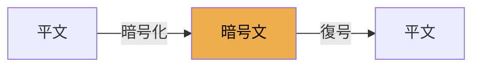
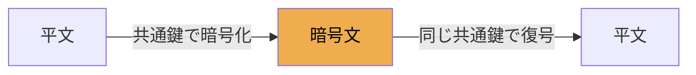
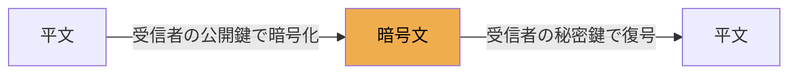
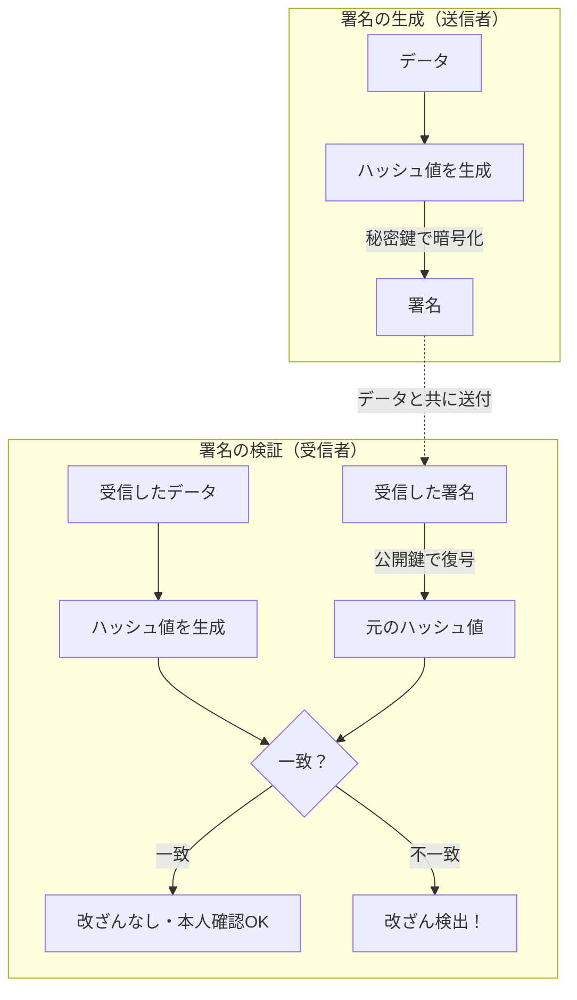
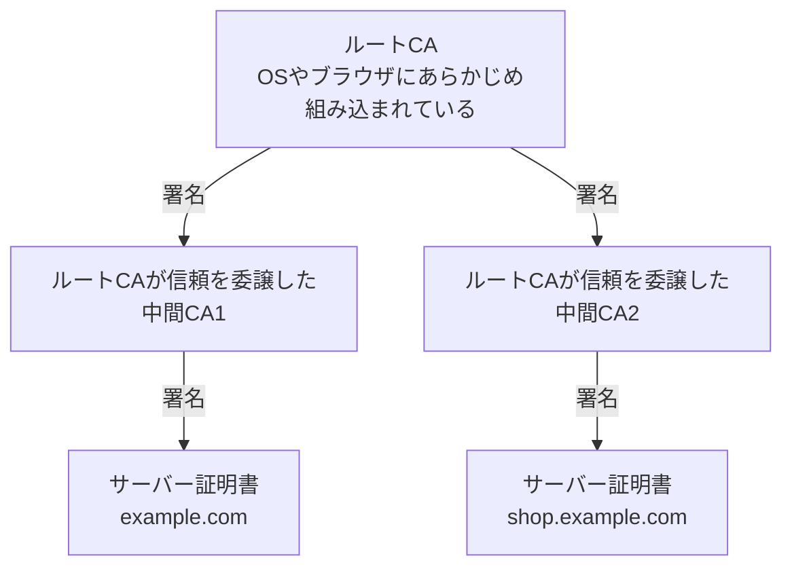
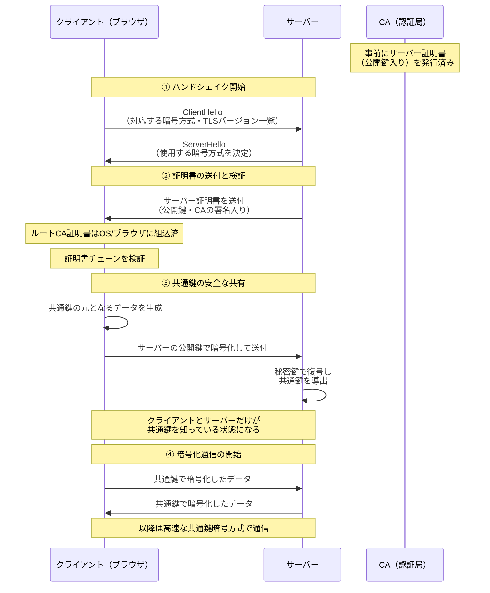
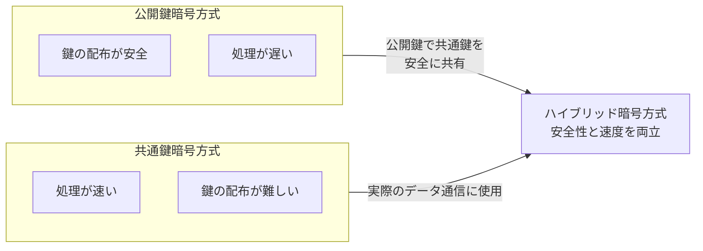
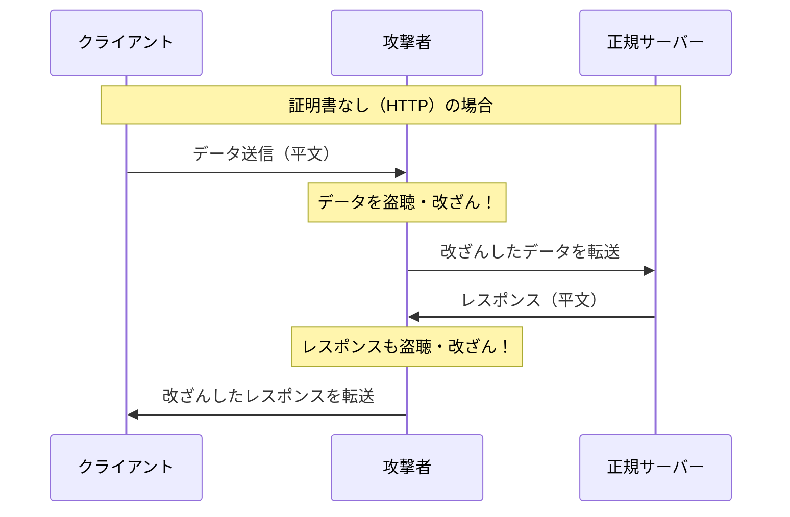
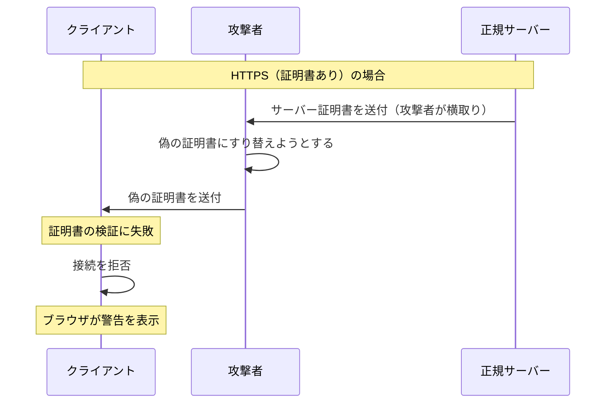
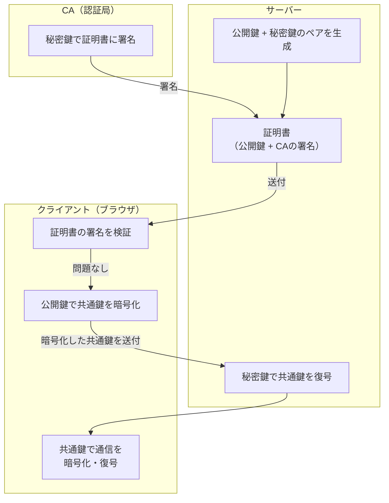

この記事では、HTTPSを支える暗号化の仕組みを「暗号化」「復号」「共通鍵」「公開鍵」「秘密鍵」「証明書」「署名」「CA」という8つのキーワードを軸に、図解を交えながら解説します。

## 記事概要

| キーワード | 概要                                           |
| ---------- | ---------------------------------------------- |
| **暗号化** | データを第三者に読めない形に変換すること       |
| **復号**   | 暗号化されたデータを元に戻すこと               |
| **共通鍵** | 暗号化と復号に同じ鍵を使う方式の鍵             |
| **公開鍵** | 誰にでも公開される鍵。暗号化に使う             |
| **秘密鍵** | 自分だけが持つ鍵。復号や署名に使う             |
| **証明書** | 公開鍵が本物であることを証明する電子文書       |
| **署名**   | データが改ざんされていないことを証明する仕組み |
| **CA**     | 証明書を発行する信頼された第三者機関           |

## 1. 暗号化と復号

**暗号化（Encryption）** とは、データを「鍵」を使って第三者には意味をなさない形に変換することです。逆に、暗号化されたデータを元に戻す操作を **復号（Decryption）** と呼びます。

## 2. 鍵の種類

暗号化には「鍵」が必要です。HTTPSでは **2種類の暗号方式** が組み合わされて使われています。

### 2-1. 共通鍵暗号方式

**共通鍵（対称鍵）暗号方式** は、暗号化と復号に **同じ1つの鍵** を使う方式です。

**代表的なアルゴリズム**：AES（Advanced Encryption Standard）など

### 2-2. 公開鍵暗号方式

**公開鍵暗号方式（非対称鍵暗号方式）** は、**異なる2つの鍵のペア（公開鍵・秘密鍵）** を使う方式です。公開鍵で暗号化したデータは、ペアになる秘密鍵でしか復号できません。

**代表的なアルゴリズム**：RSA、楕円曲線暗号（ECC）など

#### 公開鍵と秘密鍵の役割

| 鍵の種類                  | 公開範囲       | できること                 |
| ------------------------- | -------------- | -------------------------- |
| **公開鍵（Public Key）**  | 誰でも取得可能 | データの暗号化・署名の検証 |
| **秘密鍵（Private Key）** | 本人のみ保持   | データの復号・署名の生成   |

**重要な性質**：公開鍵で暗号化したデータは、ペアの秘密鍵でしか復号できません。逆も同様に、秘密鍵で署名したデータは公開鍵で検証できます。

### 2-3. 2つの方式を比較する

| 項目         | 共通鍵暗号方式               | 公開鍵暗号方式                 |
| ------------ | ---------------------------- | ------------------------------ |
| **使う鍵**   | 同一の鍵（1種類）            | 公開鍵＋秘密鍵（2種類）        |
| **処理速度** | 高速                         | 低速（数十〜百倍遅い）         |
| **鍵の配布** | 難しい（安全に共有できない） | 容易（公開鍵は誰に渡してもOK） |
| **主な用途** | 大量データの暗号化通信       | 鍵交換・電子署名               |
| **代表例**   | AES-128、AES-256             | RSA-2048、ECDSA                |

:::message alert
**共通鍵の配布問題**
共通鍵方式の弱点は「最初の鍵の共有」です。鍵を安全に渡す手段がなければ、そもそも暗号通信を始めることができません。この問題を解決するのが公開鍵暗号方式です。
:::

## 3. 署名と証明書

暗号化だけでは「通信相手が本物かどうか」を確認できません。そこで登場するのが **デジタル署名** と **証明書** です。

### 3-1. デジタル署名

**デジタル署名（Digital Signature）** とは、データが改ざんされていないこと・送信者が本人であることを証明する仕組みです。署名は「秘密鍵を持つ本人しか生成できない」ため、受信者は公開鍵で署名を検証することで、送信者が本人であることを確認できます。

### 3-2. 証明書（SSL/TLS証明書）

**証明書（Certificate）** とは、「この公開鍵は確かにこのサーバーのものです」ということを第三者が保証した電子文書です。

証明書には主に以下の情報が含まれます。

| 項目                     | 内容                         |
| ------------------------ | ---------------------------- |
| **サーバーのドメイン名** | `example.com` など           |
| **サーバーの公開鍵**     | 通信の暗号化に使われる公開鍵 |
| **発行者（CA）の情報**   | 証明書を発行した認証局の名前 |
| **有効期限**             | 証明書の有効期間             |
| **CAの電子署名**         | 証明書が本物であることの保証 |

:::message
**証明書がなぜ必要か？**
公開鍵は誰でも作れます。悪意ある第三者が「私がexample.comです」と偽の公開鍵を配布しても、技術的には防げません。証明書は信頼された第三者（CA）がその公開鍵の正当性を「署名」することで、なりすましを防ぎます。
:::

### 3-3. CA（認証局）

**CA（Certificate Authority / 認証局）** とは、デジタル証明書を発行・管理する信頼された第三者機関です。CAは証明書を発行する際に、申請者のドメインや組織の実在を審査し、自身の秘密鍵で証明書に署名します。

**CAの信頼階層（証明書チェーン）**

ブラウザは、受け取ったサーバー証明書からこのチェーンをたどって、最終的に信頼するルートCAに行き着けるかを検証します。行き着けなければ`接続は安全ではありません`と警告を表示します。

**認証レベルの種類**

| 認証レベル   | 略称 | 審査内容             | 主な用途                   |
| ------------ | ---- | -------------------- | -------------------------- |
| ドメイン認証 | DV   | ドメインの所有権のみ | 個人・ブログ・社内サーバー |
| 組織認証     | OV   | 組織の実在確認       | 一般企業サイト             |
| 拡張認証     | EV   | 厳格な法人審査       | 金融・ECサイトなど         |

## 4. HTTPS通信（TLSハンドシェイク）の全体像

これまでの知識から、実際のHTTPS通信がどのように確立されるかを見ていきます。この事前のやり取りを **TLSハンドシェイク** と呼びます。

:::message
**TLS 1.3 について**
現在の主流は TLS 1.3（2018年標準化）です。TLS 1.3 では鍵交換に **ECDHE（楕円曲線ディフィー・ヘルマン鍵交換）** を採用しており、クライアントが公開鍵で暗号化して送る旧来の方式とは異なります。しかし「公開鍵を使って安全に共通鍵を共有する」という本質的な考え方は同じです。本記事では概念理解を優先した説明としています。
:::

### 「公開鍵暗号」と「共通鍵暗号」を組み合わせる理由

| フェーズ           | 使用する暗号方式 | 目的                   |
| ------------------ | ---------------- | ---------------------- |
| **ハンドシェイク** | 公開鍵暗号方式   | 共通鍵を安全に共有する |
| **データ通信**     | 共通鍵暗号方式   | 高速に暗号化通信を行う |

### なぜ公開鍵暗号方式でデータ通信をしないのか

公開鍵は誰でも入手できるため、時間をかけることで理論上は秘密鍵を特定できる可能性があります。現在の鍵長（RSA-2048など）では現実的な時間内での解読は不可能ですが、公開鍵でのデータの直接の暗号化や、その暗号文を攻撃者に与え続けることはリスクを高める行為です。

## 5. セキュリティの脅威

代表的な攻撃手法から、HTTPSの重要性を理解しましょう。

### 5-1. 中間者攻撃（MITM: Man-In-The-Middle Attack）とは

通信経路の間に攻撃者が割り込み、双方が気づかないままにデータを盗聴・改ざんする攻撃です。

### 5-2. HTTPSが中間者攻撃を防ぐ仕組み

## 6. まとめ

HTTPS通信は、**「公開鍵暗号方式で共通鍵を安全に共有し、共通鍵暗号方式で高速に通信する」** というハイブリッド設計と、**「CAによる証明書チェーン」** という信頼の仕組みによって成り立っています。

**参考：**

- [RFC 8446 - The Transport Layer Security (TLS) Protocol Version 1.3（IETF / RFC Editor）](https://www.rfc-editor.org/rfc/rfc8446)
- [RFC 5280 - Internet X.509 Public Key Infrastructure Certificate（IETF）](https://www.rfc-editor.org/rfc/rfc5280)
