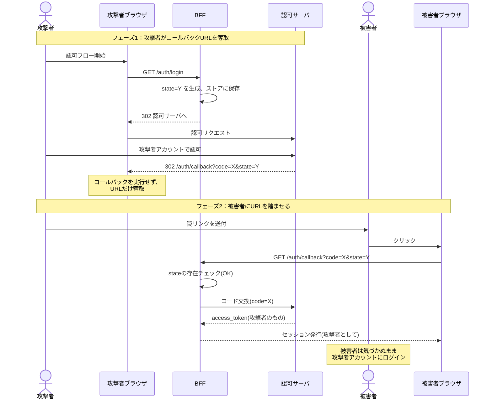

## はじめに

本記事は、OAuth 2.0 の Authorization Code フローを BFF (Backends for Frontends) パターンで実装する際に陥りがちな、`state` パラメータの実装ミスについて解説します。

具体的には、**`state` をサーバー側のストア(Redis など)に「キー」として保存し、コールバック時にそのキーの存在のみを検証する実装** が、被害者を攻撃者のアカウントにログインさせる攻撃(Login CSRF)を防げないことを示します。

### 想定読者

- OAuth 2.0 Authorization Code フローを実装したことがある方
- BFF パターンで OAuth クライアントを実装している/する予定の方
- `state` を「ランダム値を発行して保存しておけば良い」と理解している方

### TL;DR

- `state` の本質は「**このブラウザのために**サーバーが発行した値か」を検証することにある
- サーバーストアに `state` をキーとして保存するだけでは、「どのブラウザから始まったフローか」が紐づかず、CSRF を防げない
- `state` も(導入していれば) PKCE の `code_verifier` も、**ユーザーエージェントに紐づいた形で保存する** 必要がある
- 実装方式として、サーバーサイドセッションに保存する方式と、暗号化 Cookie に直接保存する方式が現実的

## 前提知識のおさらい

### Authorization Code フロー + BFF

BFF パターンでは、SPA からアクセストークンを隔離し、BFF がトークンを保持・利用します。ブラウザと BFF 間は通常のセッション Cookie で認証状態を維持します。


### state パラメータの役割(教科書的な説明)

RFCでは、`state` は「クライアントがリクエストとコールバックの間で状態を維持するために用いる不透明な値」と定義されており、CSRF防止のために使用すべきとされています。

そしてCSRF対策について次のように規定されています。

- クライアントはリダイレクションURIに対するCSRF対策を実装しなければならない
- 典型的な実装方法は、リダイレクションURIエンドポイントへ送られるあらゆるリクエストに「リクエストをユーザーエージェントの認証状態に紐づける値」(例として、認証に使われるセッションCookieのハッシュ) を含めることを要求すること
- この値を認可サーバへ届けるために `state` リクエストパラメータを利用すべき

ここで重要なのは「ユーザーエージェントの認証状態にリクエストを紐づける値」という表現です。単にランダム値を発行して照合するのではなく、**そのブラウザに紐づいた値** であることが要求されています。

## ありがちな実装：「state はサーバーで持っているから安全」という思い込み

以下のような実装を見かけることがあります。

**認可開始時:**

```ts
// /auth/login
const state = crypto.randomBytes(32).toString("hex");
await redis.set(`oauth:state:${state}`, "1", "EX", 600);
res.redirect(buildAuthorizeUrl({ state /* ... */ }));
```

**コールバック時:**

```ts
// /auth/callback
const { code, state } = req.query;
const exists = await redis.get(`oauth:state:${state}`);
if (!exists) {
  return res.status(400).send("invalid state");
}
await redis.del(`oauth:state:${state}`);
// コード交換へ進む...
```

一見問題なさそうに見えます。

- `state` は十分なエントロピーを持つランダム値
- サーバー側ストアに保存しているので外部から漏洩しない
- 使用後は削除しているので再利用もできない
- 通常のログインフローでは正常に動作する

しかし、この実装は **CSRF を防げません**。なぜか? それは、この `state` 検証が **「サーバーが発行した値か」しか確認しておらず、「リクエスト元ブラウザのために発行した値か」を確認していない** からです。

## 攻撃シナリオ：被害者を攻撃者のアカウントにログインさせる

### 攻撃の全体像



### ステップ解説

**フェーズ1: 攻撃者がコールバックURLを奪取**

1. 攻撃者は自分のブラウザで対象アプリの認可フローを開始する
2. BFF は `state=Y` を生成し、BFFストアに保存する
3. 攻撃者は認可サーバで自分のアカウントを使って認可する
4. 認可サーバは `redirect_uri?code=X&state=Y` へリダイレクトしようとする
5. 攻撃者はこのコールバック URL を **実行せずに奪取する** (ブラウザの開発者ツール、プロキシ、認可サーバの応答画面の URL バー観察などで取得可能)

**フェーズ2: 被害者にURLを踏ませる**

6. 攻撃者は奪取した URL を、メール・SNS・罠サイトの `` や `<iframe>` などで被害者に踏ませる
7. 被害者のブラウザが `GET /auth/callback?code=X&state=Y` を BFF に送信する
8. BFF はストアに `state=Y` が存在することを確認する → **検証通過**
9. BFF は `code=X` を認可サーバに送ってトークン交換する
10. 認可サーバは攻撃者アカウントのアクセストークンを返す
11. BFF は被害者ブラウザに対して、攻撃者のアイデンティティに紐づくセッション Cookie を発行する

### この攻撃が引き起こすこと

被害者は自分のアカウントだと信じてアプリを利用するため、

- 検索した内容、閲覧履歴が攻撃者アカウントに記録される
- アップロードしたファイル・写真が攻撃者アカウントに保存される
- 入力したメモ・メッセージが攻撃者の手に渡る
- 被害者が「このアカウントを使っていたつもり」だった行動が、すべて攻撃者の手元に残る

これは **Login CSRF** と呼ばれる類型の攻撃です。一般的な「攻撃者が被害者になりすます」CSRF とは逆方向の、**「被害者を攻撃者になりすまさせる」** 攻撃です。

## なぜ起きるのか：state の本質は「ブラウザ と サーバーの紐付け」

問題の核心は、`state` 検証が **「リクエスト元ブラウザの主体性」を確認していない** ことです。

| 検証している内容                     | この実装 | 本来必要な検証 |
| ------------------------------------ | -------- | -------------- |
| サーバーが発行した値か               | ○        | ○              |
| 未使用の値か                         | ○        | ○              |
| **このブラウザのために発行した値か** | **×**    | **○**          |

URL クエリの `state` をストアのキーにしてしまうと、「攻撃者ブラウザのために発行された `state`」を「被害者ブラウザ」が送ってきた場合に区別がつきません。**ストアにキーが存在することは、「どこかのブラウザのために発行された」ことしか証明しない** のです。

RFCが要求しているのは、「リクエストをユーザーエージェントの認証状態に紐づける値」であり、その例として「ユーザーエージェントの認証に使われるセッションCookieのハッシュ」が示されています。

つまり「Cookie などを介してブラウザに紐づいた値」であることが要求されています。Cookie は、Webアプリにおいて「特定ブラウザだけが送ってくる」ことが保証される標準的な手段であり、これを介さない限り「リクエスト元ブラウザの主体性」は確認できません。

## PKCE との関係：CSRF 対策の主役交代と、共通する実装上の罠

### PKCE の本来の目的は CSRF 対策ではない

PKCE (RFC 7636) は、もともと **認可コード横取り攻撃 (Authorization Code Interception Attack) への対策** として設計されました。RFC 7636では、認可コードがクライアントに紐づいていないことに起因する横取り攻撃への緩和策として、クライアントが動的に生成する高エントロピーの秘密値 `code_verifier` と、その変換値 `code_challenge` を用いる仕組みが導入されています。クライアントは認可リクエスト時に `code_challenge` を送信し、トークン交換時に `code_verifier` を送信することで、認可サーバはその一致を検証します。

PKCE は「認可リクエストを開始したクライアントだけが、対応する code をトークンに交換できる」ことを保証する仕組みです。CSRF の文脈で議論されるのとは別レイヤーの対策です。

### しかし RFC 9700 では CSRF 対策の主役が PKCE に

**RFC 9700 (OAuth 2.0 Security Best Current Practice)** では、リダイレクトベースのフローへの攻撃対策が整理されています。CSRF 防止の文脈において、認可コードグラントを利用するクライアントは PKCE を使用することが推奨されており、PKCE が技術的な理由で利用できない場合の代替手段として、`state` パラメータをユーザーエージェントに紐づけたCSRFトークンとして用いることが規定されています。

つまり現代的な位置付けは、

- CSRF 対策の **主役は PKCE**
- PKCE が使えない場合の **代替が `state`**
- どちらを使うにせよ「**ユーザーエージェントに紐づける**」ことが必須

となっています。

### 整理：state と code_verifier、それぞれの役割と責務

| 項目                                    | state                            | code_verifier (PKCE)                             |
| --------------------------------------- | -------------------------------- | ------------------------------------------------ |
| 規定 RFC                                | RFC 6749                         | RFC 7636                                         |
| 本来の目的                              | CSRF 対策                        | 認可コード横取り攻撃対策                         |
| RFC 9700 における CSRF 対策上の位置付け | フォールバック                   | 推奨                                             |
| 検証する場所                            | クライアント (RP) 側             | 認可サーバ側<br>(クライアントが verifier を送る) |
| 紐づけの要件                            | ユーザーエージェントに紐づけ必須 | ユーザーエージェントに紐づけ必須                 |

ここで強調したいのは、**PKCE は認可サーバ側で検証される仕組みだが、`code_verifier` をクライアント側で「どこに保存するか」はクライアントの責務** という点です。`state` がクライアント側責務なのと同様に、`code_verifier` の保管もクライアント側責務であり、**サーバーストアに `state` をキーとして保存する実装と同じ罠が成立します**。

### よくある誤解：「PKCE を入れたから安全」

PKCE を入れたから安全、とは言い切れません。問題は **`code_verifier` をどこに保存しているか** です。

`state` をキーとしてサーバーストアに `code_verifier` を保存している実装は、本記事でこれまで見てきた `state` の脆弱な実装と全く同じ構造の問題を抱えています。攻撃者が認可フローを開始したときの `state` と `code` を被害者に踏ませると、BFF は攻撃者の `state` をキーに攻撃者の `code_verifier` を引き当ててしまい、トークン交換が成功します。結果として被害者は攻撃者のアカウントにログインさせられます。

つまり **`state` か PKCE のどちらを採用するかではなく、いずれを採用するにせよ「ユーザーエージェントに紐づけて保存しているか」** が本質です。RFC 9700 が CSRF 対策として PKCE を推奨しているのは、PKCE を正しく実装することを前提にした話であり、保存方法を誤ればPKCEでの実装もstateでの実装と同じ脆弱性を持ちます。

結論として、**`state` と `code_verifier` のどちらを使うにせよ、また両方使うにせよ、ユーザーエージェントに紐づけて保存することが必須**、というのが本記事のメッセージです。

## 正しい実装：state と code_verifier の保存方式

「ユーザーエージェントに紐づけて保存する」を実装する方法を、2 つの方式として整理します。

### 共通原則

- コールバック処理時、**リクエスト元ブラウザ自身が持つ Cookie をキーにして** 認可開始時の値を引き出せる状態にすること
- `state` と `code_verifier` を **同じセッション(同じCookie)の中で一緒に管理する** こと

### 方式 A: サーバーサイドセッションに保存

最も王道で、BFF パターンと相性が良い方式です。

**仕組み:**

1. ユーザーがアクセスしてきたら、BFF はセッション ID を発行し Cookie にセットする
   `Set-Cookie: sid=xxx; HttpOnly; Secure; SameSite=Lax`
2. サーバー側のセッションストア (Redis 等) に `session:xxx → { state, codeVerifier, ... }` の形で保存する
3. コールバック時、Cookie の `sid` からセッションを引き、その中の `state` をクエリの `state` と照合する

**ポイント:**

- ストアのキーは **セッション ID (= Cookie)**、`state` や `code_verifier` はあくまでセッションの中身の値
- 攻撃者の `state` で攻撃者のセッションを引くことはできない(攻撃者のセッション ID Cookie を被害者は持っていないため)

**必要なもの:**

- セッションストア (Redis、メモリ、DB 等)

### 方式 B: 暗号化 Cookie に直接保存

サーバー側ストレージを持たないステートレス方式です。

**仕組み:**

1. 認可開始時、`state` と `code_verifier` を含むオブジェクトを暗号化・署名し、Cookie に格納する
2. コールバック時、Cookie を復号して `state` と `code_verifier` を取り出し、クエリの `state` と照合する

**ポイント:**

- サーバー側ストレージ不要、完全ステートレス
- iron-session のような暗号化 Cookie ライブラリで実現可能
- Cookie サイズ制限 (4KB) があるが、`state` (数十バイト) と `code_verifier` (43〜128 文字) なら余裕で収まる
- サーバーレス環境で外部ストレージを持ちたくない場合の選択肢

**必要なもの:**

- Cookie の暗号化・署名に使う秘密鍵
- 鍵ローテーションの設計

### 方式 A・B の比較

| 項目           | 方式 A (サーバーセッション) | 方式 B (暗号化 Cookie)  |
| -------------- | --------------------------- | ----------------------- |
| ストレージ     | Redis 等が必要              | 不要                    |
| ステートフル性 | ステートフル                | ステートレス            |
| Cookie サイズ  | セッション ID のみ          | 暗号化ペイロード        |
| 適性           | 一般的な BFF                | サーバーレス、Edge 環境 |

## セルフチェックリスト

- [x] 認可開始時、`state` をユーザーエージェントに紐づいた形(セッション or 暗号化 Cookie)で保存している
- [x] コールバック時、Cookie 経由で取得した値とクエリの `state` を比較している
- [x] 検証後、使用済みの `state` を破棄している
- [x] PKCE を導入している場合、`code_verifier` も同じくユーザーエージェントに紐づけて保存している
- [x] `state` と `code_verifier` を別々のキー戦略で管理していない(同じセッション/Cookie に同居)
- [x] サーバーストアのキーが `state` の値そのものになっていない

## まとめ

- **`state` の存在確認 ≠ CSRF 対策**。「サーバーが発行したか」ではなく「**このブラウザのために**発行したか」の検証が本質
- RFC 6749が要求しているのは「ユーザーエージェントの認証状態にリクエストを紐づける値」である
- PKCE は本来 CSRF とは別目的(認可コード横取り攻撃対策)だが、RFC 9700 では CSRF 対策の主役にも位置付けられている
- ただし PKCE を入れても、`code_verifier` を `state` キーでサーバー保存していれば同じ罠にハマる
- BFF はもともとセッション Cookie を持つアーキテクチャなので、`state` も `code_verifier` もセッションに同居させるのが自然な実装

「ランダム値を発行してサーバーで照合している」だけで安心せず、**その値が本当にリクエスト元ブラウザに紐づいているか** を必ず確認しましょう。

**参考：**

- [RFC 6749 - The OAuth 2.0 Authorization Framework](https://datatracker.ietf.org/doc/html/rfc6749)
  - [§4.1.1 Authorization Request](https://datatracker.ietf.org/doc/html/rfc6749#section-4.1.1)
  - [§10.12 Cross-Site Request Forgery](https://datatracker.ietf.org/doc/html/rfc6749#section-10.12)
- [RFC 7636 - Proof Key for Code Exchange by OAuth Public Clients (PKCE)](https://datatracker.ietf.org/doc/html/rfc7636)
  - [§1 Introduction](https://datatracker.ietf.org/doc/html/rfc7636#section-1)
  - [§4 Protocol](https://datatracker.ietf.org/doc/html/rfc7636#section-4)
- [RFC 9700 - Best Current Practice for OAuth 2.0 Security](https://datatracker.ietf.org/doc/html/rfc9700)
  - [§2.1 Protecting Redirect-Based Flows](https://datatracker.ietf.org/doc/html/rfc9700#section-2.1)
- [OAuth 2.0 Threat Model and Security Considerations (RFC 6819)](https://datatracker.ietf.org/doc/html/rfc6819)
