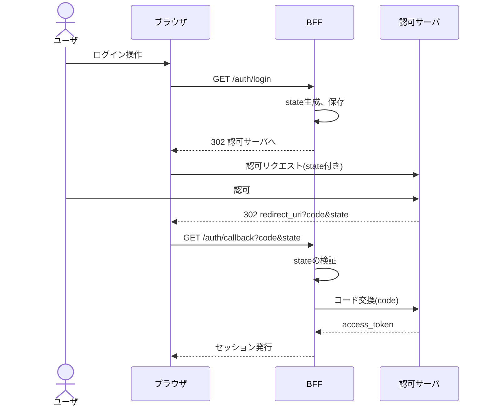
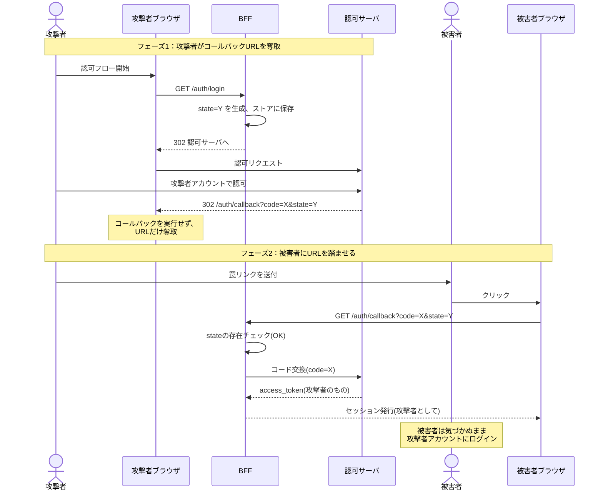

## はじめに

OAuth 2.0 の Authorization Code フローを BFF (Backends for Frontends) パターンで実装する際、`state` をサーバストア(Redis 等)にキーとして保存し、コールバック時にそのキーの存在のみを検証する実装を見かけます。実は筆者自身もかつてこのように実装していました。本記事ではこの実装が Login CSRF を防げないこと、およびその修正方針を扱います。

### TL;DR

- `state` 検証の役割は「このブラウザのために発行された値か」を確認すること
- サーバストアに `state` をキーとして保存するだけでは、ブラウザとの紐付けが行えず CSRF を防げない
- `state` も `code_verifier` (PKCE) も、ユーザエージェントに紐づけて保存する必要がある
- 現実的な保存方式は、サーバサイドセッションか暗号化 Cookie

## 前提知識のおさらい

### Authorization Code フロー + BFF

BFF パターンでは、SPA からアクセストークンを隔離し、BFF がトークンを保持・利用します。ブラウザと BFF 間は通常のセッション Cookie で認証状態を維持します。



### state パラメータの役割(RFC の定義)

RFC 6749 §4.1.1 では `state` を次のように定義しています。

> state
> RECOMMENDED. An opaque value used by the client to maintain
> state between the request and callback. The authorization
> server includes this value when redirecting the user-agent back
> to the client. The parameter SHOULD be used for preventing
> cross-site request forgery as described in Section 10.12.

> (訳)state — 推奨。クライアントがリクエストとコールバックの間で状態を維持するために用いる不透明な値。認可サーバはユーザエージェントをクライアントへリダイレクトする際にこの値を含める。このパラメータは §10.12 で述べる CSRF 対策のために使用すべき (SHOULD)。

そしてその §10.12 で、CSRF対策の中身が規定されています。

> The client MUST implement CSRF protection for its redirection URI.
> This is typically accomplished by requiring any request sent to the
> redirection URI endpoint to include a value that binds the request to
> the user-agent's authenticated state (e.g., a hash of the session
> cookie used to authenticate the user-agent). The client SHOULD
> utilize the "state" request parameter to deliver this value to the
> authorization server when making an authorization request.

> (訳)クライアントはそのリダイレクションURIに対するCSRF対策を実装しなければならない (MUST)。典型的には、リダイレクションURIエンドポイントに送られるあらゆるリクエストに、**リクエストをユーザエージェントの認証された状態に紐づける値**(例: ユーザエージェントの認証に使われるセッションCookieのハッシュ)を含めるよう要求することによってこれを達成する。認可リクエストの際にこの値を認可サーバへ届けるために、クライアントは `state` リクエストパラメータを利用すべき (SHOULD)。

ここで重要なのは「ユーザエージェントの認証された状態に紐づける値」という表現です。単にランダム値を発行して照合するのではなく、そのブラウザに紐づいた値であることが要求されています。

## ありがちな実装：「state はサーバで持っているから安全」という誤解

以下のような実装を見かけることがあります。

**認可開始時:**

```ts
// /auth/login
const state = crypto.randomBytes(32).toString("hex");
await redis.set(`oauth:state:${state}`, "1", "EX", 600);
res.redirect(buildAuthorizeUrl({ state /* ... */ }));
```

**コールバック時:**

```ts
// /auth/callback
const { code, state } = req.query;
const exists = await redis.get(`oauth:state:${state}`);
if (!exists) {
  return res.status(400).send("invalid state");
}
await redis.del(`oauth:state:${state}`);
// コード交換へ進む...
```

一見問題なさそうに見えます。`state` は十分なエントロピーを持つランダム値、サーバストアにあるので外部から漏洩しない、使用後に削除するので再利用もできない、通常のログインフローでは正常に動作します。

しかしこの実装は CSRF を防げません。なぜなら、この検証は **「サーバが発行した値か」しか確認しておらず、「リクエスト元ブラウザのために発行した値か」を確認していない** からです。

## 攻撃シナリオ：被害者を攻撃者のアカウントにログインさせる

### 攻撃の全体像



### ステップ解説

**フェーズ1: 攻撃者がコールバックURLを奪取**

1. 攻撃者は自分のブラウザで対象アプリの認可フローを開始する
2. BFF は `state=Y` を生成し、サーバストアに保存する
3. 攻撃者は認可サーバで自分のアカウントを使って認可する
4. 認可サーバは `redirect_uri?code=X&state=Y` へリダイレクトしようとする
5. 攻撃者はこのコールバック URL を **実行せずに奪取する** (ブラウザの開発者ツール、プロキシ、認可サーバの応答画面の URL バー観察などで取得可能)

**フェーズ2: 被害者にURLを踏ませる**

6. 攻撃者は奪取した URL を、メール・SNS・罠サイトのリンクとして被害者にクリックさせる
7. 被害者のブラウザが `GET /auth/callback?code=X&state=Y` を BFF に送信する
8. BFF はストアに `state=Y` が存在することを確認する → **検証通過**
9. BFF は `code=X` を認可サーバに送ってトークン交換する
10. 認可サーバは攻撃者アカウントのアクセストークンを返す
11. BFF は被害者ブラウザに対して、攻撃者のアイデンティティに紐づくセッション Cookie を発行する

### この攻撃が引き起こすこと

被害者は自分のアカウントだと信じてアプリを使うため、検索履歴・アップロードしたファイル・入力したメッセージなど、本人が自分の活動だと思っていたものがすべて攻撃者のアカウントに残ります。

これは **Login CSRF** と呼ばれる類型の攻撃です。一般的な「攻撃者が被害者になりすます」CSRF とは逆の、「被害者を攻撃者になりすまさせる」攻撃です。

## なぜ起きるのか：state は「ブラウザとサーバの紐付け」を担う

問題の核心は、`state` 検証が「リクエスト元ブラウザの主体性」を確認していないことです。

| 検証している内容                     | この実装 | 本来必要な検証 |
| ------------------------------------ | -------- | -------------- |
| サーバが発行した値か                 | ○        | ○              |
| 未使用の値か                         | ○        | ○              |
| **このブラウザのために発行した値か** | **×**    | **○**          |

URL クエリの `state` をストアのキーにしてしまうと、「攻撃者ブラウザのために発行された `state`」を「被害者ブラウザ」が送ってきた場合に区別がつきません。ストアにキーが存在することは、「どこかのブラウザのために発行された」ことしか証明しないのです。

RFC 6749 §10.12 が要求しているのは「リクエストをユーザエージェントの認証された状態に紐づける値」であり、その例として「セッションCookieのハッシュ」が示されています。つまり Cookie などを介してブラウザに紐づいた値であることが要求されているわけです。

## PKCE との関係：CSRF 対策の優先順位と、共通する実装上の罠

### PKCE の本来の目的は CSRF 対策ではない

PKCE (RFC 7636) は、もともと **認可コード横取り攻撃 (Authorization Code Interception Attack) への対策** として設計されました。RFC 7636 §1 (Introduction) はこう述べています。

> OAuth 2.0 [RFC6749] public clients are susceptible to the
> authorization code interception attack.
>
> In this attack, the attacker intercepts the authorization code
> returned from the authorization endpoint within a communication path
> not protected by Transport Layer Security (TLS), such as inter-
> application communication within the client's operating system.

> (訳)OAuth 2.0 のパブリッククライアントは、認可コード横取り攻撃の影響を受けやすい。この攻撃では、攻撃者は、TLS で保護されていない通信経路 — 例えばクライアントOS内のアプリケーション間通信など — で認可エンドポイントから返される認可コードを傍受する。

このように、PKCE はクライアントが動的に生成する高エントロピーの秘密値 `code_verifier` と、その変換値 `code_challenge` を用いることで「認可リクエストを開始したクライアントだけが、対応する code をトークンに交換できる」ことを保証する仕組みです。CSRF の文脈で議論されるのとは別レイヤの対策です。

### しかし RFC 9700 では PKCE が CSRF 対策の第一選択肢に

**RFC 9700 (OAuth 2.0 Security Best Current Practice)** §2.1 では、CSRF 対策について次のように規定されています。

> Clients MUST prevent Cross-Site Request Forgery (CSRF). [...] Clients that have ensured that the authorization server supports Proof Key for Code Exchange (PKCE) [RFC7636] MAY rely on the CSRF protection provided by PKCE. In OpenID Connect flows, the `nonce` parameter provides CSRF protection. Otherwise, one-time use CSRF tokens carried in the `state` parameter that are securely bound to the user agent MUST be used for CSRF protection (see Section 4.7.1).

> (訳)クライアントは Cross-Site Request Forgery (CSRF) を防止しなければならない (MUST)。… 認可サーバが PKCE をサポートしていることを確認したクライアントは、PKCE が提供する CSRF 保護に依拠してもよい (MAY)。OpenID Connect のフローでは、`nonce` パラメータが CSRF 保護を提供する。**それ以外の場合**、`state` パラメータで運ばれる、ユーザエージェントに安全に紐づいた使い切りの CSRF トークンを CSRF 保護のために使用しなければならない (MUST)。

さらに §4.7.1 では、PKCE が CSRF 保護として強い理由が述べられています。

> PKCE provides robust protection against CSRF attacks even in the presence of an attacker that can read the authorization response

> (訳)PKCE は、認可レスポンスを読み取れる攻撃者の存在下でも、CSRF 攻撃に対する堅牢な保護を提供する。

本記事の攻撃シナリオはまさに「攻撃者が認可レスポンスを読み取り被害者に踏ませる」もので、この一文が指す脅威モデルそのものです。`state` だけの場合、攻撃者が奪取した `state` を被害者のリクエストに含めれば検証を通せてしまいますが、PKCE なら攻撃者の知らない `code_verifier` がトークン交換時に必要なため保護が崩れません — ただし `code_verifier` がブラウザに紐づけて保管されている前提です(後述)。

つまり現代的な位置付けは、

- CSRF 対策の第一選択肢は PKCE
- OpenID Connect 環境では `nonce` も同等の役割
- どれも使えない場合のフォールバックが `state` (このときは MUST)
- どれを使うにせよ「ユーザエージェントに紐づける」ことが必須

### state と code_verifier の役割整理

| 項目                                    | state                          | code_verifier (PKCE)                             |
| --------------------------------------- | ------------------------------ | ------------------------------------------------ |
| 規定 RFC                                | RFC 6749                       | RFC 7636                                         |
| 本来の目的                              | CSRF 対策                      | 認可コード横取り攻撃対策                         |
| RFC 9700 における CSRF 対策上の位置付け | フォールバック                 | 第一選択肢 (MAY rely on)                         |
| 検証する場所                            | クライアント (RP) 側           | 認可サーバ側<br>(クライアントが verifier を送る) |
| 紐づけの要件                            | ユーザエージェントに紐づけ必須 | ユーザエージェントに紐づけ必須                   |

PKCE は認可サーバ側で検証される仕組みですが、`code_verifier` をクライアント側でどこに保存するかはクライアントの責務です。`state` と同じく、保存方法を誤れば同じ罠が成立します。

### 「PKCE を入れたから安全」とは言えない

`state` をキーとしてサーバストアに `code_verifier` を保存している実装は、これまで見てきた `state` の脆弱な実装と同じ構造の問題を抱えます。攻撃者が認可フローを開始したときの `state` と `code` を被害者に踏ませると、BFF は攻撃者の `state` をキーに攻撃者の `code_verifier` を引き当てて、トークン交換に成功します。結果として被害者は攻撃者のアカウントにログインさせられます。

要点は **`state` か PKCE のどちらを採用するかではなく、どちらを採用するにせよユーザエージェントに紐づけて保存しているか** です。RFC 9700 が PKCE を第一選択肢としているのも、PKCE を正しく実装する前提での話であり、保存方法を誤れば同じ脆弱性を持ちます。

## 正しい実装：state と code_verifier の保存方式

「ユーザエージェントに紐づけて保存する」を実装する方法を、2 つの方式として整理します。

### 共通原則

- コールバック処理時、リクエスト元ブラウザ自身が持つ Cookie をキーにして認可開始時の値を引き出せる状態にする
- `state` と `code_verifier` を同じセッション(同じCookie)の中で一緒に管理する

なお、保存先について RFC 6749 §10.12 はこう規定しています。

> [...] the user-agent's authenticated state (e.g., session cookie, HTML5 local storage) MUST be kept in a location accessible only to the client and the user-agent (i.e., protected by same-origin policy).

> (訳)ユーザエージェントの認証された状態(例: セッションCookie、HTML5 local storage)は、**クライアントとユーザエージェントだけがアクセスできる場所**、すなわち Same-Origin Policy で保護された場所に保管されなければならない (MUST)。

このため、後述する方式 A・B はいずれも Same-Origin Policy で保護される領域(セッションCookie / 暗号化Cookie)に状態を置く設計になっています。

### 方式 A: サーバサイドセッションに保存

BFF はもともとセッション Cookie を持つアーキテクチャなので、そのセッションに `state` と `code_verifier` を紐づけます。

ユーザがアクセスしてきたら BFF はセッション ID を発行し Cookie にセットし(`Set-Cookie: sid=xxx; HttpOnly; Secure; SameSite=Lax`)、サーバ側のセッションストア (Redis 等) に `session:xxx → { state, codeVerifier, ... }` の形で保存します。コールバック時は Cookie の `sid` からセッションを引き、その中の `state` をクエリの `state` と照合します。

ストアのキーはセッション ID (= Cookie) であり、`state` や `code_verifier` はあくまでセッションの中身の値です。攻撃者の `state` で攻撃者のセッションを引くことはできません(攻撃者のセッション ID Cookie を被害者は持っていないため)。セッションストア (Redis、メモリ、DB 等) が必要です。

### 方式 B: 暗号化 Cookie に直接保存

サーバ側ストレージを持たないステートレス方式です。

認可開始時、`state` と `code_verifier` を含むオブジェクトを暗号化・署名し Cookie に格納します。コールバック時は Cookie を復号して取り出し、クエリの `state` と照合します。

iron-session のような暗号化 Cookie ライブラリで実現可能です。Cookie サイズ制限 (4KB) はありますが、`state` (数十バイト) と `code_verifier` (43〜128 文字) なら余裕で収まります。サーバレス環境で外部ストレージを持ちたくない場合の選択肢として有用です。Cookie の暗号化・署名に使う秘密鍵と、その鍵ローテーションの設計が必要です。

### 方式 A・B の比較

| 項目           | 方式 A (サーバセッション) | 方式 B (暗号化 Cookie) |
| -------------- | ------------------------- | ---------------------- |
| ストレージ     | Redis 等が必要            | 不要                   |
| ステートフル性 | ステートフル              | ステートレス           |
| Cookie サイズ  | セッション ID のみ        | 暗号化ペイロード       |
| 適性           | 一般的な BFF              | サーバレス、Edge 環境  |

## セルフチェックリスト

- [x] `state` と `code_verifier` をユーザエージェントに紐づいた形(セッション or 暗号化 Cookie)で保存している
- [x] サーバストアのキーが `state` の値そのものになっていない
- [x] コールバック時、Cookie 経由で取得した値とクエリの `state` を比較している
- [x] 検証後、使用済みの値を破棄している
- [x] PKCE を CSRF 対策として用いる場合、認可サーバが PKCE をサポートしていることを確認している (RFC 9700 §4.7.1)

## まとめ

- 「サーバが発行した値か」ではなく「このブラウザのために発行したか」を確認するのが `state` 検証の役割 (RFC 6749 §10.12)
- PKCE を入れても、`code_verifier` を `state` キーでサーバ保存していれば同じ罠にハマる
- BFF ならセッション Cookie に `state` と `code_verifier` を紐づけて管理する

「ランダム値を発行してサーバで照合している」だけで安心せず、その値が本当にリクエスト元ブラウザに紐づいているかを確認しましょう。

**参考：**

- [RFC 6749 - The OAuth 2.0 Authorization Framework](https://datatracker.ietf.org/doc/html/rfc6749)
  - [§4.1.1 Authorization Request](https://datatracker.ietf.org/doc/html/rfc6749#section-4.1.1)
  - [§10.12 Cross-Site Request Forgery](https://datatracker.ietf.org/doc/html/rfc6749#section-10.12)
- [RFC 7636 - Proof Key for Code Exchange by OAuth Public Clients (PKCE)](https://datatracker.ietf.org/doc/html/rfc7636)
  - [§1 Introduction](https://datatracker.ietf.org/doc/html/rfc7636#section-1)
  - [§4 Protocol](https://datatracker.ietf.org/doc/html/rfc7636#section-4)
- [RFC 9700 - Best Current Practice for OAuth 2.0 Security](https://datatracker.ietf.org/doc/html/rfc9700)
  - [§2.1 Protecting Redirect-Based Flows](https://datatracker.ietf.org/doc/html/rfc9700#section-2.1)
  - [§4.7.1 CSRF Countermeasures](https://datatracker.ietf.org/doc/html/rfc9700#section-4.7.1)
- [OAuth 2.0 Threat Model and Security Considerations (RFC 6819)](https://datatracker.ietf.org/doc/html/rfc6819)

(各 RFC は 2026-04-29 時点の本文を参照)
