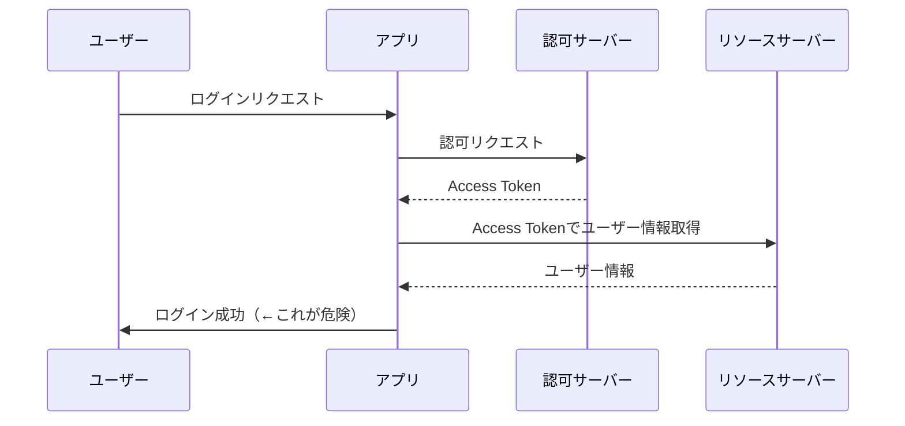
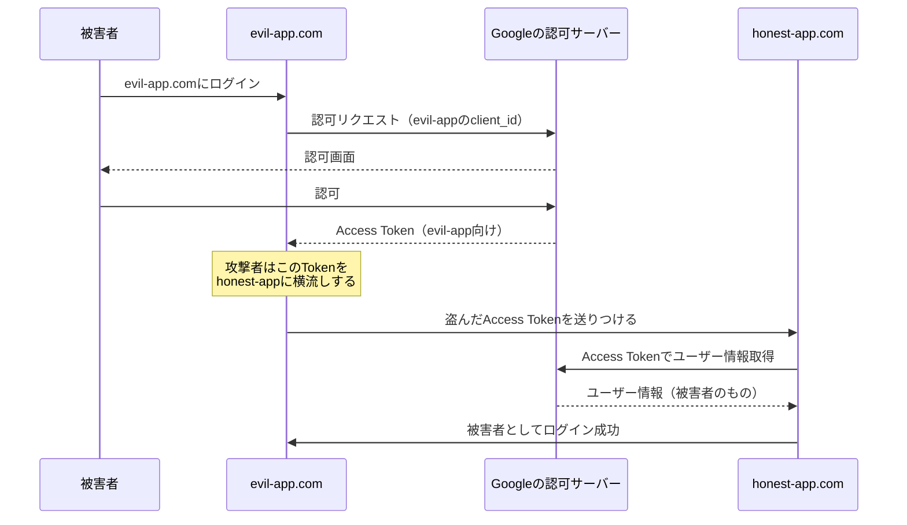
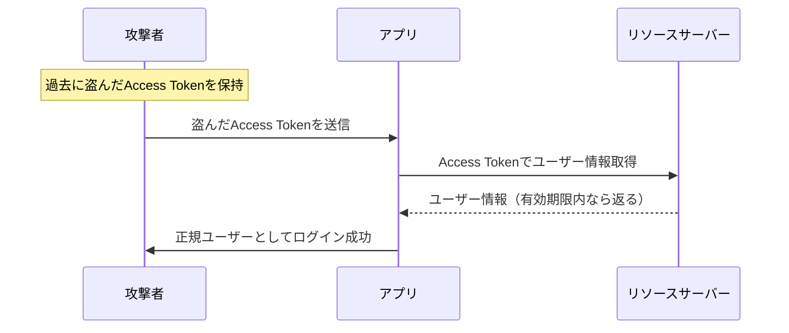
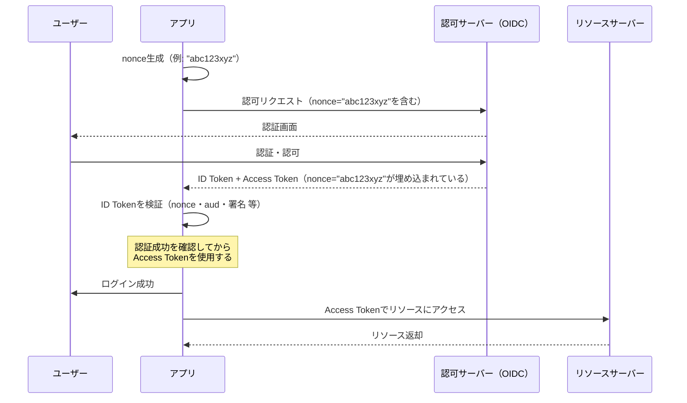

## はじめに

本記事の結論を先に述べます。

- **OAuth2.0は「認可」のプロトコルであり、「認証」には使ってはいけない**
- **OIDCはその問題を解決するために、OAuth2.0を拡張した「認証」のプロトコルである**

OAuth2.0を認証に使うと**具体的にどんな脆弱性が生まれるか**を示したうえで、OIDCがそれをどう解決したかを解説します。

対象読者はOAuth2.0とOIDCのフローの基礎を理解している方を想定しています。

## 1. OAuth2.0は「認可」のプロトコルである

### OAuth2.0が解決したかった問題

OAuth2.0はもともと、**リソースへのアクセス権限を第三者に委譲する**ための仕組みとして設計されました。

たとえば「あるサービスに、自分のGoogleドライブへのアクセスを許可する」といったユースケースです。ユーザーのパスワードを第三者に渡すことなく、スコープを絞ったアクセス権限だけを渡せます。

この文脈でOAuth2.0が発行するのが **Access Token** です。

### Access Tokenは「誰が」を保証しない

Access Tokenの役割は「**このトークンを持つ者は、指定されたリソースにアクセスできる**」という認可の証明です。

**「このトークンは誰のものか」は、Access Tokenの関心事ではありません。**

| 項目           | Access Token                         |
| -------------- | ------------------------------------ |
| 目的           | リソースへのアクセス認可             |
| 保証すること   | スコープ内のリソースにアクセスできる |
| 保証しないこと | トークンの持ち主が誰であるか         |

OAuth2.0の仕様（RFC 6749）にも、ユーザー認証の方法は定義されていません。これは設計上の欠陥ではなく、**意図的な責務の分離**です。

:::message
なお、JWT形式のAccess Tokenを規定したRFC 9068では`aud`クレームの含め方が定義されており、一部の実装ではAccess Tokenにも`aud`が含まれます。ただしこれはコアOAuth2.0（RFC 6749）の仕様外であり、すべての実装で保証されるものではありません。
:::

## 2. OAuth2.0を認証に使うと何が起きるか

### 2-1. アンチパターン

OAuth2.0を「認証」に流用する典型的なパターンがあります。

1. Access Tokenを取得する
2. そのTokenでUserInfo APIを呼び出してユーザー情報を取得する
3. 取得できたユーザー情報を「ログイン済み」の根拠にする



一見うまく動いているように見えますが、このフローには**重大な脆弱性**が潜んでいます。

### 2-2. Confused Deputy攻撃

**Confused Deputy問題**とは、あるサービス（Deputy）が、本来意図していない別のサービスへの攻撃に「利用されてしまう」問題です。

#### シナリオ

- `honest-app.com`：正規のサービス（OAuth2.0でGoogleログインを実装）
- `evil-app.com`：攻撃者が用意した悪意あるサービス
- 被害者：`evil-app.com`でもGoogleログインを使ったことがあるユーザー



#### なぜこれが起きるか

Access Tokenには「**どのアプリ向けに発行されたか**」という情報が含まれていません。

`honest-app.com`は受け取ったTokenでユーザー情報を取得できてしまうため、そのTokenが本来`evil-app.com`向けに発行されたものだと判別できないのです。

### 2-3. リプレイ攻撃

リプレイ攻撃とは、**以前に盗んだトークンを再利用**して、正規のユーザーとして認証を突破する攻撃です。

#### シナリオ

- 攻撃者は何らかの手段でAccess Tokenを入手済み
- そのTokenを使って、対象サービスへのログインを試みます



#### なぜこれが起きるか

Access Tokenには「**どの認証セッションのために発行されたか**」という情報がありません。OAuth2.0を認証に流用する限り、トークンと認証セッションを紐付ける仕組みが存在しないのです。

有効期限内であれば、**どこから来たTokenでもUserInfo APIは応答してしまいます。** アプリ側は、そのTokenが今この瞬間のログインフローから来たものか、過去に盗まれたものかを区別できません。

## 3. OIDCが登場した背景

OAuth2.0の普及とともに、多くのサービスが上述のようなアンチパターンでユーザー認証を実装するようになりました。

実装ごとに独自の方法で「認証っぽいもの」を作ることは、**セキュリティの一貫性を損なう**大きなリスクでした。

そこで2014年、OpenID Foundationは **OpenID Connect（OIDC）** を仕様化しました。

> **OIDCはOAuth2.0の「認可」の仕組みをベースに、「認証」の標準を上乗せした拡張仕様です。**

OAuth2.0を置き換えるものではなく、OAuth2.0が意図的に持たなかった「認証」の責務を、標準化された形で補完するものです。

## 4. OIDCが認証の問題をどう解決したか

OIDCが導入した仕組みが **ID Token** です。

### ID Token（JWT）の役割

OIDCでは、Access Tokenに加えて **ID Token** が発行されます。ID TokenはJWT形式で、ユーザーの認証情報を含んでいます。

|              | Access Token                   | ID Token                       |
| ------------ | ------------------------------ | ------------------------------ |
| 用途         | リソースへのアクセス認可       | ユーザー認証の証明             |
| 形式         | 任意（不透明なトークンが多い） | JWT（署名付き）                |
| 主な検証対象 | 有効期限、スコープ             | `aud`、`nonce`、署名、有効期限 |

Access Tokenは「リソースサーバーへのパスポート」、ID Tokenは「**ユーザーが誰であるかの証明書**」です。アプリはID Tokenを検証することで、安全にユーザーを認証できます。

### `aud`クレームによるConfused Deputy対策

ID Tokenには **`aud`（audience）クレーム** が含まれます。これは「**このトークンは誰向けに発行されたか**」を示すフィールドで、値は発行先アプリの`client_id`です。

アプリはID Tokenを受け取ったとき、`aud`が自分の`client_id`と一致するかを検証しなければなりません。

```
// ID Tokenのペイロード例
{
  "iss": "https://accounts.google.com",
  "sub": "1234567890",
  "aud": "honest-app-client-id",  // ← honest-app向けに発行
  "exp": 1712345678,
  "nonce": "abc123xyz"
}
```

`evil-app.com`向けに発行されたID Tokenを`honest-app.com`に横流しても、`aud`の値が`honest-app-client-id`と一致しないため、**検証で弾かれます。** Confused Deputy攻撃を防げます。

### `nonce`によるリプレイ攻撃対策

OIDCでは、アプリが認可リクエスト時に **`nonce`（ワンタイムのランダム値）** を含めます。認可サーバーはこの値をそのままID Tokenに埋め込んで返します。これにより、ID Tokenと認証セッションが紐付けられます。

アプリは受け取ったID Tokenの`nonce`が、リクエスト時に生成した値と一致するかを検証します。



過去に盗まれたID Tokenを再送しても、`nonce`がアプリの現在のセッションと一致しないため、**検証で弾かれます。** リプレイ攻撃を防げます。

## 5. まとめ

ここまでの内容を整理します。

|                         | OAuth2.0単体                   | OIDC（OAuth2.0拡張）         |
| ----------------------- | ------------------------------ | ---------------------------- |
| **責務**                | 認可（リソースアクセスの委譲） | 認証（ユーザーが誰かの証明） |
| **発行トークン**        | Access Token                   | Access Token + ID Token      |
| **Confused Deputy対策** | なし                           | `aud`クレームで防御          |
| **リプレイ攻撃対策**    | なし                           | `nonce`で防御                |
| **認証への使用**        | 使ってはいけない               | こちらを使う                 |

**OAuth2.0は認可のために設計されており、認証の概念が仕様に含まれていません。** そのためOAuth2.0単体で認証を実装しようとすると、Confused Deputyやリプレイといった攻撃を受けるリスクが生まれます。

OIDCはOAuth2.0を置き換えるのではなく、**認可はOAuth2.0に任せ、認証の責務だけを標準化して上乗せした**プロトコルです。

> - リソースへのアクセス認可 → **OAuth2.0のAccess Token**
> - ユーザーが誰かの証明 → **OIDCのID Token**

責務の分離を適切に理解して利用しましょう。

**参考：**

- [RFC 6749 - The OAuth 2.0 Authorization Framework](https://datatracker.ietf.org/doc/html/rfc6749)
- [OpenID Connect Core 1.0](https://openid.net/specs/openid-connect-core-1_0.html)
- [OAuth 2.0 Security Best Current Practice](https://datatracker.ietf.org/doc/html/draft-ietf-oauth-security-topics)
