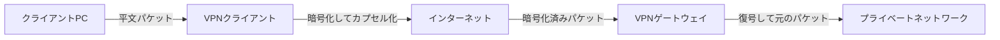
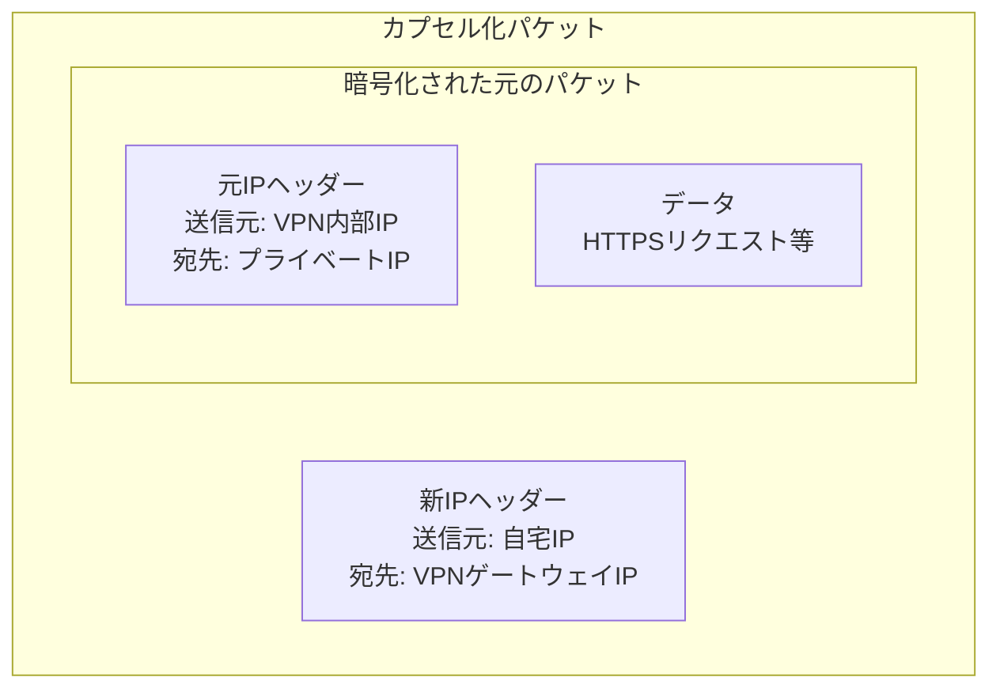
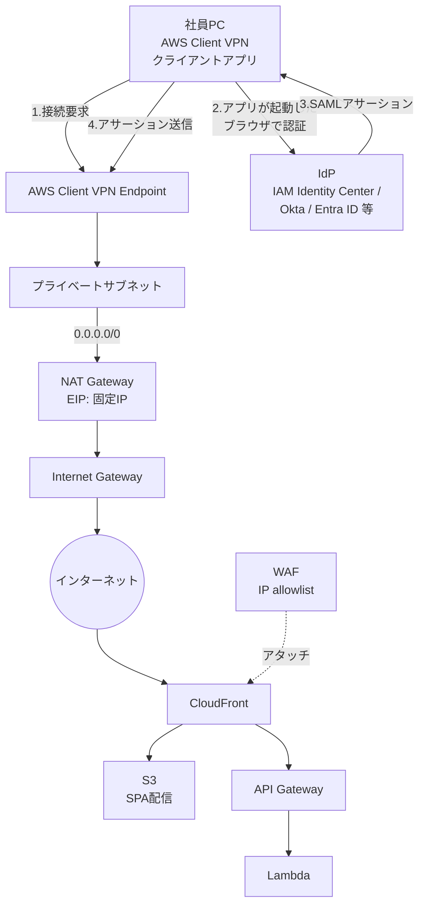
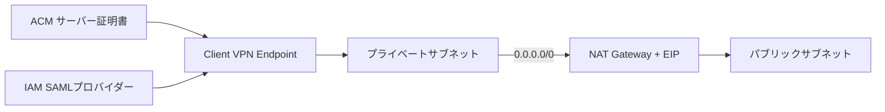
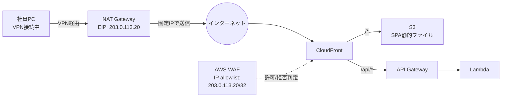
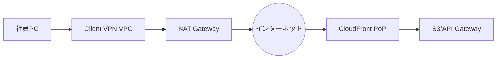

## はじめに

業務Webアプリのアクセス制御で「特定の経路からのアクセスのみ許可したい」という要件は多く存在する。リモートワーカーが各地から動的IPでアクセスする環境では、IP制限を機能させるために何らかの仕組みが必要となる。

本記事では、VPNの基本的な仕組みを整理した上で、AWSでクライアントVPNを構築し、サーバーレス構成(CloudFront + S3 + API Gateway + Lambda)のWebアプリに対してネットワークレベルのアクセス制御を実装する例を扱う。

対象読者は以下を想定している。

- VPNの仕組みを理解したいエンジニア
- AWSでネットワークレベルのアクセス制御を検討している方
- サーバーレス構成にIP制限を追加したい方

## VPNとは何か

### VPNが解決する3つの問題

VPN(Virtual Private Network)が必要とされる理由は、大きく以下の3つに集約される。

| 解決する問題                         | 内容                                             |
| ------------------------------------ | ------------------------------------------------ |
| 通信内容の保護                       | 信頼できない経路上での盗聴・改竄を防ぐ           |
| プライベートネットワークへのアクセス | インターネットから到達できないリソースに接続する |
| 出口IPの統制                         | 通信の送信元IPを固定・予測可能にする             |

本記事では3つ目の「出口IPの統制」を主な目的としたAWS構成を扱う。

### VPNの基本的な仕組み

VPNは「カプセル化」と「暗号化」によって、プライベート通信をインターネット上で運ぶ。元のパケットを丸ごと暗号化し、カプセル化パケットの中に入れ子で詰め込んで送信する。

カプセル化の仕組みにより、プライベートIP宛の通信を、グローバルIP宛のパケットで包んで運ぶことができる。経路上のISPやルーターからは「VPN宛通信」としか見えず、中身は暗号化された状態で送信される。

カプセル化されたパケットの構造は以下のようになる。

外側の新IPヘッダーがインターネット上のルーティングに使われ、中身の元パケットは暗号化されているため経路上では参照できない。VPNゲートウェイで復号され、中身の元パケットがプライベートネットワークに配信される。

### IPアドレスの変化

VPN経由で通信する際、パケットの送信元・宛先IPは段階的に変化する。

| 段階               | 送信元IP                       | 宛先IP                   |
| ------------------ | ------------------------------ | ------------------------ |
| PC内部(VPN前)      | 10.0.100.50(VPN払い出し)       | 10.0.10.20(社内サーバー) |
| カプセル化後       | 192.168.1.5(PCの本来IP)        | 203.0.113.10(VPN GW)     |
| 自宅ルーターNAT後  | 203.0.113.99(自宅グローバルIP) | 203.0.113.10(VPN GW)     |
| VPN GW受信後(復号) | 10.0.100.50                    | 10.0.10.20               |
| サーバー受信時     | 10.0.100.50                    | 10.0.10.20               |

サーバーから見える送信元IPは「10.0.100.50」というVPC内部のIPとなる。元の自宅IPはサーバーには届かない。

## VPNの種類

VPNは用途によって大きく2つの形態に分類される。

| 種類                           | 用途               | 特徴                                 |
| ------------------------------ | ------------------ | ------------------------------------ |
| 拠点間接続型(Site-to-Site VPN) | 拠点同士の常時接続 | ネットワーク機器同士をトンネルで接続 |
| リモートアクセス型(Client VPN) | 個人端末からの接続 | 個人PCから拠点ネットワークへ接続     |

AWSでも同じ分類で「AWS Site-to-Site VPN」「AWS Client VPN」というサービスが提供されている。本記事ではリモートワーカーや個人端末からのアクセスを想定し、リモートアクセス型を扱う。

## AWSでのVPN構築選択肢

AWSが提供する主なVPN関連サービスは以下の通り。

| サービス             | 用途             | 認証方式                         |
| -------------------- | ---------------- | -------------------------------- |
| AWS Site-to-Site VPN | 拠点間接続       | IPsec(機器間)                    |
| AWS Client VPN       | リモートアクセス | 証明書 / Active Directory / SAML |
| AWS Verified Access  | ZTNA(VPN代替)    | IdP + デバイス信頼性             |

リモートアクセス用途で「AWSで完結 + IdP連携 + 出口IP固定化」の要件を満たす場合、AWS Client VPNが選択肢となる。

## 構築する全体構成

本記事で構築する構成の全体像を示す。

ポイントは以下の通り。

- 社員はPCにインストールしたAWS Client VPN(クライアントアプリ)から接続を開始する。接続時にクライアントアプリが自動的にブラウザを起動し、SAML連携したIdP(IAM Identity Center、Okta、Microsoft Entra ID等)で認証が行われる
- VPN経由のアウトバウンド通信はNAT Gatewayを通り、固定IP(Elastic IP)から出る
- CloudFrontに紐づけたWAFが、その固定IPからのリクエストのみを許可する
- Webアプリ本体(S3、API Gateway、Lambda)はサーバーレス構成のまま

## AWS Client VPNの構築

### 必要なリソース

| リソース                 | 役割                              |
| ------------------------ | --------------------------------- |
| VPC                      | VPN関連付け先のネットワーク       |
| パブリックサブネット     | NAT Gatewayを配置                 |
| プライベートサブネット   | Client VPN endpoint関連付け       |
| NAT Gateway + Elastic IP | 出口IPの固定化                    |
| ACM証明書                | Client VPNサーバー証明書          |
| IAM SAMLプロバイダー     | IdPとの信頼関係を定義             |
| IdP                      | 認証基盤(Identity Center、Okta等) |
| Client VPN Endpoint      | VPN接続の終端                     |

### 構築手順の概要

1. **VPCとサブネット作成**: VPCのCIDRを決め、パブリック/プライベートサブネットを作成する
2. **NAT Gateway配置**: パブリックサブネットにNAT Gatewayを作成し、Elastic IPを明示的にアタッチする
3. **ルーティング設定**: プライベートサブネットの0.0.0.0/0をNAT Gatewayに向ける
4. **ACM証明書準備**: Client VPNサーバー用の証明書をACMにインポートまたは発行する
5. **IdPでSAMLアプリ作成**: Client VPN用のSAMLアプリケーションをIdP側で作成する
6. **IAM SAMLプロバイダー登録**: IdPから取得したメタデータXMLをIAMに登録する
7. **Client VPN Endpoint作成**: 認証方式に「Federated authentication」を選択し、SAMLプロバイダーを指定する
8. **サブネット関連付け**: プライベートサブネットを関連付ける
9. **認可ルール設定**: SAMLグループに対するアクセス範囲を設定する
10. **クライアント設定ファイル配布**: `.ovpn`ファイルを生成し、利用者に配布する

### グループベースの認可

AWS Client VPNはSAML 2.0でIAM Identity CenterやOkta、Microsoft Entra ID等のIdPと連携できる。SAML応答に含まれるグループ属性を使い、Client VPNの認可ルールでアクセス範囲を制御できる。

| グループ    | アクセス可能なCIDR範囲(例) |
| ----------- | -------------------------- |
| engineering | 10.0.10.0/24(開発環境)     |
| operations  | 10.0.20.0/24(本番環境)     |
| admin       | 10.0.0.0/16(全範囲)        |

退職時はIdP側でユーザーを無効化することで、VPN接続も不可となる。

## CloudFront構成へのアクセス制御

### 構成図

VPN出口IPからのみアクセスを許可するサーバーレス構成は以下の通り。

### 構築のポイント

| 設定項目             | 内容                                                                                                                                                 |
| -------------------- | ---------------------------------------------------------------------------------------------------------------------------------------------------- |
| NAT GatewayのEIP     | Elastic IPを明示的に確保し、固定でアタッチする                                                                                                       |
| CloudFront           | パスベースで`/*`をS3、`/api/*`をAPI Gatewayに振り分ける                                                                                              |
| WAF Web ACL          | scopeを`CLOUDFRONT`に設定し、us-east-1リージョンに作成する                                                                                           |
| IP set               | NAT GatewayのEIPを`/32`で登録する                                                                                                                    |
| デフォルトアクション | Block(IPセットに該当する場合のみAllow)                                                                                                               |
| S3バケット           | OAC(Origin Access Control)でCloudFront経由のみ許可                                                                                                   |
| API Gateway          | カスタムヘッダー(例: `X-Origin-Verify`)をCloudFrontで付与し、API Gateway側のWAFまたはLambda Authorizerで検証することで、CloudFront経由のみに限定する |

### 動作確認

| 状態                | 結果                               |
| ------------------- | ---------------------------------- |
| VPN未接続でアクセス | 自宅IPで送信 → WAFで403 Block      |
| VPN接続後にアクセス | NAT GatewayのEIPで送信 → WAFを通過 |

## 実装時の注意点

### IPv6によるVPNバイパス

本記事の構成はIPv4のみを前提としている。AWS Client VPNが提供するトンネルはIPv4のみで、IPv6の通信はVPNトンネルを経由せず、クライアントPCの本来のネットワーク経路(自宅回線等)で直接インターネットに送信される(VPNバイパス)。

CloudFrontがIPv6を有効にしている場合、DNSがAAAAレコードを返すため、クライアントPCはIPv6を優先する仕組み(Happy Eyeballs等)によりIPv6で送信する。この通信はVPNを経由せず、自宅回線のIPv6グローバルアドレスからCloudFrontに到達する。WAFのIP allowlistにはNAT GatewayのIPv4 EIPしか登録されていないため、ブロックされる。

サーバー側で対応する場合は以下の選択肢が挙げられる。

- **CloudFront側でIPv6を無効化する**: AAAAレコードが返らなくなるため、クライアントはIPv4でしか送信先を解決できず、VPN経由のIPv4通信に統一される(VPNバイパスが発生しない)
- **IPv6用のWAF IP setを別途作成して登録する**: WAFのIP setは1つのIPバージョンのみ扱うため、IPv4用とIPv6用で分けて作成する。ただし本記事の構成ではIPv6側に固定の出口IPがないため、現実的な選択肢にはなりにくい

### split-tunnelとルーティング

Client VPNの「split-tunnel」設定により、トラフィックの経路が変わる。

| 設定                         | 動作                                                          |
| ---------------------------- | ------------------------------------------------------------- |
| split-tunnel無効(デフォルト) | クライアントの全通信がVPN経由                                 |
| split-tunnel有効             | Client VPNエンドポイントのルートテーブルにある宛先のみVPN経由 |

CloudFrontへの通信もVPN経由にしたい場合、split-tunnelを無効化するか、split-tunnel有効のままClient VPNエンドポイントのルートテーブルに必要な経路を追加する。

なお、split-tunnel有効時にClient VPNエンドポイントのルートテーブルへ`0.0.0.0/0`を追加することはAWSドキュメントで非推奨とされている。広範囲の宛先を扱う場合はsplit-tunnel無効を選択する。

### NameID形式の制約

SAMLアサーションでは、NameID属性にEメールアドレス形式を使用する必要がある。IdP側の属性マッピングで該当形式を指定する。

### NAT GatewayのEIP固定

NAT Gatewayを再作成するとElastic IPが変わる場合がある。事前にElastic IPを確保し、NAT Gatewayに明示的にアタッチしておくことで、IP変更に伴うWAFのallowlist更新作業を防げる。

### WAFのリージョン

CloudFront用のWAFは、Web ACLのscopeを`CLOUDFRONT`にし、us-east-1(バージニア北部)リージョンに作成する必要がある。

### Client CIDRとVPC CIDRの重複

Client VPNが利用者に払い出すIP範囲(Client CIDR)は、関連付け先VPCのCIDRと重複してはならない。Client CIDRは`/22`から`/12`の範囲で指定する。

## アーキテクチャのトレードオフ

### CloudFrontエッジ配信への影響

VPN経由でCloudFrontにアクセスする場合、トラフィックは以下のように経由する。

クライアントから直接最寄りのCloudFrontエッジに到達する経路ではなく、VPN VPCのリージョンを経由する経路となる。CDNによるレイテンシ低減効果は、VPN VPCのリージョンに依存する。

### 代替案

ネットワークレベルのIP制限が必須でない場合は、以下の代替案も存在する。

| 代替案              | 特徴                                |
| ------------------- | ----------------------------------- |
| AWS Verified Access | IDベースのZTNA、VPNクライアント不要 |
| Cognito + WAF複合   | アプリ層認証中心、IP制限を緩める    |

「ネットワークレベルでの制御がコンプライアンス要件として必須」「特定IPからのみという明確な要件がある」場合に、本記事の構成が選択肢となる。

## まとめ

本記事では、VPNの基本的な仕組みからAWS Client VPNを使ったCloudFront構成へのIP制御までを扱った。

要点は以下の通り。

- VPNはカプセル化と暗号化により、プライベート通信を運ぶ仕組みである
- AWS Client VPNはIAM Identity Center等のIdPとSAML連携できる
- NAT Gatewayの固定IPを使うことで、利用者の動的IP環境でも固定の出口IPを得られる
- CloudFront + WAFのIP allowlistで、サーバーレス構成にもIP制限を実装できる
- 実装時にはIPv6によるVPNバイパス、split-tunnel、NameID形式、CIDR重複等の制約に注意する
- ネットワーク制御が必須でない場合は、Verified Access等の代替案も検討対象となる

**参考：**

- [RFC 1918 - Address Allocation for Private Internets](https://www.rfc-editor.org/rfc/rfc1918)
- [RFC 4301 - Security Architecture for the Internet Protocol](https://datatracker.ietf.org/doc/html/rfc4301)
- [RFC 4303 - IP Encapsulating Security Payload (ESP)](https://datatracker.ietf.org/doc/html/rfc4303)
- [RFC 7296 - Internet Key Exchange Protocol Version 2 (IKEv2)](https://datatracker.ietf.org/doc/html/rfc7296)
- [RFC 8446 - The Transport Layer Security (TLS) Protocol Version 1.3](https://datatracker.ietf.org/doc/html/rfc8446)
