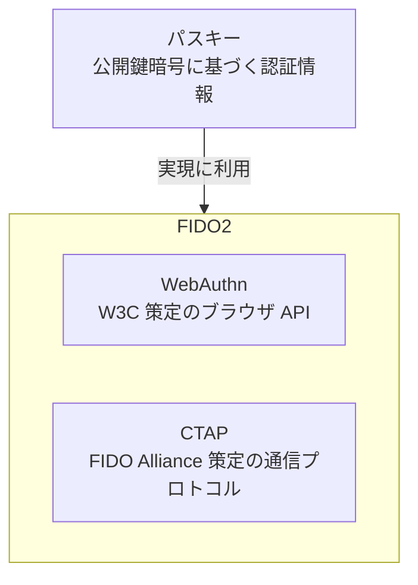
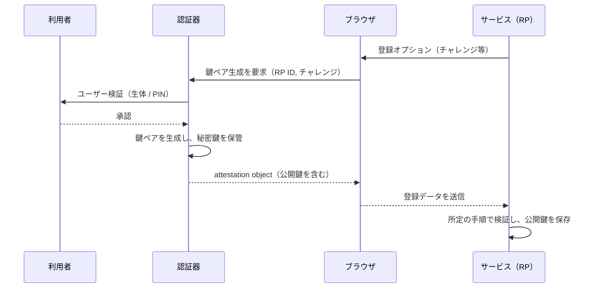
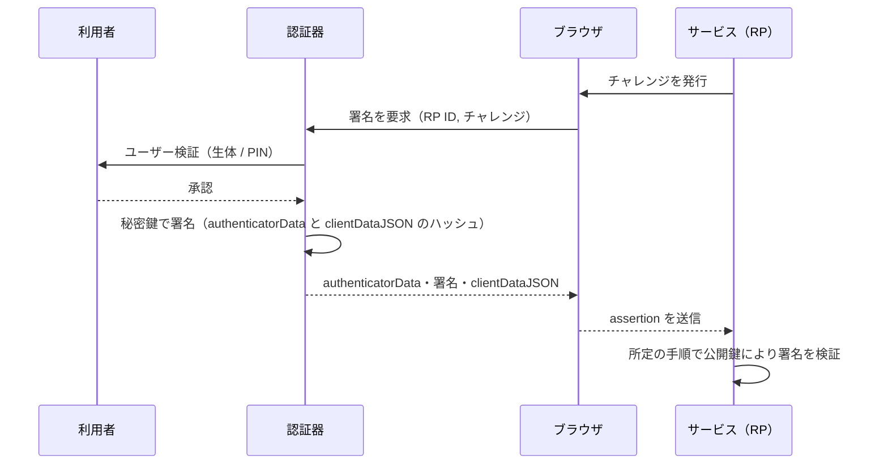
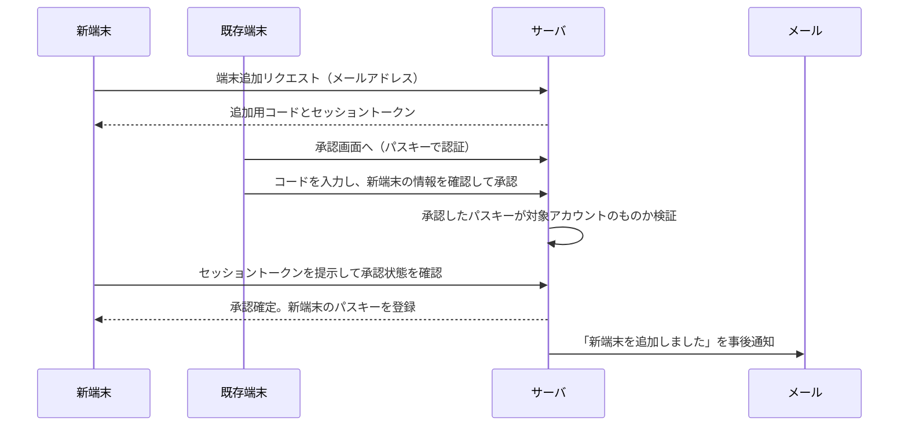
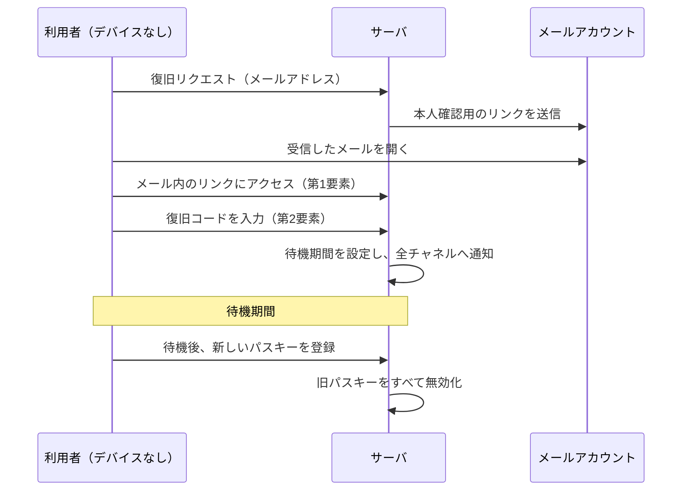
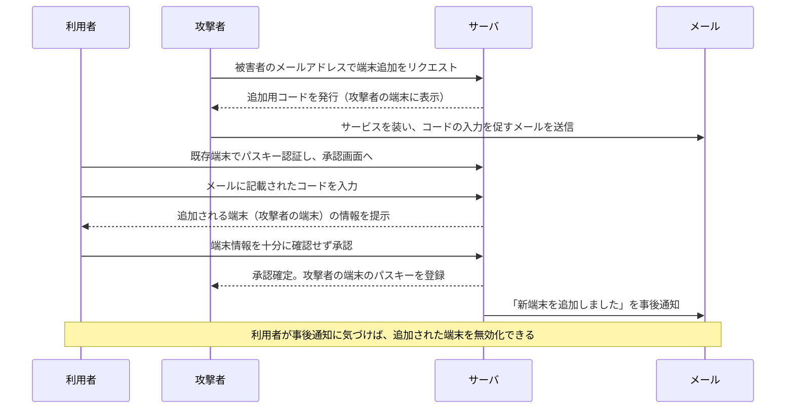
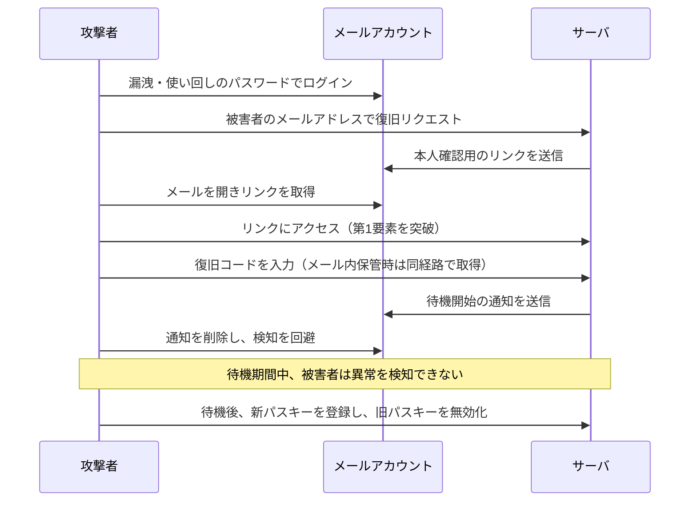

本記事では、パスキーの設計思想と仕組みを、公開されている仕様に基づいて整理します。本文ではパスキーの定義、パスワード認証との比較、種類、認証の仕組み、限界を扱い、Appendix ではアカウント復旧と端末追加のフロー設計、およびそれらに対する攻撃と防御を扱います。

## 1. パスワード認証の課題

パスワード認証には、構造に由来する次の課題があります。

- **使い回し**: 複数のサービスで同一のパスワードを設定した場合、一つのサービスからの漏洩が他のサービスにも波及します。
- **フィッシング**: パスワードは送信先のサイトを区別しない秘密情報のため、偽サイトに入力された値はそのまま攻撃者に渡ります。
- **サーバ側のクレデンシャル漏洩**: サービスはパスワード、またはそのハッシュを保持するため、サーバ侵害で認証情報が流出します。ハッシュ化されていても、オフラインでの総当たり攻撃の対象になります。
- **リスト型攻撃**: 漏洩した認証情報の組み合わせを他のサービスのログインに試行する攻撃で、使い回しと組み合わさって成立します。

これらの課題に共通する構造は、パスワードが、利用者とサービスが同一の秘密を共有する方式である点です。共有された秘密が一度でも第三者に渡ると、認証が成立します。

## 2. パスキーの概要

パスキーは、公開鍵暗号に基づく認証情報です。利用者の認証器、すなわちスマートフォン、PC、セキュリティキーなどが、サービスごとに鍵ペア（公開鍵と秘密鍵）を生成します。秘密鍵は認証器が保持し、公開鍵はサービス側に登録されます。認証は、認証器が秘密鍵で署名を生成し、サービスが対応する公開鍵で検証する手順で行われます。

パスキーに関連する用語の関係を整理します。

- WebAuthn（Web Authentication）: W3C が策定するブラウザ API の仕様です。Level 1 が2019年3月4日、Level 2 が2021年4月8日に W3C Recommendation として公開されました。Level 3 は策定が進められており、2026年初頭時点で Candidate Recommendation の段階です。
- CTAP（Client to Authenticator Protocol）: FIDO Alliance が策定する、クライアント（OS やブラウザ）と認証器の間の通信プロトコルです。現行は CTAP2 系が用いられています。
- FIDO2: WebAuthn と CTAP を合わせた呼称です。
- パスキー: FIDO2 および WebAuthn に基づく認証情報を指す呼称です。技術的には discoverable credential、すなわち利用者が識別子を入力しなくても認証器が利用可能なクレデンシャルを提示できる方式に相当します。

パスキーは、ブラウザ API としての WebAuthn を通じて利用され、外部の認証器との通信には CTAP が用いられます。

:::message
パスキーによる認証は、生体認証と混同されることがありますが、両者は別の段階です。サービスに対する認証は秘密鍵による署名で行われ、生体認証や PIN は、その署名を行う前に認証器がローカルで実施するユーザー検証、すなわち秘密鍵の利用を許可するための本人確認です。利用される検証方式はパスキーが保存されたデバイスが備えるもの（指紋、顔、PIN など）であり、生体情報そのものはデバイス内で照合され、サービスには送信されません。
:::

## 3. パスワード認証との比較

パスワード認証とパスキーを、観点ごとに対比します。なお、表に示すパスキーの性質の一部は、サービス（リライングパーティ。以下 RP）が WebAuthn 仕様の定める検証手順を正しく実装することを前提に成り立ちます。

| 観点                 | パスワード認証                                               | パスキー                                                                     |
| -------------------- | ------------------------------------------------------------ | ---------------------------------------------------------------------------- |
| 認証の秘密の所在     | 利用者とサービスが同一の秘密を共有する                       | 秘密鍵は認証器のみが保持し、サービスは公開鍵のみを保持する                   |
| サービス間の独立性   | 使い回した場合、一つの漏洩が他サービスに波及する             | サービスごとに独立した鍵ペアを使用する                                       |
| フィッシング時の影響 | 入力した秘密がそのまま攻撃者に渡る                           | 署名対象にオリジンが含まれ、偽サイト向けの署名は本物サービスの検証を通らない |
| サーバ漏洩時の影響   | パスワード、またはそのハッシュが流出し、総当たりの対象になる | 公開鍵のみが流出し、署名の生成には使えない                                   |
| リプレイ             | 同じパスワードを繰り返し送信できる                           | セレモニーごとの使い捨てチャレンジに署名が束縛される                         |

## 4. パスキーの種類

FIDO Alliance は、パスキーを同期パスキー（synced passkey）とデバイスバウンドパスキー（device-bound passkey）の二種類に分類しています。

同期パスキーは、クレデンシャルマネージャ（Apple の iCloud キーチェーン、Google パスワードマネージャー、サードパーティのパスワードマネージャーなど）に保管され、同一プロバイダを利用する複数のデバイス間で同期されます。秘密鍵は暗号化された形でクラウドに保管され、認可された他のデバイス上で復元されます。

デバイスバウンドパスキーは、単一のデバイス、主にセキュリティキーに固定され、秘密鍵がそのデバイスの外に出ません。

両者を観点ごとに対比します。

| 観点             | 同期パスキー                                                 | デバイスバウンドパスキー                         |
| ---------------- | ------------------------------------------------------------ | ------------------------------------------------ |
| 秘密鍵の所在     | 暗号化された形でクラウドに保管され、複数デバイスに複製される | 単一のデバイス内に留まり、外部に出ない           |
| デバイス間の同期 | 同一プロバイダ配下のデバイス間で同期される                   | 同期されない                                     |
| デバイス紛失時   | 他のデバイスから利用を継続できる                             | 当該デバイスでの利用はできず、再登録が必要になる |
| アテステーション | 端末の出自証明を提供しない                                   | 端末の出自証明を提供しうる                       |

異なるデバイス間でのサインインは、CTAP のハイブリッドトランスポートを用いて行われます。

## 5. 認証の仕組み

パスキーの処理は、鍵ペアの生成と公開鍵の登録を行う登録フェーズと、秘密鍵による署名とその検証を行う認証フェーズに分かれます。

### 登録フェーズ

1. サービス（RP）が、チャレンジ、RP の情報、利用者の情報などを含む登録用のオプションを生成し、ブラウザに渡します。
2. ブラウザが `navigator.credentials.create()` を呼び出し、認証器がユーザー検証（生体認証または PIN）を行います。
3. 認証器が鍵ペアを生成して秘密鍵を認証器内に保管し、生成された公開鍵を含む attestation object を返します。
4. RP は WebAuthn 仕様が定める手順でレスポンスを検証し、公開鍵とクレデンシャル ID を利用者のアカウントに紐づけて保存します。

### 認証フェーズ

1. RP が、使い捨てのチャレンジを発行します。
2. ブラウザが `navigator.credentials.get()` を呼び出します。認証器がユーザー検証を行い、秘密鍵で署名を生成します。
3. 署名の対象は、authenticatorData と、clientDataJSON の SHA-256 ハッシュを連結したものです。
4. 認証器が authenticatorData、署名、clientDataJSON を返します（assertion）。
5. RP は WebAuthn 仕様が定める手順で、保存済みの公開鍵を用いて署名を検証し、チャレンジ、オリジン、rpIdHash、各フラグを照合します。

### 署名対象に含まれるデータ

clientDataJSON は、操作種別（type）、チャレンジ（challenge）、オリジン（origin）を含む JSON です。authenticatorData は、RP ID の SHA-256 ハッシュ（rpIdHash）、フラグ（ユーザーの存在を示す UP、ユーザー検証の成否を示す UV など）、署名カウンタ（signCount）などを含みます。

署名アルゴリズムの識別子や公開鍵の表現は COSE（RFC 9052 / 9053）で定義されます。COSE および attestation object の符号化には CBOR（RFC 8949）が用いられます。

署名カウンタは認証のたびに増加する値で、RP はこの値が減少していないかを確認することで、複製された認証器を検知できます。ただし同期パスキーでは秘密鍵が複数のデバイスに複製されるため、カウンタが増加せず常に 0 となる実装が一般的です。このため複製検知は、主にデバイスバウンドの認証器に対する補助的な機能です。

## 6. パスキーの限界

パスキーには、現状、次の限界があります。

### 同期パスキーの安全性が依存する対象

同期パスキーでは秘密鍵がデバイス外に複製されるため、その安全性は、同期基盤となるプロバイダのアカウントおよびその復旧経路の安全性に依存します。秘密鍵が単一のデバイス内に留まるデバイスバウンドパスキーとは、この点が異なります。

また、同期パスキーは、アテステーションによる端末の出自証明を提供しません。NIST の SP 800-63B（Digital Identity Guidelines）は、同期パスキーを syncable authenticator として位置づけ、認証の保証レベル AAL2 に該当しうるものとして扱っています。一方で、AAL3 は認証に用いる鍵がエクスポート不可能であることを求めるため、秘密鍵がデバイス外に複製される同期パスキーは AAL3 には該当しません。

| 観点                              | 同期パスキー           | デバイスバウンドパスキー / セキュリティキー |
| --------------------------------- | ---------------------- | ------------------------------------------- |
| アテステーション                  | 端末の出自を証明しない | 端末の出自を証明しうる                      |
| 到達可能な AAL（NIST SP 800-63B） | AAL2                   | AAL2 または AAL3                            |

:::message
AAL（Authenticator Assurance Level）は、NIST SP 800-63B が定める認証の保証レベルで、認証プロセスの確からしさを表す区分です。AAL1 から AAL3 まであり、数字が大きいほど要求が厳しくなります。AAL2 は複数の認証要素による認証を、AAL3 はそれに加えてハードウェアに基づく認証器であることなどを要求します。
:::

### アカウント復旧における非パスキー要素

利用者がすべてのデバイスを失った場合、定義上、パスキーによる認証は行えません。このため、アカウント復旧のフローでは、パスキー以外の要素、多くの場合はメールアドレスなどを本人確認に用いることになります。この復旧経路の強度が、システム全体の実効的なセキュリティの下限になります。復旧経路の具体的な設計については、Appendix で扱います。

### エコシステム間の移行と実装状況

異なるプロバイダの間でクレデンシャルを移行する仕組みは、FIDO Alliance で仕様の策定が進められている段階です。また、パスキーに対応する RP の範囲や実装の成熟度にも、ばらつきがあります。

## 7. まとめ

パスキーは、サービスごとに独立した鍵ペアを用い、秘密鍵を認証器内に保持し、署名対象にオリジンとチャレンジを含めることで、使い回し、サーバ漏洩、フィッシング、リプレイに対する耐性を持ちます。これらの性質の多くは、RP が WebAuthn 仕様の定める検証手順を正しく実装することを前提とします。

一方で、同期パスキーの安全性は同期基盤に依存し、アカウント復旧の経路には非パスキー要素が残ります。パスキーの実効的なセキュリティは、日常の認証部分だけでなく、復旧経路を含めた認証経路全体のうち、最も弱い要素によって決まります。

**参考：**

- [Web Authentication: An API for accessing Public Key Credentials Level 2 (W3C)](https://www.w3.org/TR/webauthn-2/)
- [Web Authentication: An API for accessing Public Key Credentials Level 3 (W3C)](https://www.w3.org/TR/webauthn-3/)
- [Specifications (FIDO Alliance)](https://fidoalliance.org/specs/)
- [Passkeys (FIDO Alliance)](https://fidoalliance.org/passkeys/)
- [RFC 9052: CBOR Object Signing and Encryption (COSE): Structures and Process (IETF)](https://www.rfc-editor.org/rfc/rfc9052.html)
- [RFC 9053: CBOR Object Signing and Encryption (COSE): Initial Algorithms (IETF)](https://www.rfc-editor.org/rfc/rfc9053.html)
- [RFC 8949: Concise Binary Object Representation (CBOR) (IETF)](https://www.rfc-editor.org/rfc/rfc8949.html)
- [SP 800-63B Digital Identity Guidelines (NIST)](https://pages.nist.gov/800-63-4/)

## Appendix: 本人確認にメールアカウントを用いる場合に想定される攻撃と防御

本記事の Appendix では、アカウント復旧と端末追加のフロー設計を扱い、とくに本人確認にメールアカウントを用いる場合の脆弱性と防御を整理します。

### A.1 前提となる全体フロー

端末追加フローと復旧フローは、メールへの依存度が異なります。

端末追加フローは、利用者が既存のデバイスを持っていることを前提とします。新しいデバイスの登録は既存デバイスのパスキーによる承認で行えるため、メールを本人確認の経路から外すことができます。メールは、追加が行われたことを知らせる事後通知にのみ用います。

復旧フローは、利用者が既存のデバイスを持たない状況を対象とします。この状況では、パスキー以外の手段で本人確認を行う必要があります。本記事ではその手段としてメールアカウントを用いる場合を前提とし、この前提のもとでは、復旧の安全性はメールアカウント自体の堅牢性に依存します。

### A.2 メールアカウントの保護が弱い場合の工程別脆弱性

復旧フローにメールアカウントを用いる場合、メールアカウントの保護が弱いと、パスキー自体の安全性とは無関係に復旧フローが突破され、アカウントの安全性は、サービス側の実装では制御できないメールアカウントの堅牢性に依存します。以下では、メールアカウントがパスワード認証のみで保護されている場合を例に、復旧フローの各工程で生じる脆弱性を示します。

| 工程                             | 生じる脆弱性                                                                                                                                                         |
| -------------------------------- | -------------------------------------------------------------------------------------------------------------------------------------------------------------------- |
| メール本人確認（第1要素）        | 第1要素の強度が、メールアカウントのパスワードの強度と等しくなる。使い回し、漏洩、フィッシングによって突破されうる                                                    |
| 復旧コード入力（第2要素）        | 復旧コードを同じメールアカウント内に保管した場合、第1要素と第2要素の取得経路が同一になり、二要素が単一の障害点に縮退する                                             |
| 待機・通知                       | 通知の経路がメールのみの場合、メールアカウントを掌握した攻撃者が通知を削除でき、待機期間中の検知が機能しない                                                         |
| 新パスキー登録・旧パスキー無効化 | 攻撃者主導の復旧が完了すると、攻撃者のパスキーが登録され、正規の利用者のパスキーはすべて無効化される。アカウントの乗っ取りと、正規の利用者の締め出しが同時に発生する |

これらの脆弱性は、独立しているはずのメール本人確認と復旧コードが保管場所しだいで同一経路に集約されること、および待機と通知という保険がメール外の通知経路の有無に依存することを示しています。

### A.3 想定攻撃パターンと防御

端末追加フローと復旧フローのそれぞれについて、想定される攻撃と防御を示します。

#### 端末追加フローを悪用した攻撃

攻撃者は自分の端末を被害者のアカウントに追加しようとし、そのために必要な追加用コードを、サービスを装ったメールで被害者に入力させます。

この攻撃では、パスキーによる認証自体は正規のものですが、被害者が、自分で発行していない追加用コードを入力して攻撃者の端末を承認してしまう点が起点になります。防御は、追加用コードを追加開始端末の画面にのみ表示してメールなど別経路では配布しないこと、承認画面で追加される端末の情報を明示して確認を求めること、追加完了を全デバイスへ事後通知することです。

#### 復旧フローの乗っ取り

攻撃者がメールアカウントを掌握し、復旧フローを通じてアカウントを乗っ取ります。

この攻撃は、メールアカウントの掌握により本人確認の第1要素が突破され、復旧コードも同じメール内にあれば第2要素まで同時に失われることで成立します。防御は、復旧コードをメールで送付・保存させず、メールとは別の経路で扱うこと、復旧の開始と完了をメール以外の経路にも通知すること、完了までに待機期間を設けて利用者に検知と中断の猶予を与えることです。

### A.4 設計上の留意点

- 復旧コードや各種トークンなど、秘密として扱う値をメールの経路に置かないようにします。メールアカウントが掌握されれば、メール内の値もそのまま攻撃者に渡るためです。
- 復旧の開始を知らせる通知と、復旧を取り消す導線を、メールから独立した経路にも設けます。メールアカウントが掌握された場合でも、利用者が異常を検知して中断できる余地を残すためです。
- 高い保証レベルが求められるアカウントでは、メールのみに依存する復旧を許容しない選択肢を持ちます。
