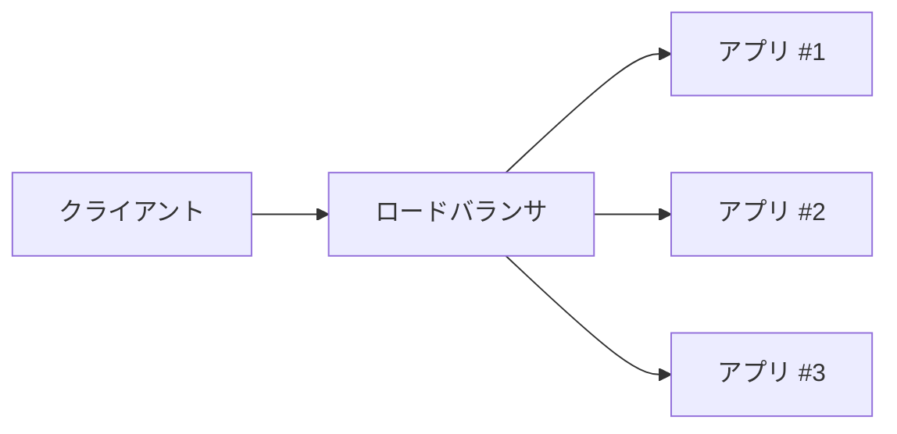
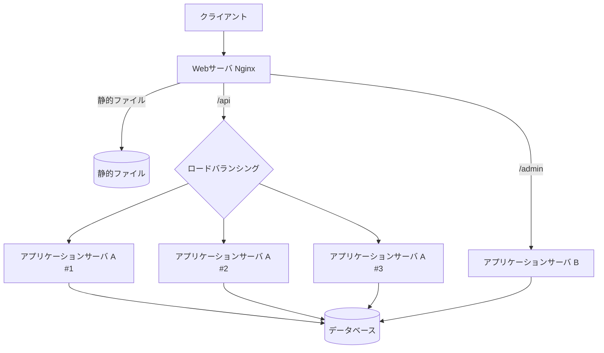

## はじめに

Web技術を扱っていると「サーバ」という言葉に頻繁に出会います。ところがこの言葉は、データセンタにある物理マシンを指したり、その上で動くソフトウェアを指したり、通信における「応える側」という役割を指したりと、文脈によって意味が変わります。同じ会話の中で何度も「サーバ」と言いながら、毎回違うレイヤーの話をしている、ということも珍しくありません。

そこでこの記事では、「サーバ」というワードを具体化し、Webアプリを支える周辺の技術用語をまとめて整理してみます。

なお「サーバ」という語は、英語の動詞 serve（提供する、給仕する）に「〜するもの」を表す -er が付いたものです。つまり本来は「要求に応じて何かを提供する側」という役割を表す言葉で、特定の機械の名前ではありません。この記事に出てくる用語の多くが「〜サーバ」と名乗っているのは、いずれも何かを提供する役割を担っているからです。

## Webサーバ

Webサーバは、クライアント（主にブラウザ）からのHTTPリクエストを最初に受け取る入口となるソフトウェアです。代表的なソフトウェアに Nginx と Apache があります。

Webサーバの主な役割は次の通りです。

| 役割               | 内容                                                             |
| ------------------ | ---------------------------------------------------------------- |
| 静的ファイルの配信 | HTML・CSS・JavaScript・画像などをディスクから読んでそのまま返す  |
| TLS終端            | HTTPSの暗号化・復号を担い、背後のアプリには平文のHTTPで渡す      |
| リバースプロキシ   | 受け取ったリクエストを背後のアプリケーションサーバへ転送する     |
| ロードバランシング | リクエストを複数のアプリケーションサーバへ分散する               |
| その他             | アクセス制御、gzip圧縮、キャッシュ、レートリミット、ログ記録など |

静的ファイルの配信を例にとると、画像やCSSのようなあらかじめ用意されたファイルを返すだけの処理は、Webサーバが直接おこなうのが効率的です。アプリケーション側に処理させるよりも高速で、負荷も小さく済みます。

最も単純な静的配信の設定は、Nginxでは次のように書きます。

```nginx
server {
    listen 80;
    server_name example.com;
    root /var/www/html;
}
```

Webサーバはこのように単独でも機能しますが、実際には「アプリケーションの前に立つ受付係」として使われることが多くあります。以降の副章では、その役割を順に見ていきます。

### リバースプロキシ

リバースプロキシは、Webサーバの代表的な使われ方のひとつです。受け取ったリクエストを、自分では処理せず背後の別のサーバへ転送する役割を指します。

「プロキシ」には2種類あります。フォワードプロキシはクライアント側に立ち、クライアントの代わりに外部へリクエストを出すものです。一方リバースプロキシはサーバ側に立ち、クライアントから見て「本当のサーバ」のように振る舞います。

リバースプロキシを置くと、背後の構成（サーバが何台あるか、どのポートで動いているか）を隠すことができ、TLS終端や圧縮を入口で一括処理できます。また、ひとつのドメインで複数のアプリへリクエストを振り分けることも可能になります。

Nginxでリバースプロキシを構成するには、`proxy_pass` を使います。

```nginx
server {
    listen 80;
    server_name example.com;

    location / {
        proxy_pass http://127.0.0.1:3000;
    }
}
```

ここで注意したいのは、リバースプロキシを通ってもプロトコルが特別な形式に変換されるわけではない、という点です。Nginxが背後へ渡すのは、改めて送り直されるHTTPリクエストです。Webサーバがおこなうのは主にヘッダの付加・書き換えで、元のクライアントIPを伝える `X-Forwarded-For` や、元のプロトコルを伝える `X-Forwarded-Proto` などを付与します。

### ロードバランシング

ロードバランシングは、受け取ったリクエストを複数の同じアプリケーションサーバに分散させる仕組みです。1台では処理しきれない量をさばけるようになり、1台が停止しても他が稼働していればサービスを継続できます。



Nginxでは `upstream` で転送先のサーバ群をまとめて定義します。

```nginx
upstream backend {
    server 127.0.0.1:3001;
    server 127.0.0.1:3002;
    server 127.0.0.1:3003;
}

server {
    listen 80;
    location / {
        proxy_pass http://backend;
    }
}
```

リクエストをどのサーバへ振り分けるかには、いくつかのアルゴリズムがあります。

| アルゴリズム           | 振り分け方                               |
| ---------------------- | ---------------------------------------- |
| ラウンドロビン（既定） | 順番に1台ずつ均等に回す                  |
| 重み付け               | 性能の高いサーバへ多めに回す             |
| least_conn             | その時点で接続数が最も少ないサーバへ回す |
| ip_hash                | クライアントのIPから振り先を固定する     |

ロードバランサは各サーバが応答するかを監視し、応答しないサーバへの振り分けを止めます。これにより障害時の自動的な切り離しが実現します。

ひとつ注意点があります。ラウンドロビンのように振り先が毎回変わる方式では、同じユーザのリクエストが毎回別のサーバへ届きます。サーバ内のメモリにログイン状態などを保持していると不整合が起きるため、セッション情報は共有ストアに置くか、`ip_hash` で振り先を固定する（スティッキーセッション）といった対策が必要になります。

### 仮想ホスト

仮想ホストは、1台のWebサーバで複数のWebサイト（ドメイン）を運用する仕組みです。`example.com` と `example.org` を、ひとつのマシン上のひとつのNginxで同時にホストできます。

実現方法は大きく3つあります。

| 方式         | 区別の基準                 | 現在の使われ方                 |
| ------------ | -------------------------- | ------------------------------ |
| 名前ベース   | リクエストの `Host` ヘッダ | 主流。これが基本               |
| IPベース     | IPアドレス                 | IPv4の枯渇によりほぼ使われない |
| ポートベース | ポート番号                 | 開発・内部用途のみ             |

主流である名前ベースでは、HTTPリクエストに必ず含まれる `Host` ヘッダを見て、対応する設定へ振り分けます。Nginxでは、`server` ブロックを複数並べることで実現します。

```nginx
server {
    listen 80;
    server_name example.com;
    root /var/www/example_com;
}

server {
    listen 80;
    server_name example.org;
    root /var/www/example_org;
}
```

名前ベースには、HTTPSのときに歴史的な課題がありました。暗号化通信を開始する時点では `Host` ヘッダがまだ読めないため、サーバはどのサイトの証明書を返せばよいか判断できなかったのです。これを解決するのが SNI（Server Name Indication）です。クライアントが接続の最初の段階で接続先のドメイン名を伝える仕組みで、現在のブラウザとサーバはいずれも対応しているため、HTTPSでも名前ベースの仮想ホストが問題なく使えます。

### ApacheとNginx

Webサーバの具体例として挙げた Apache と Nginx は、設計思想が異なります。

最も根本的な違いは、リクエストの処理モデルです。Apacheは伝統的に「1接続ごとにプロセスやスレッドを割り当てる」モデルを採ってきました。直感的でわかりやすい反面、同時接続が大量になるとプロセスやスレッドが増えすぎ、メモリを圧迫します。一方Nginxは「イベント駆動・非同期」モデルで、少数のワーカープロセスが多数の接続を同時にさばきます。同時接続が増えてもメモリ消費がほぼ一定で、高負荷に強いのが特徴です。

| 項目             | Apache                                     | Nginx                    |
| ---------------- | ------------------------------------------ | ------------------------ |
| 処理モデル       | プロセス・スレッド                         | イベント駆動・非同期     |
| 大量同時接続     | やや苦手                                   | 得意                     |
| 静的ファイル配信 | 標準的                                     | 高速                     |
| 動的コンテンツ   | モジュールで内部処理が可能                 | 外部プロセスへ渡す前提   |
| 設定方法         | `.htaccess` でディレクトリ単位の設定も可能 | 中央の設定ファイルに集約 |

なお現在のApacheには複数の処理方式があり、設定によってはNginxに近い動作も可能です。ここで述べたのは歴史的・標準的なイメージです。

どちらが優れているという話ではなく、用途による向き不向きがあります。大量の同時接続をさばきたい場合や、リバースプロキシ・ロードバランサとして使う場合はNginxが選ばれやすく、現代のNode.jsアプリの前段としてもNginxがよく使われます。一方、`.htaccess` による柔軟な設定が必要な共有ホスティングなどではApacheの利点が生きます。両者を対立させず、Nginxを前面に立てて背後でApacheに動的処理をさせる、という併用構成もよくあります。

## アプリケーションサーバ

アプリケーションサーバは、実際にビジネスロジックを実行する側です。Node.js上で動く Express や Hono で書いたアプリケーションは、このアプリケーションサーバにあたります。

ここまで見てきたWebサーバとの責務分担を整理すると、次のようになります。Webサーバはリクエストの受付と配送、静的ファイルの返却、暗号化処理といった入口の処理を担います。これに対しアプリケーションサーバは、リクエストの内容に応じてデータベースを参照したり、計算をおこなったり、ページを組み立てたりといった、アプリ固有の処理を担います。受付係と調理場のような関係です。

この「実際に処理をする側」は、文脈によって複数の呼び方をされます。

| 呼び方                 | どの観点からの呼び方か                                  |
| ---------------------- | ------------------------------------------------------- |
| アプリケーションサーバ | 役割を一般的に表す呼び方                                |
| バックエンド           | クライアントから見えない裏側、という観点                |
| オリジンサーバ         | リバースプロキシやCDNから見た「転送先の大元」という観点 |
| アップストリーム       | Nginxの設定上での、転送先サーバ群を指す用語             |

いずれも同じ対象を別の角度から呼んでいるものです。

なお、Webアプリのフレームワークである Express や Hono は、Webサーバではなくこのアプリケーションサーバ側に位置します。両者は、リクエストを受け取った後に独自のオブジェクトモデルへ整える処理をおこないます。とくにHonoはWeb標準の `Request` / `Response` をベースに設計されている点が特徴で、これは後述するEdge環境とも関わってきます。

## 全体像を図で整理

ここまでに登場した用語が、実際にどう組み合わさるのかを図で見てみます。



Webサーバはすべてのリクエストの入口に立ち、その内容を見て行き先を判断します。静的ファイルへのリクエストであれば自分で返し、APIへのリクエストであればロードバランシングしながらアプリケーションサーバ群へ転送し、管理画面であれば別のアプリケーションサーバへ振り分ける、といった具合です。ドメインによる振り分けは仮想ホストの仕組み、パスによる振り分けやアプリへの転送はリバースプロキシの仕組みにあたります。

そしてその先で、実際の処理をおこなうのがアプリケーションサーバです。Webサーバが「振り分ける役」、アプリケーションサーバが「処理する役」という分担で、ひとつのリクエストが処理されていきます。

なお、この図は「役割の構成」を示したものであり、「物理的なマシンの台数」を示したものではありません。図に並んだWebサーバとアプリケーションサーバは、いずれも1台のコンピュータの中で動かすことが可能です。Nginxをポート80で起動し、Node.jsアプリを localhost:3001 などの複数プロセスとして同じマシン上で起動して、Nginxがそれらのローカルポートへ振り分ける、という構成です。ロードバランシングの節で示した upstream の例も、振り分け先が 127.0.0.1 のローカルポートになっていました。これは1台のマシン内で複数プロセスへ分散している状態です。Node.jsは基本的に1プロセスで1つのCPUコアしか使わないため、複数コアを活用する目的で、1台のマシンにアプリプロセスを複数立てることがあります。

一方、規模が大きくなると、役割ごとにマシンを分けるのが一般的です。1台が故障すると全体が停止してしまうこと、1台あたりのCPUやメモリには上限があること、WebサーバとアプリケーションサーバとDBでは求められる性能特性が異なることなどが理由です。つまり図の論理構成は同じまま、それを何台の物理マシンへ割り当てるかは別の設計判断であり、小規模な構成では1台に集約し、大規模な構成では分離する、という幅があります。

## クラウドによる変化

ここまでは、自前でWebサーバを立てて構成する前提の話でした。クラウド環境を使う場合、この構図は少し変わります。

### マネージドサービスによる抽象化

クラウドのマネージドサービスを使うと、これまでWebサーバが担っていた役割の多くが、プラットフォーム側のサービスとして提供されます。

- ロードバランシングは、専用のロードバランササービス（AWSのALBなど）が担う
- TLS終端と証明書管理は、プラットフォームが自動でおこなう
- 静的ファイルの配信は、オブジェクトストレージとCDNの組み合わせが担う
- ルーティングは、API Gatewayなどの設定でおこなう

この場合、「Webサーバが不要になった」のではなく「Webサーバの役割がサービスとして抽象化された」と言えます。リバースプロキシやロードバランシングの機能そのものは、クラウド内部でも動いています。ただしその実体は利用者から見えなくなり、マネージドな仕組みに置き換わっています。

その実体は、必ずしもNginxのような既存のソフトウェアではありません。たとえばAWSのロードバランサは独自実装で、内部の詳細は公開されていません。CloudflareはかつてリバースプロキシのコアにNginxを使っていましたが、自社の規模に合わせてRust製の独自プロキシ基盤へ置き換えたことを公表しています。クラウド規模のトラフィックでは、汎用のソフトウェアでは要件を満たしにくく、独自開発が選ばれることがあります。

### サーバーレス

抽象化をさらに進めた形が「サーバーレス」です。

この言葉は「サーバが無い」という意味ではありません。実際にはサーバは存在して動いています。指しているのは「開発者がサーバ（インフラ）の存在や管理を意識しなくてよい」という形態です。プロビジョニング、スケーリング、メンテナンスをすべてプラットフォームが引き受けます。"less" は「無い」ではなく「（管理から）解放されている」を表します。

サーバーレスというと「リクエストがあったときだけ起動し、無いときは動いていない」という動作を思い浮かべるかもしれません。これは AWS Lambda に代表される FaaS（Function as a Service）の説明としては正確ですが、サーバーレスの一例にすぎません。実際には、常に稼働しているのにサーバーレスと呼ばれるサービスもあります。たとえばサーバーレスを名乗るデータベースは、性質上つねに応答できる状態にありますが、容量管理やスケーリングを意識しなくてよいという点でサーバーレスと呼ばれます。

したがって「リクエスト時のみ起動するか」はサーバーレスの判定基準ではありません。判定基準は「インフラ管理から解放されているか」のほうです。

### Edge環境

サーバーレスの一形態がEdge環境です。

Edgeとは「ネットワークの端」、つまりユーザに物理的に近い側を指します。Edge環境とは、世界中に分散した多数の拠点でコードを実行し、アクセスしてきたユーザに最も近い拠点で処理をおこなう仕組みです。

なぜ「近さ」が重要かというと、物理的な距離がそのまま通信の遅延になるからです。アプリが特定のリージョンにしか無い場合、遠方のユーザのリクエストは長い距離を往復します。Edge環境では近くの拠点が応答するため、この距離由来の遅延を減らせます。

発想自体はCDN（コンテンツ配信網）から来ています。CDNは画像やCSSなどの静的ファイルを世界中の拠点にキャッシュして「近くから配る」仕組みでした。Edge環境は、これを一歩進めて「静的ファイルだけでなくコード（ロジック）も近くで動かせるようにした」ものです。

ただしEdge環境には固有の制約があります。軽量・高速に起動できる代わりに、次のようなトレードオフがあります。

| 向いている処理                       | 向いていない処理                   |
| ------------------------------------ | ---------------------------------- |
| 軽量なAPI処理、認証チェック          | 重い計算や長時間の処理             |
| リクエスト・レスポンスの書き換え     | 大きなライブラリへの依存           |
| 地理的に分散したユーザへの低遅延配信 | 特定リージョンのDBに密結合した処理 |
| リダイレクトやパーソナライズ         | 状態を保持する処理                 |

具体的には、Node.jsのすべてのAPIが使えるとは限らず、実行時間やメモリに上限があり、状態を持てない（ステートレス）といった制約があります。また、データベースは特定のリージョンに置かれているため、せっかくEdgeでユーザに近くても、DBアクセスのために遠くまで往復してしまう、という課題もあります。

前述の Hono は、ここで再び関わってきます。Edge環境のランタイムはWeb標準のAPIを中心としており、通常のNode.jsとは実行環境が異なります。HonoがWeb標準の `Request` / `Response` をベースに設計されているため、同じコードをNode.js上でもEdge環境でも動かせます。

## まとめ

「サーバ」という曖昧な言葉を起点に、Webアプリの周辺技術を整理してきました。

| 用語                   | 役割                               | 具体例・関連                 |
| ---------------------- | ---------------------------------- | ---------------------------- |
| Webサーバ              | リクエストの入口。受付と配送       | Nginx、Apache                |
| リバースプロキシ       | リクエストを背後のサーバへ転送する | Webサーバの使われ方のひとつ  |
| ロードバランシング     | 複数のサーバへ負荷を分散する       | `upstream` による設定        |
| 仮想ホスト             | 1台で複数サイトをホストする        | `Host` ヘッダによる振り分け  |
| アプリケーションサーバ | ビジネスロジックを実行する         | Express、Hono                |
| マネージドサービス     | Webサーバの役割を抽象化して提供    | クラウドのロードバランサなど |
| サーバーレス           | インフラ管理から解放された形態     | FaaS、サーバーレスDBなど     |
| Edge環境               | ユーザに近い拠点でコードを実行     | 低遅延だが制約あり           |

「サーバ」とは特定の機械の名前ではなく、「要求に応えて何かを提供する側」という役割の呼び名です。Webサーバもアプリケーションサーバも、その役割を担うものとして「サーバ」と名乗っています。

クラウドやEdgeの登場で変わったのは、これらの役割の担い手と見え方です。役割そのものは引き続き存在しています。「サーバ」という言葉に出会ったときは、それがどのレイヤー（ハードウェア、ソフトウェア、役割）の、どの用語を指しているのかを確認すると、内容を正確に把握できます。
