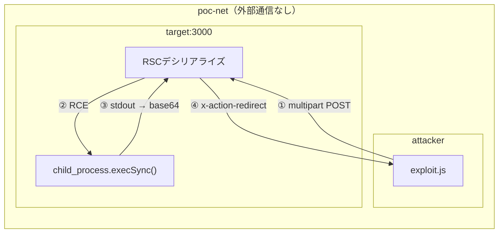

:::message alert
**重要な法的注意事項**

本記事で紹介する技術は、セキュリティ教育および自身が管理するシステムでの脆弱性診断を目的としたものです。**許可なく他者のシステムに対してこれらの技術を使用することは、不正アクセス禁止法等の法律に違反し、刑事罰の対象となります。**

- 自身が所有・管理するシステム、または許可されたテスト環境でのみ使用してください
- 本記事の内容を悪用した場合、筆者は一切の責任を負いません
  :::

## PoC動作確認環境

本記事で解説したペイロードを実際に動作させる検証環境を公開しています。

https://github.com/hanacus87/react2shell-poc

### 環境の概要

Dockerで構築された完全隔離ネットワーク（`internal: true`）上で、脆弱なNext.jsサーバーとattackerコンテナが通信します。ホストへのポート公開はありません。



使用するバージョンはいずれも脆弱なバージョンに固定されています。

**React（CVE-2025-55182）**

| 脆弱なバージョン | 修正バージョン |
| ---------------- | -------------- |
| 19.0.0           | 19.0.1         |
| 19.1.0, 19.1.1   | 19.1.2         |
| 19.2.0           | 19.2.1         |

**Next.js（CVE-2025-66478）**

| 脆弱な範囲      | 修正バージョン |
| --------------- | -------------- |
| 15.0.0 – 15.0.4 | 15.0.5         |
| 15.1.0 – 15.1.8 | 15.1.9         |
| 15.2.0 – 15.2.x | 15.2.6         |
| 15.3.0 – 15.3.x | 15.3.6         |
| 15.4.0 – 15.4.x | 15.4.8         |
| 15.5.0 – 15.5.x | 15.5.7         |
| 16.0.0 – 16.0.6 | 16.0.7         |

### 環境

- Docker 20.10+
- Docker Compose v2+

### 使い方

**poc.sh**

```bash
./poc.sh                                                  # デフォルト: 'id' を実行
./poc.sh -c 'whoami && hostname && cat /etc/os-release'   # カスタムコマンド
```

**rev-shell.sh**

```bash
./rev-shell.sh          # デフォルトポート 4444
./rev-shell.sh 9001     # ポート指定
```

**クリーンアップ**

```bash
docker compose down -v
```
