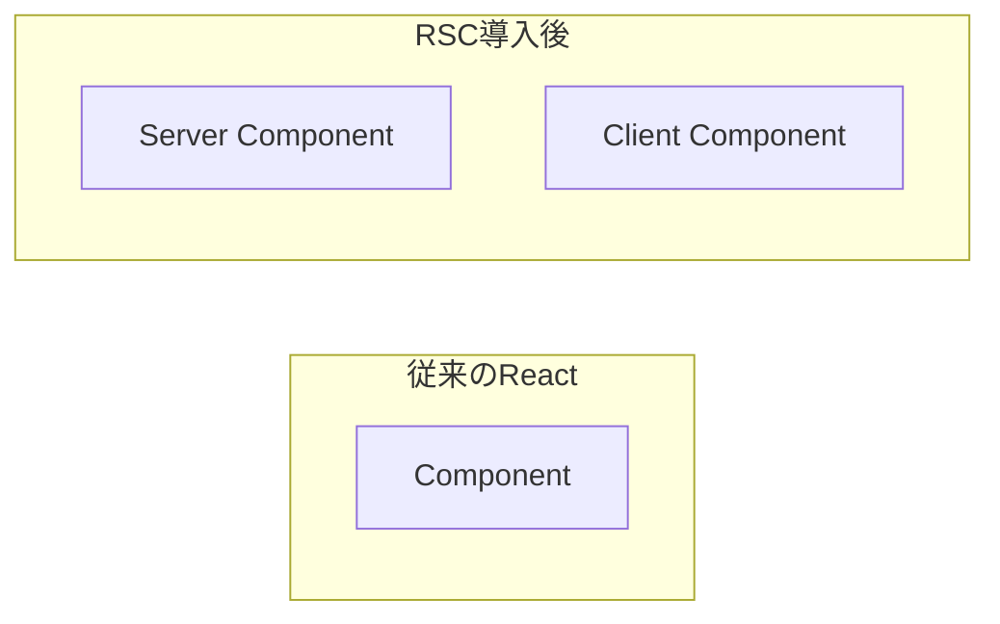
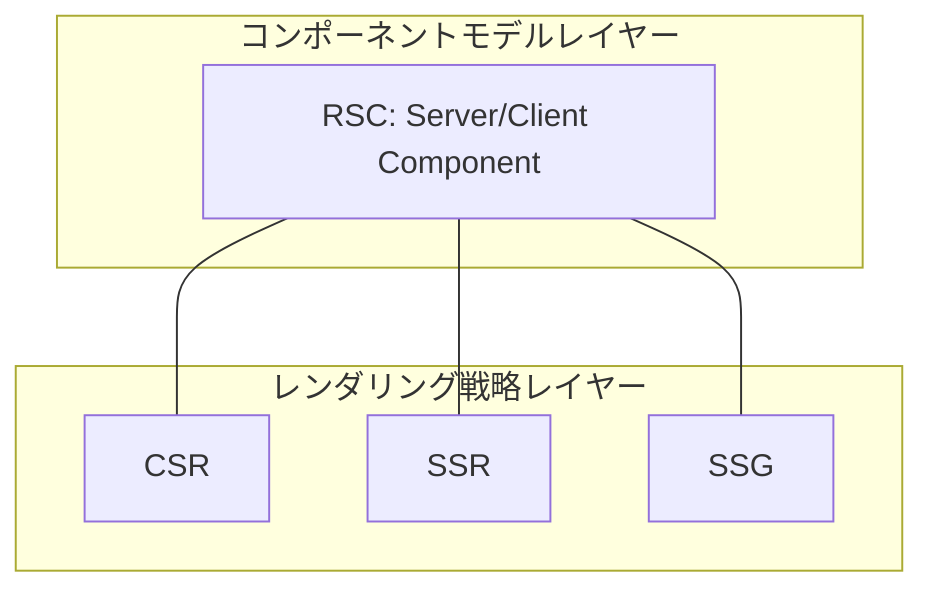
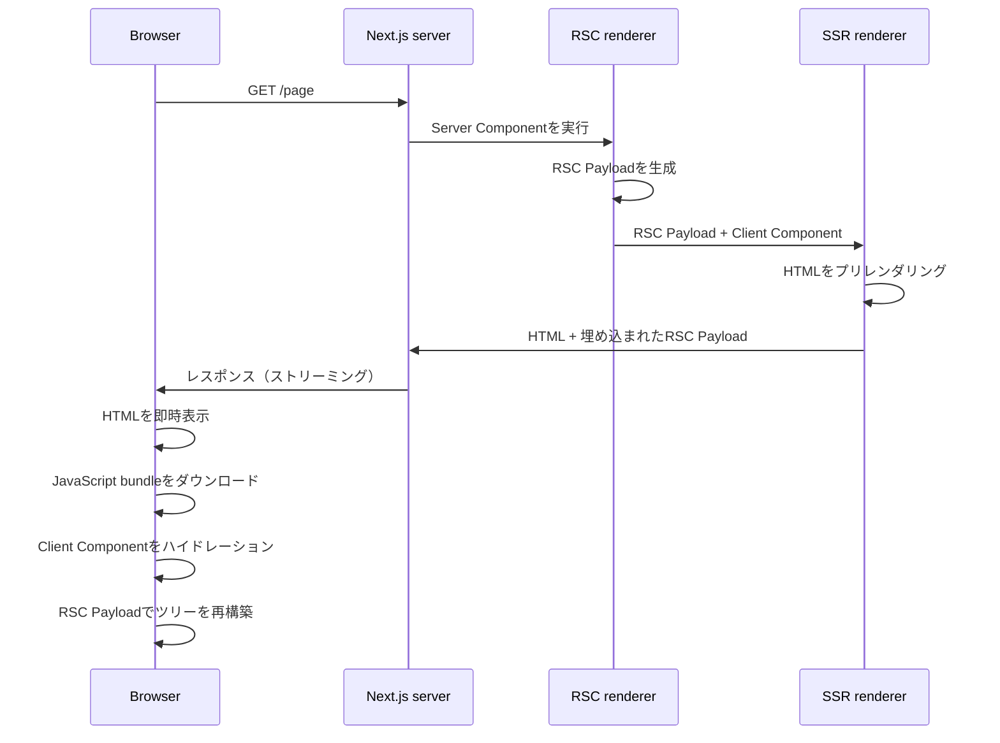
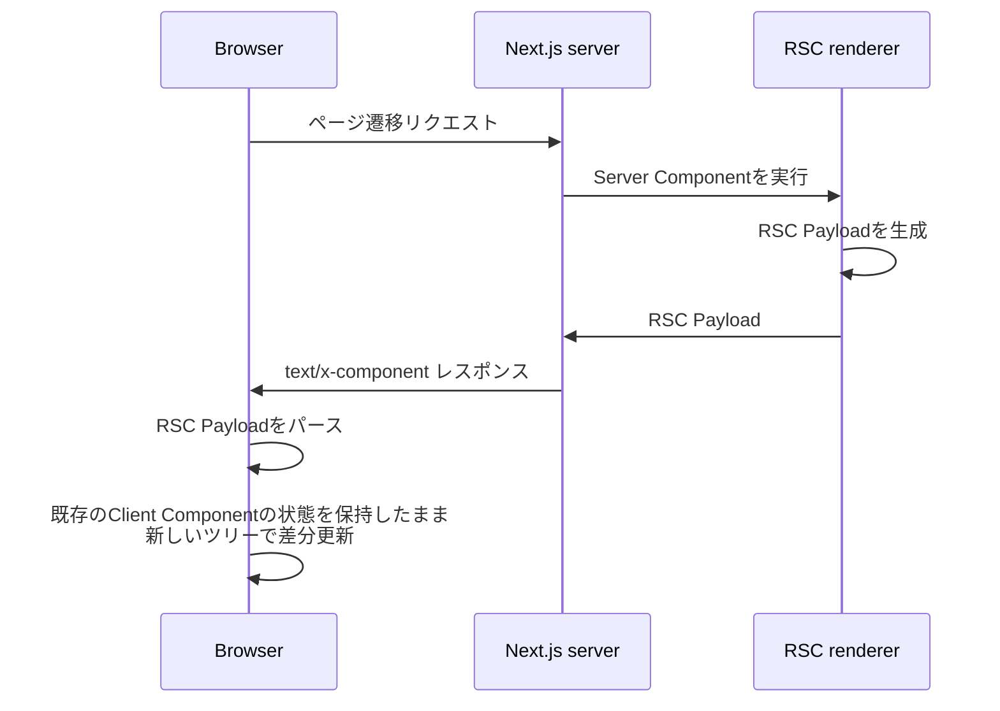
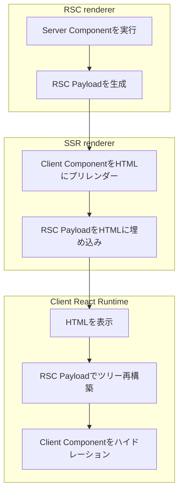
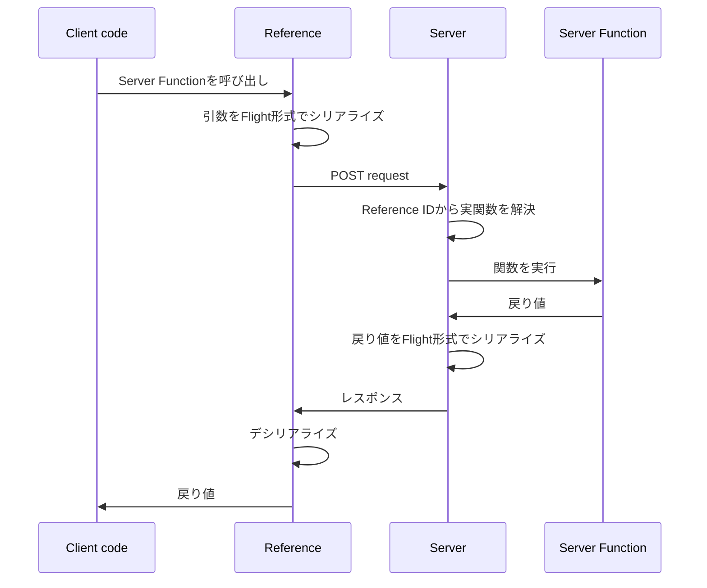

## はじめに

React Server Components（以下RSC）は、React 19で安定版となった新しいコンポーネントモデルです。

本記事の目的は次の2点です。

1. RSCがReact architecture上どこに位置するかを明らかにする
2. サーバーとクライアントの間で実際にやり取りされるFlight Protocolの構造を仕様レベルで把握する

対象読者はReactの基本（コンポーネント、props、フック）を理解しているが、RSCには未着手の開発者を想定しています。フレームワーク非依存の仕様を中心に扱い、具体例としてNext.js App Routerを参照します。

## 1. RSCとは何か

### 1.1 定義

> Server Components are a new type of Component that renders ahead of time, before bundling, in an environment separate from your client app or SSR server.
>
> — [react.dev: Server Components](https://react.dev/reference/rsc/server-components)

訳：Server Componentsは、クライアントアプリやSSR serverとは別の環境で、バンドル前にレンダリングされる新しい種類のコンポーネントです。

ここで重要なのは「クライアントアプリやSSR serverとは別の環境」という記述です。RSCはCSR/SSR/SSGのいずれとも独立した実行環境を持ちます。

### 1.2 「コンポーネントの種類」という新しい軸

従来のReactにおいて、コンポーネントは単一の種類しか存在しませんでした。RSCは「サーバーで実行されるコンポーネント」と「クライアントで実行されるコンポーネント」という分類を導入します。



### 1.3 CSR/SSR/SSGとの関係

ここで誤解されやすいのは、RSCがCSR/SSR/SSGと「並列の選択肢」だと捉えてしまう構図です。実際には、これらは異なるレイヤーに属する概念です。

| レイヤー             | 軸                               | 選択肢                              |
| -------------------- | -------------------------------- | ----------------------------------- |
| コンポーネントの種類 | どこで実行されるコンポーネントか | Server Component / Client Component |
| レンダリング戦略     | 初回HTMLをいつ・どこで生成するか | CSR / SSR / SSG / ISR               |

この2軸は直交しており、組み合わせは自由です。RSCはSSRなしでも、SSGと組み合わせても動作します。Next.js App RouterはRSCとSSRの両方を組み合わせた構成を採用しています。



### 1.4 RSCが解決しようとする問題

RSC導入によって、以下が実現可能になります。

- クライアントにJavaScriptとして送る必要のないコードを、サーバー実行のみに留められる
- データ取得をコンポーネントに統合でき、`useEffect`内でのfetchやクライアントサーバー間のウォーターフォールを避けられる
- 環境変数やデータベース接続など、本来クライアントに渡すべきでない値をサーバー側に閉じ込められる

## 2. Server ComponentとClient Component

### 2.1 2種類のコンポーネントの違い

両者の違いを整理します。

| 項目                                           | Server Component                       | Client Component                       |
| ---------------------------------------------- | -------------------------------------- | -------------------------------------- |
| 実行環境                                       | サーバー（ビルド時またはリクエスト時） | ブラウザ                               |
| クライアントへの送信                           | レンダリング結果のみ送信される         | ソースコードがバンドルされて送信される |
| `useState` / `useEffect`                       | 使用不可                               | 使用可                                 |
| イベントハンドラー（`onClick`等）              | 使用不可                               | 使用可                                 |
| `async`/`await`                                | 使用可                                 | `use` API経由で利用可                  |
| データベース・ファイルシステムへの直接アクセス | 可                                     | 不可                                   |
| RSCの規定上のデフォルト                        | デフォルト                             | `"use client"`の指定が必要             |

Server Componentがクライアントに送信されない点が最も重要な相違です。クライアントはServer Componentの定義（関数本体）を知らず、レンダリング結果のみを受け取ります。

### 2.2 `"use client"`ディレクティブの仕様

`"use client"`はファイルの先頭に記述するディレクティブです。

> Add 'use client' at the top of a file to mark the module and its transitive dependencies as client code.
>
> — [react.dev: 'use client'](https://react.dev/reference/rsc/use-client)

訳：ファイルの先頭に `'use client'` を追加することで、そのモジュールおよび推移的な依存関係をクライアントコードとしてマークします。

ここで誤解されやすい点が2つあります。

**誤解1：`"use client"`は「クライアント実行」の宣言ではない**

正確には、`"use client"`は**サーバー側モジュールグラフとクライアント側モジュールグラフの境界を宣言する**ものです。`"use client"`を付けたモジュール自体は、初回ロード時にはサーバーでもSSRされうるものです（後述の3章を参照）。

**誤解2：Server Componentに対応するディレクティブは存在しない**

> A common misunderstanding is that Server Components are denoted by "use server", but there is no directive for Server Components. The "use server" directive is used for Server Functions.
>
> — [react.dev: Server Components](https://react.dev/reference/rsc/server-components)

訳：Server Componentsが `"use server"` で示されるという誤解がありますが、Server Componentsに対するディレクティブは存在しません。`"use server"`はServer Functionsのためのディレクティブです。

つまり「ディレクティブが付いていないコンポーネント = Server Component」がデフォルトであり、明示する手段は提供されていません。

### 2.3 シリアライズ可能なpropsの制約

Server ComponentからClient Componentに渡されるpropsは、Wire Formatでシリアライズ可能な値に限られます。許容型は以下の通りです。

- プリミティブ：string、number、bigint、boolean、undefined、null、グローバルレジストリに登録されたsymbol（`Symbol.for`で作成したもの）
- 反復可能オブジェクト：String、Array、Map、Set、TypedArray、ArrayBuffer
- Date
- プレーンオブジェクト（シリアライズ可能なプロパティを持つもの）
- Server Functionである関数
- Client / Server ComponentのJSX要素
- Promise

許容されないものは以下です。

- Server Function以外の通常の関数
- クラスとそのインスタンス
- グローバルレジストリに登録されていないsymbol（例：`Symbol('my new symbol')`）

## 3. Next.jsから見るRSCの全体フロー

ここではNext.js App Routerを例に、ブラウザからリクエストが送られてレスポンスが返るまでのフローを追います。

### 3.1 サーバー側の処理

> On the server, Next.js uses React's APIs to orchestrate rendering. The rendering work is split into chunks, by individual route segments (layouts and pages):
>
> - Server Components are rendered into a special data format called the React Server Component Payload (RSC Payload).
> - Client Components and the RSC Payload are used to prerender HTML.
>
> — [nextjs.org: Server and Client Components](https://nextjs.org/docs/app/getting-started/server-and-client-components)

訳：サーバー上で、Next.jsはReactのAPIを使ってレンダリングを統括します。レンダリング処理はルートセグメント（レイアウトとページ）ごとにchunkに分割されます。

- Server ComponentはReact Server Component Payload（RSC Payload）と呼ばれる特別なデータ形式にレンダリングされます。
- Client ComponentとRSC PayloadはHTMLのプリレンダリングに使用されます。

つまりNext.jsでは、サーバー側で以下の2段階のレンダリングが行われます。

1. RSC rendering：Server Componentを実行し、RSC Payload（Flight形式）を生成する
2. SSR rendering：RSC PayloadとClient Componentを用いてHTMLをプリレンダリングする

### 3.2 RSC PayloadとHTMLの役割

RSC Payloadは以下を含みます。

- Server Componentのレンダリング結果
- Client Componentが配置されるべき位置のプレースホルダーと、対応するJavaScript fileへの参照
- Server ComponentからClient Componentに渡されるprops

HTMLはユーザーに対する即時表示のために生成され、RSC Payloadはクライアント側でServer ComponentとClient Componentのツリーを再構築するために使用されます。

### 3.3 初回ロードのフロー



クライアント側では次の処理が順に行われます。

1. HTMLによって即座にルートの非インタラクティブなプレビューを表示する
2. RSC PayloadによってClient ComponentとServer Componentのツリーを照合する
3. JavaScriptによってClient Componentをハイドレーションし、インタラクティブにする

### 3.4 後続のナビゲーション

ページ遷移時には、HTMLは再生成されず、RSC Payloadのみが取得されます。

> On subsequent navigations:
>
> - The RSC Payload is prefetched and cached for instant navigation.
> - Client Components are rendered entirely on the client, without the server-rendered HTML.
>
> — [nextjs.org: Server and Client Components](https://nextjs.org/docs/app/getting-started/server-and-client-components)

訳：後続のナビゲーションでは、

- RSC Payloadはプリフェッチされキャッシュされるため、即座にナビゲーションが行われます。
- Client Componentは、サーバーでレンダリングされたHTMLを使わず、完全にクライアント側でレンダリングされます。



図中の `text/x-component` は、レスポンスボディがFlight Protocol（4章で詳述）のストリームであることをHTTPレベルで示すMIMEタイプです。IANAに正式登録されたものではなく、`x-` プレフィックスが示す通り非標準のカスタムMIMEタイプで、Reactチームが定義したものです。本記事ではこのほか、5章のServer Functionsでもリクエストとレスポンスの両方で同じMIMEタイプが用いられます。

この設計により、ページ遷移時にClient Componentの状態（フォーム入力、スクロール位置など）が保持されます。SSRのみの構成（従来のSPA以外のページ遷移）と比較した際の構造的な差異となります。

### 3.5 RSCとSSRの担当範囲

3層を整理すると次のようになります。



両者の役割を整理すると次のようになります。

- **SSR rendererが出力するもの**：HTML。ブラウザがそのまま描画できる形式。
- **RSC rendererが出力するもの**：RSC Payload。コンポーネントツリーの構造（タグ名・props・子要素の入れ子関係・Client Componentへの参照など）を独自フォーマットでエンコードしたテキストデータ。HTMLではなく、ブラウザにそのまま描画できない。

つまりRSC rendererは「HTMLを作るのではなく、コンポーネントツリーをネットワーク越しに送れる形に変換する」ためのレンダラーです。実際にユーザーが目にするHTMLは、別のレンダラーであるSSR rendererが、このRSC PayloadとClient Componentから生成します。両者は独立したReactのレンダラー実装で、出力形式と役割が異なります（RSC Payloadの具体的な中身は4章で詳しく扱います）。

## 4. Flight Protocol（Wire Format）の構造

ここからは、Server ComponentからクライアントへFlightで送られるペイロードの構造を仕様レベルで解説します。Flight Protocolは「RSC Payload」「RSC Wire Format」とも呼ばれます。

### 4.1 全体構造：行ベースのchunk stream

Flight Protocolは改行で区切られた行（chunk）の連なりです。各行は次の形式を持ちます。

```
<chunk ID(16進数)>:<オプションのタグ><JSONとしてシリアライズされたペイロード>
```

たとえば次のJSON objectを考えます。

```json
{ "name": "Alice", "age": 20 }
```

これは次のように1つのchunkにシリアライズされます。

```
0:{"name":"Alice","age":20}
```

上の例のようにタグがなく、`:` の直後がそのままJSONで始まるchunkを「model chunk」と呼びます。これがFlight Protocolで最も基本的な形式です。

### 4.2 chunk間の参照：`$`プレフィックス

chunkは他のchunkを参照できます。参照は文字列値として `$<chunk ID>` の形式で表現されます。

```
0:["$1",{"name":"Pop","age":23},"$1","$2"]
1:{"name":"Alice","age":22}
2:{"name":"John","age":25}
```

chunk 0の`"$1"`は「chunk 1の値」を意味します。これにより、循環参照や共有参照を表現できます。

### 4.3 React要素の表現

React要素は次の配列形式でシリアライズされます。

```
["$", type, key, props]
```

先頭の `"$"` は `REACT_ELEMENT_TYPE`（React要素の`$$typeof`）を表します。次の例で確認します。

```jsx
<div className="app">
  <h1>Title</h1>
  <p>Body</p>
</div>
```

これは次のようにシリアライズされます。

```
0:["$","div",null,{"className":"app","children":[["$","h1",null,{"children":"Title"}],["$","p",null,{"children":"Body"}]]}]
```

`type`はHTMLのタグ名の場合は文字列で、Client Componentの場合は後述の参照形式で表現されます。

### 4.4 Client Componentの参照：`I`タグと`$L`プレフィックス

Client Componentはサーバーで実行されません。代わりに、クライアント側のモジュールを指す参照がシリアライズされます。このときに使われるのが`I`タグ（Import chunk）です。

次のコードを考えます。

```jsx
// Counter.js
"use client";
export function Counter() {
  const [count, setCount] = useState(0);
  return <button onClick={() => setCount((c) => c + 1)}>{count}</button>;
}

// Page.js（Server Component）
import { Counter } from "./Counter";
export function Page() {
  return (
    <div>
      <h1>My Page</h1>
      <Counter />
    </div>
  );
}
```

`<Page />`をシリアライズすると次のようになります。

```
1:I{"id":"./src/Counter.js","chunks":["chunk-abc"],"name":"Counter"}
0:["$","div",null,{"children":[["$","h1",null,{"children":"My Page"}],["$","$L1",null,{}]]}]
```

各行を解読すると以下の通りです。

| chunk | 内容                                                                                 |
| ----- | ------------------------------------------------------------------------------------ |
| 1     | `I`タグ：Import chunk。Counter moduleのid、ロードすべきchunk名、エクスポート名を含む |
| 0     | React要素ツリー。`<Counter />` の位置は `"$L1"` として表現されている                 |

`$L`プレフィックスは「`React.lazy()`でラップして遅延ロードする参照」を意味します。これによりブラウザはchunk 1で示されたモジュールを取得し、ロード完了までSuspense fallbackを表示できます。

なお、Client Componentが「React要素のtype」ではなく「propsの値」として渡される場合は `$L` ではなく `$` のみが使われます。

```
React要素のtypeとして使用 → "$L1"（lazy参照）
propsの値として使用 → "$1"（直接参照）
```

### 4.5 JavaScript primitiveの表現

JSONで表現できない型は、`$`プレフィックスとそれに続く識別文字でエンコードされます。

| 元の値            | エンコード                            |
| ----------------- | ------------------------------------- |
| `undefined`       | `"$undefined"`                        |
| `Infinity`        | `"$Infinity"`                         |
| `-Infinity`       | `"$-Infinity"`                        |
| `NaN`             | `"$NaN"`                              |
| `-0`              | `"$-0"`                               |
| `Date`            | `"$D<ISO文字列>"`                     |
| `BigInt`          | `"$n<数字>"`                          |
| `Symbol.for('x')` | `"$Sx"`                               |
| `Map`             | 別のchunkに展開して `"$Q<id>"` で参照 |
| `Set`             | 別のchunkに展開して `"$W<id>"` で参照 |
| `Promise`         | `"$@<id>"`（後述）                    |

文字列がリテラルで `$` から始まる場合は、`$` を二重化してエスケープします。たとえば `"$100"` は `"$$100"` としてシリアライズされます。

### 4.6 Promiseとストリーミング：`$L` と `$@` プレフィックス

Server Componentが`async`関数として定義されている場合や、PromiseをpropsとしてClient Componentに渡す場合、Flight Protocolは**Promiseを参照として先に送り、解決後に追加のchunkで値を補完する**仕組みを持っています。これによりサーバーはPromiseの解決を待たずにストリーミングを開始できます。

このPromise参照には2種類のプレフィックスがあり、解決値の種類によって使い分けられます。

| プレフィックス | 解決後の値                                                | クライアントでの扱い                                        |
| -------------- | --------------------------------------------------------- | ----------------------------------------------------------- |
| `$L<id>`       | React要素（コンポーネント・JSX）                          | `React.lazy()`相当でラップされ、Suspense fallback経由で描画 |
| `$@<id>`       | React要素以外の値（文字列、数値、配列、オブジェクトなど） | 通常のPromiseオブジェクトとして復元                         |

両者は「未解決のPromiseを先送りする」という同じ目的を持ちますが、クライアント側の処理が異なるため別マーカーになっています。

#### `$L`：React要素を解決するケース

次のコードを考えます。

```jsx
async function SlowData() {
  const data = await fetch("/api/slow");
  return <p>{data}</p>;
}

function Page() {
  return (
    <div>
      <h1>Fast Header</h1>
      <Suspense fallback={<p>Loading...</p>}>
        <SlowData />
      </Suspense>
    </div>
  );
}
```

サーバーは`SlowData`の完了を待たずにストリーミングを開始します。最初に送られるchunkは次のようになります。

```
0:["$","div",null,{"children":[["$","h1",null,{"children":"Fast Header"}],["$","$Sreact.suspense",null,{"fallback":["$","p",null,{"children":"Loading..."}],"children":"$L1"}]]}]
```

この時点でchunk 1はまだ解決していません。クライアントは`div`と`h1`を即座にレンダーし、Suspense fallbackを表示します。`fetch`が完了すると、サーバーは続けて次を送ります。

```
1:["$","p",null,{"children":"fetched data here"}]
```

chunk 1の解決値はReact要素（`<p>`）なので、`$L1`はReact要素として扱われ、Suspense fallbackが実コンテンツに置き換えられます。

#### `$@`：React要素以外の値を解決するケース

Server ComponentからClient ComponentへPromiseをpropsとして渡すようなケースでは、解決値はReact要素ではなくデータです。このようなReact要素以外のPromiseは`$@`で表現されます。

```jsx
async function Page() {
  // awaitせずPromiseのままClient Componentに渡す
  const commentsPromise = db.comments.getAll();
  return <Comments commentsPromise={commentsPromise} />;
}
```

サーバーはPromiseの解決を待たず、最初に次のchunkを送ります。

```
0:{"fast":"hello","slow":"$@1"}
```

`fast`は即値、`slow`はchunk 1で後から解決されるPromise参照です。この時点でクライアントは`$@1`を**未解決のPromiseオブジェクト**として復元します。Client Component側で`use(commentsPromise)`や`await`がこのPromiseを待機している場合、Suspense境界がフォールバックを表示します。

Promiseが解決すると、サーバーは続けて次のchunkを送ります。

```
1:"resolved after 2 seconds"
```

chunk 1が解決値を運んできたことで、クライアント側のPromiseが解決状態になり、待機していたClient Componentが再レンダーされます。

### 4.7 Hint chunk：`:H`

リソースのプリロードを指示するHint chunkは、他のchunkと異なりIDを持ちません。

```
:HL["https://cdn.example.com/style.css","style"]
```

`H` の後に続く文字（上記では `L`）がヒントの種類を示すコードで、続くJSON配列の中身がコードごとに決まります。主要なコードは以下の通りです。

| コード | 種類                  | 対応する `react-dom` API    |
| ------ | --------------------- | --------------------------- |
| `D`    | dns-prefetch          | `prefetchDNS`               |
| `C`    | preconnect            | `preconnect`                |
| `L`    | preload               | `preload`                   |
| `M`    | preloadModule         | `preloadModule`             |
| `S`    | preinit（stylesheet） | `preinit`（`as: 'style'`）  |
| `X`    | preinit（script）     | `preinit`（`as: 'script'`） |
| `m`    | preinitModule         | `preinitModule`             |

Hint chunkにより、ブラウザはCSSやフォント、JavaScriptモジュールなどをページ描画より前に取得開始できます。

### 4.8 error chunk：`E`タグ

レンダリング中にエラーが発生した場合、サーバーは`E`タグのchunkを送ります。

```
0:E{"digest":"NOT_FOUND","message":"page not found"}
```

開発モードでは、`name`、`stack`、`env`などの追加情報が含まれます。

### 4.9 chunkの送信順序

サーバーはchunkを優先度に基づいて並べて送出します。

1. Hint chunk（`:H...`）：ブラウザのリソース取得を最優先で開始させる
2. Import chunk（`I`タグ）：Client ComponentのJavaScriptのロードを開始させる
3. 通常のmodel chunk：実データ
4. error chunk

この順序により、クライアントがモデルデータのパースを開始する時点で、参照先のリソースとモジュールのダウンロードが既に進行している状態を作り出します。

### 4.10 行フォーマットの分類：テキスト行とバイナリ行

Flight Protocolにはテキスト行とバイナリ行の2種類が存在します。

**テキスト行**（改行で終端）：

```
<16進ID>:<タグ><JSON>\n
```

**バイナリ行**（バイト長で終端）：

```
<16進ID>:<タグ><16進長>,<生バイト>
```

バイナリ行のタグには `T`（長い文字列）、`A`（ArrayBuffer）、`o`（Uint8Array）、`O`（Int8Array）、`g`（Float64Array）などがあります。バイナリ行を導入することで、TypedArrayや1KBを超える長い文字列をJSON文字列より効率的に転送できます。

### 4.11 まとめ：Flight Protocolの設計上の特徴

Flight Protocolを単純なJSONではなく独自フォーマットとした設計理由は、これまでに見てきた要素から次のように整理できます。

- **chunk間の参照**：同一値の重複排除と循環構造の表現
- **モジュール参照（`I`タグ）**：クライアントで実行されるコードを文字列名で指し示し、後からバンドラーが実装と結合する
- **Promise表現（`$@`、`$L`）**：未解決の値を先に送り、解決後に追加のchunkで補完するストリーミング

これらはいずれも、コンポーネントツリーをストリーミング可能な形でシリアライズするための要件から導かれています。

## 5. Server Functions：クライアントからサーバーへのFlight

Flight Protocolはサーバーからクライアントへの一方向だけでなく、クライアントからサーバーへの方向にも用いられます。それがServer Functions（Next.jsではServer Actionsとも呼ばれます）の実装です。

### 5.1 `"use server"`ディレクティブ

> Add 'use server' at the top of an async function body to mark the function as callable by the client. We call these functions Server Functions.
>
> — [react.dev: 'use server'](https://react.dev/reference/rsc/use-server)

訳：async関数の本体先頭に `'use server'` を追加することで、その関数をクライアントから呼び出し可能としてマークします。これらの関数をServer Functionsと呼びます。

`"use server"`は2章で扱った`"use client"`と対になる概念ですが、対象が異なります。`"use client"`が**モジュール境界**の宣言だったのに対し、`"use server"`は**関数（または関数群）がクライアントから呼び出し可能なエンドポイント**であることの宣言です。

`"use server"`には以下の制約があります。

- `'use server'`は関数またはモジュールの先頭に置く（importよりも前）
- `'use server'`はサーバー側のファイルでのみ使用できる
- ネットワーク呼び出しが非同期であるため、`'use server'`はasync関数にのみ適用できる
- Server Functionへの引数は常にクライアント由来のため、信頼できない入力として扱う
- Server Functionは原則として「mutations（サーバー側状態の更新）」のために設計されており、データフェッチ用途には推奨されない

### 5.2 仕組み：Server Reference

`"use server"`を付けた関数は、ビルド時にServer Referenceとしてマークされます。クライアントコードがこの関数をimportしたとき、実際の関数本体ではなく「サーバー上のエンドポイントを指す参照」がバンドルされます。

クライアントから呼び出された際、内部的にHTTP requestが発行され、Flight Protocolでシリアライズされた引数がサーバーに送られます。サーバーは指定された関数を実行し、戻り値（こちらもFlight形式）をレスポンスとして返します。



### 5.3 引数と戻り値のシリアライズ制約

Server Functionの引数と戻り値はFlight Protocolでシリアライズできる必要があります。許容される型は2.3節で示したprops制約と概ね同じですが、Server Function特有のものとして`FormData`インスタンスが追加されています（フォーム経由の呼び出しに対応するためです）。

許容されないものは以下です。

- React要素（JSX）
- Server Function以外の通常の関数
- クラスインスタンス
- イベントハンドラーから受け取ったイベントオブジェクト

### 5.4 呼び出し方1：フォーム経由

最も一般的な呼び出し方は、HTMLの`<form>`要素の`action`プロパティに直接Server Functionを渡す方法です。

```jsx
// App.js
async function requestUsername(formData) {
  "use server";
  const username = formData.get("username");
  // ...
}

export default function App() {
  return (
    <form action={requestUsername}>
      <input type="text" name="username" />
      <button type="submit">Request</button>
    </form>
  );
}
```

フォーム経由でServer Functionを呼ぶ場合、Reactは`FormData`を第1引数として渡します。また、フォーム送信はJavaScript bundleのロード前にも動作します（プログレッシブエンハンスメント）。

このとき発行されるリクエストは、概ね次のような形式になります（具体的なエンドポイントパスや内部パラメータはフレームワーク実装に依存します）。

```
POST /<現在のパス> HTTP/1.1
Content-Type: multipart/form-data; boundary=----...
Accept: text/x-component
Next-Action: <Server FunctionのReference ID>

------...
Content-Disposition: form-data; name="username"

alice
------...
```

注目すべき点は以下です。

- `Content-Type`は`multipart/form-data`：通常のフォーム送信と同じ
- 別途ヘッダー（Next.jsの場合 `Next-Action`）でServer FunctionのReference IDが渡される
- レスポンスの`Content-Type`は`text/x-component`：Flight Protocolを示す

### 5.5 呼び出し方2：関数呼び出し経由

`<form>`を介さず、Client Componentから直接Server Functionを呼ぶこともできます。この場合は`useTransition`内で呼び出すことが推奨されます（フォーム経由の場合はReactが自動的にTransitionでラップします）。

```jsx
"use client";
import incrementLike from "./actions";
import { useState, useTransition } from "react";

function LikeButton() {
  const [isPending, startTransition] = useTransition();
  const [likeCount, setLikeCount] = useState(0);

  const onClick = () => {
    startTransition(async () => {
      const currentCount = await incrementLike();
      setLikeCount(currentCount);
    });
  };

  return (
    <button onClick={onClick} disabled={isPending}>
      Like
    </button>
  );
}
```

```js
// actions.js
"use server";
let likeCount = 0;
export default async function incrementLike() {
  likeCount++;
  return likeCount;
}
```

関数呼び出し経由の場合、引数はFlight形式でシリアライズされてリクエストボディに含まれます。Next.jsの実装では、リクエストは概ね次のような形式になります。

```
POST /<現在のパス> HTTP/1.1
Content-Type: text/plain;charset=UTF-8
Accept: text/x-component
Next-Action: <Server FunctionのReference ID>

[]
```

リクエストボディはFlight形式でシリアライズされた引数の配列です。引数なしの場合は `[]` となります。複数引数を持つ場合、各引数はFlightの参照機構を使って表現されます。

### 5.6 セキュリティ上の留意点

> Arguments to Server Functions are fully client-controlled. For security, always treat them as untrusted input, and make sure to validate and escape arguments as appropriate.
>
> — [react.dev: 'use server'](https://react.dev/reference/rsc/use-server)

訳：Server Functionへの引数は完全にクライアントの制御下にあります。セキュリティ上、常に信頼できない入力として扱い、検証とエスケープを適切に行う必要があります。

これは通常のAPI endpointと同じ扱いが必要であることを意味します。Server Functionが「サーバー側コードと同じファイルに書ける」という外観から、内部関数呼び出しと同列に扱う誤解が生じやすい点です。

## 6. まとめ

本記事では、React Server Componentsを以下の観点から整理しました。

- RSCはCSR/SSR/SSGとは異なるレイヤーに属する「コンポーネントの種類」を導入する仕様である
- `"use client"`はモジュールグラフ上のクライアント境界を宣言するディレクティブであり、Server Componentに対応するディレクティブは存在しない
- Next.js App RouterではRSC rendererとSSR rendererの2層を組み合わせ、初回ロードではHTMLとRSC Payloadの両方を、ページ遷移時にはRSC Payloadのみをクライアントに送信する
- Flight Protocolは行ベースのchunk streamであり、JSONでは表現できないモジュール参照、Promise、共有参照、バイナリデータを独自のタグとプレフィックスで表現する
- Server Functions（`"use server"`）はFlight Protocolをクライアント→サーバー方向にも使うことで、関数呼び出しのインターフェースをHTTP requestにマッピングする仕組みである

### 公式ドキュメント

- [React: Server Components](https://react.dev/reference/rsc/server-components)
- [React: Server Functions](https://react.dev/reference/rsc/server-functions)
- [React: Directives](https://react.dev/reference/rsc/directives)
- [React: `'use client'`](https://react.dev/reference/rsc/use-client)
- [React: `'use server'`](https://react.dev/reference/rsc/use-server)
- [Next.js: Server and Client Components](https://nextjs.org/docs/app/getting-started/server-and-client-components)
- [React RFC: React Server Components (RFC #188)](https://github.com/reactjs/rfcs/blob/main/text/0188-server-components.md)
- [React RFC: Server Module Conventions (RFC #227)](https://github.com/reactjs/rfcs/blob/main/text/0227-server-module-conventions.md)

### 実装リポジトリ

- [facebook/react: react-server-dom-webpack](https://github.com/facebook/react/tree/main/packages/react-server-dom-webpack)
- [facebook/react: react-server](https://github.com/facebook/react/tree/main/packages/react-server)

### 補助的な技術解説

Flight Protocolの仕様詳細を確認する際は以下が有用です。

- [Flight Protocol Syntax (React on Rails)](https://reactonrails.com/docs/pro/react-server-components/flight-protocol-syntax) — Flight Protocolの全タグと記法を網羅
- [Understanding React Server Components (Vercel)](https://vercel.com/blog/understanding-react-server-components)
- [How React server components work (Plasmic)](https://www.plasmic.app/blog/how-react-server-components-work)
