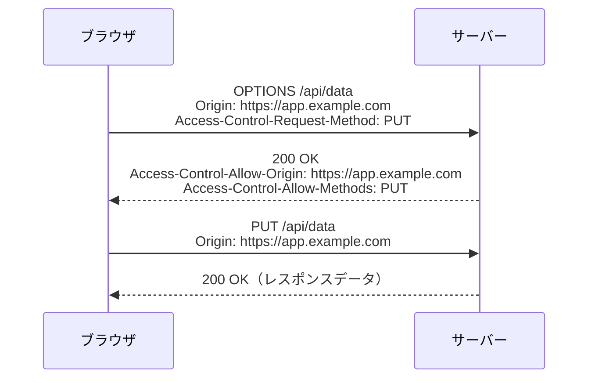
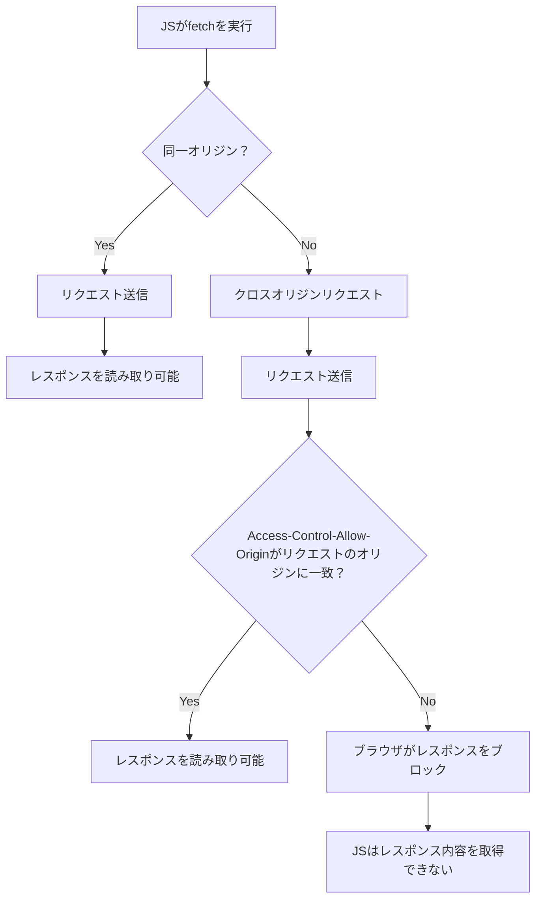
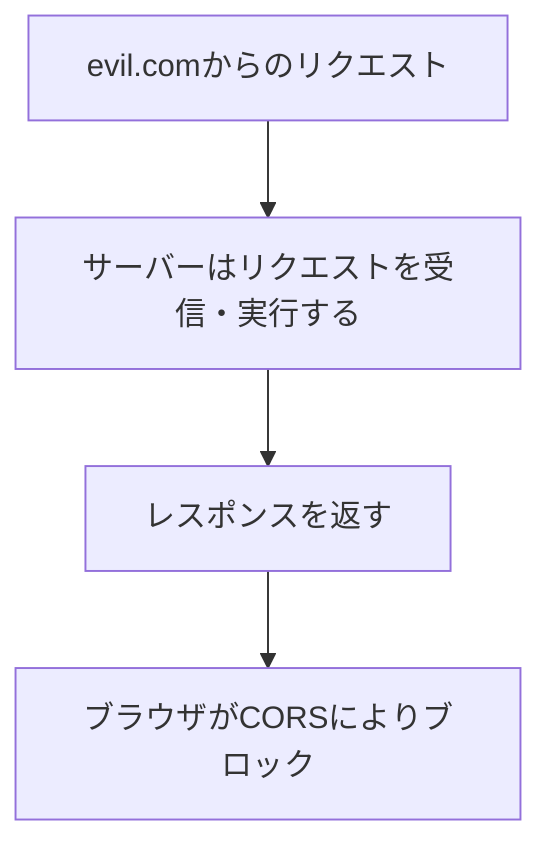
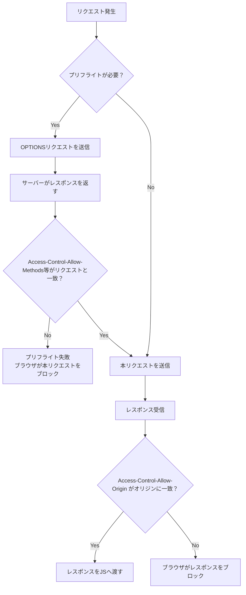
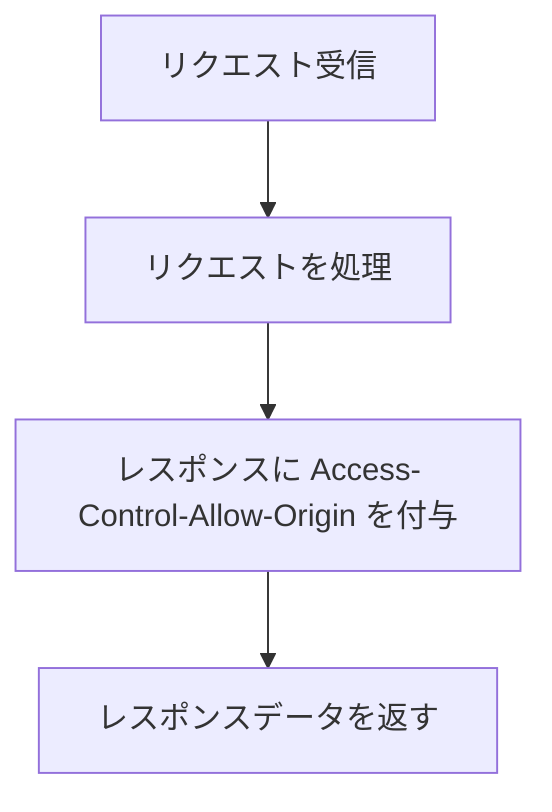
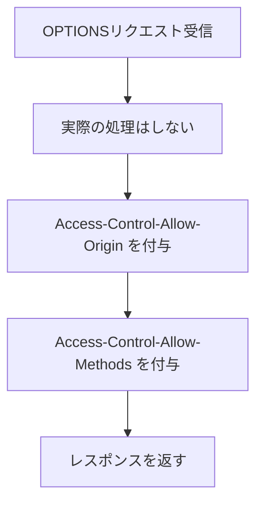
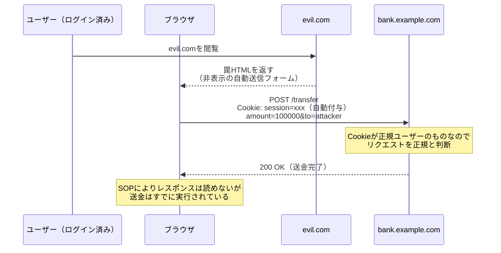
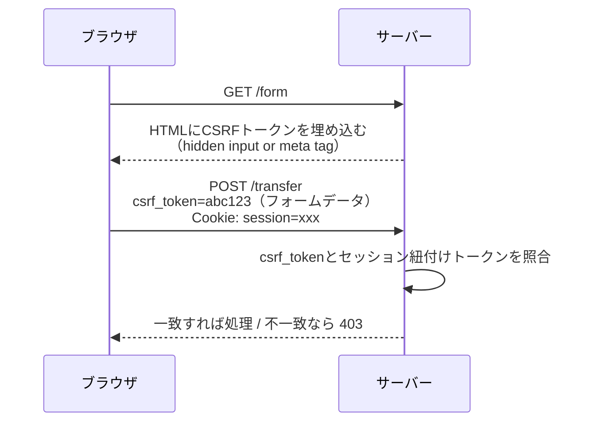
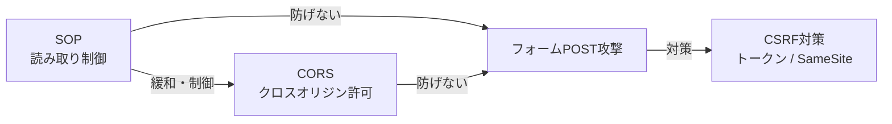

:::message alert
**重要な法的注意事項**

本記事で紹介する技術は、セキュリティ教育および自身が管理するシステムでの脆弱性診断を目的としたものです。**許可なく他者のシステムに対してこれらの技術を使用することは、不正アクセス禁止法等の法律に違反し、刑事罰の対象となります。**

- 必ず事前に書面による許可を得てください
- 自身が所有・管理するシステム、または許可されたテスト環境でのみ使用してください
- 本記事の内容を悪用した場合、筆者は一切の責任を負いません
  :::

## 1. SOP（同一オリジンポリシー）とは

**SOP（Same-Origin Policy）** とは、ブラウザが持つセキュリティ機構で、「あるオリジンから読み込まれたリソースが、別のオリジンのリソースにアクセスすることを制限する」ポリシーです。

### オリジンの定義

オリジンは以下の3要素で構成されます。**すべて一致した場合のみ**同一オリジンと判断されます。

| 要素                   | 例            |
| ---------------------- | ------------- |
| スキーム（プロトコル） | `https`       |
| ホスト（ドメイン）     | `example.com` |
| ポート                 | `443`         |

### オリジン比較の例

基準URL：`https://example.com/page`

| 比較URL                         | 結果           | 理由           |
| ------------------------------- | -------------- | -------------- |
| `https://example.com/other`     | 同一オリジン   | パスのみ異なる |
| `http://example.com/page`       | 異なるオリジン | スキームが違う |
| `https://sub.example.com/page`  | 異なるオリジン | ホストが違う   |
| `https://example.com:8080/page` | 異なるオリジン | ポートが違う   |

## 2. CORS（クロスオリジンリソース共有）とは

**CORS（Cross-Origin Resource Sharing）** は、SOPの制限を安全に緩和するための仕組みです。サーバーが「このオリジンからのアクセスは許可する」とブラウザに伝えることで、クロスオリジンのリクエストを可能にします。

### シンプルリクエストとプリフライトリクエスト

CORSのリクエストは2種類に分類されます。

| 種別                       | 条件                                                                                                                                                                                                               | 動作                                  |
| -------------------------- | ------------------------------------------------------------------------------------------------------------------------------------------------------------------------------------------------------------------ | ------------------------------------- |
| **シンプルリクエスト**     | メソッドが `GET` / `HEAD` / `POST` のいずれか、<br>かつ Content-Type が `application/x-www-form-urlencoded` / `multipart/form-data` / `text/plain` に限定、<br>かつ `Authorization` 等のカスタムヘッダーを含まない | 直接リクエストを送信                  |
| **プリフライトリクエスト** | 上記以外<br>（`PUT` / `DELETE`、`Content-Type: application/json`、カスタムヘッダーなど）                                                                                                                           | 本リクエスト前に `OPTIONS` で事前確認 |

:::message
現代のWebアプリでは `POST` でも `Content-Type: application/json` を使うことがほとんどです。この場合はシンプルリクエストの条件を満たさないため、**POSTではほぼ必ずプリフライトが発生します。**
シンプルリクエストは「HTMLフォームが歴史的にクロスオリジン送信を許可していた」という経緯から定義されており、現代のAPI通信では例外的なケースです。
:::

### プリフライトリクエストから本リクエスト実行までの流れ



## 3. Access-Control-Allow-Origin とは

`Access-Control-Allow-Origin` は、CORSにおけるサーバーからのレスポンスヘッダーで、**どのオリジンからのアクセスを許可するか**をブラウザに伝えます。

### 設定値のパターン

| 設定値                | 意味                         | 用途                   |
| --------------------- | ---------------------------- | ---------------------- |
| `*`                   | すべてのオリジンを許可       | 公開APIなど            |
| `https://example.com` | 特定のオリジンのみ許可       | 自社フロントエンドなど |
| （未設定）            | クロスオリジンアクセスを拒否 | デフォルト動作         |

:::message
`*`（ワイルドカード）は `withCredentials`（Cookie付きリクエスト）と併用できません。認証が必要なAPIでは必ず特定のオリジンを指定してください。
:::

### レスポンスヘッダーの例

```http
# 特定オリジンを許可
Access-Control-Allow-Origin: https://app.example.com

# すべてのオリジンを許可（公開API）
Access-Control-Allow-Origin: *

# 認証情報付きリクエストを許可
Access-Control-Allow-Origin: https://app.example.com
Access-Control-Allow-Credentials: true
```

### 複数オリジンを許可する場合 - サーバー側の実装例

```js
const allowedOrigins = ["https://app.example.com", "https://admin.example.com"];

app.use((req, res, next) => {
  const origin = req.headers.origin;
  if (allowedOrigins.includes(origin)) {
    res.setHeader("Access-Control-Allow-Origin", origin);
  }
  next();
});
```

## 4. SOPの仕様

### ブラウザ視点：クロスオリジンの読み取り制御

ブラウザはSOPに基づき、クロスオリジンレスポンスの**読み取り**を制限します。



**ブラウザが守るもの：**

- 悪意あるサイトによる他サイトのAPIレスポンス盗み取り
- セッション情報・個人データの横断的な読み取り

### サーバー視点：SOPはサーバー側には存在しない

SOPは**ブラウザ固有のセキュリティ機構**です。サーバーはすべてのオリジンからのリクエストを受信します。



:::message alert
SOPはレスポンスの**読み取り**をブロックするだけです。リクエスト自体はサーバーに届いています。プリフライトリクエストが発生していない場合、**サーバー内で処理はすでに実行されています。**
:::

## 5. CORSの仕様

### ブラウザ視点：許可されたクロスオリジン通信の制御



:::message
`Access-Control-Allow-Methods` は、プリフライトリクエストに対するサーバーのレスポンスヘッダーで、**許可するHTTPメソッドをブラウザに伝えます。**
ブラウザはこの値と実際に送信しようとしているメソッドを照合し、一致しない場合は本リクエストを送信しません。

```http
Access-Control-Allow-Methods: GET, POST, PUT, DELETE
```

:::

**ブラウザが保証すること：**

- サーバーが許可していないオリジンへのレスポンスをJSに渡さない
- プリフライト未承認の場合、本リクエスト自体を送信しない

### サーバー視点：レスポンスヘッダーによるアクセス制御

**通常リクエストの場合：**



**プリフライト（OPTIONS）リクエストの場合：**



**サーバーが担う責務：**

- 許可するオリジンをホワイトリストで管理する
- ワイルドカード `*` の安易な使用を避ける
- 認証が必要なAPIでは `Access-Control-Allow-Credentials` を適切に設定する

## 6. SOP/CORSだけではCSRFを防げない

### なぜ防げないのか

SOPとCORSは**レスポンスの読み取り制御**が目的です。**サーバーでの処理実行そのものは防ぎません。**

HTMLフォームによる `POST` リクエストはSOPもCORSも介在せず、ブラウザは Cookie を自動で付与してサーバーへ送信します。

### 攻撃例：フォームを使ったCSRF



**ポイント：**

- `<form>` による `POST` は、ブラウザがクロスオリジン送信をもともと許可しており、CORSの制約を受けない
- ブラウザはCookieを自動付与するため、サーバーは正規ユーザーのリクエストと区別できない
- SOPでレスポンスはブロックされるが、**副作用（送金）はすでに実行済み**

## 7. CSRF対策

### 対策

| 対策                           | 概要                                                    | 効果             |
| ------------------------------ | ------------------------------------------------------- | ---------------- |
| **CSRFトークン**               | サーバーがランダムなトークンを発行、リクエスト時に検証  | 最も確実         |
| **SameSite Cookie**            | `SameSite=Strict` または `Lax` でクロスサイト送信を制御 | シンプルで効果的 |
| **Originヘッダー検証**         | サーバーがリクエストの `Origin` ヘッダーを検証          | 補完的対策       |
| **カスタムリクエストヘッダー** | `X-Requested-With` などのヘッダーを必須化               | 補完的対策       |

### CSRFトークン



evil.com は正規のトークンを取得できないため、リクエストを偽造できません。

### SameSite Cookie

```http
Set-Cookie: session=xxx; SameSite=Strict; Secure; HttpOnly
```

| 値       | 動作                                                                 |
| -------- | -------------------------------------------------------------------- |
| `Strict` | クロスサイトリクエストには一切 Cookie を送信しない                   |
| `Lax`    | GETのトップレベルナビゲーションのみ許可（Chrome 80以降のデフォルト） |
| `None`   | 常に送信（`Secure` 必須）                                            |

### Originヘッダー検証

```js
app.post("/transfer", (req, res) => {
  const origin = req.headers.origin;
  if (origin !== "https://bank.example.com") {
    return res.status(403).json({ error: "Forbidden" });
  }
  // 処理を続ける
});
```

:::message
現代のWebアプリでは **SameSite=Lax 以上のCookie設定** と **CSRFトークン** の組み合わせが推奨されます。
:::

## 8. まとめ

| 技術                | 目的                           | 防げるもの                       | 防げないもの               |
| ------------------- | ------------------------------ | -------------------------------- | -------------------------- |
| **SOP**             | クロスオリジンの読み取り制限   | 他サイトAPIレスポンスの盗み取り  | CSRFによる副作用リクエスト |
| **CORS**            | 安全なクロスオリジン通信の許可 | 未許可オリジンへのレスポンス漏洩 | フォームPOSTによるCSRF     |
| **CSRFトークン**    | リクエストの正当性検証         | フォームを使った偽造リクエスト   | XSSによるトークン窃取      |
| **SameSite Cookie** | クロスサイトCookie送信の制御   | 大半のCSRF攻撃                   | サブドメイン経由の攻撃など |



**参考：**

- [Same-origin policy – MDN Web Docs](https://developer.mozilla.org/en-US/docs/Web/Security/Defenses/Same-origin_policy)
- [Cross-Origin Resource Sharing (CORS) – MDN Web Docs](https://developer.mozilla.org/en-US/docs/Web/HTTP/Guides/CORS)
- [Access-Control-Allow-Origin – MDN Web Docs](https://developer.mozilla.org/en-US/docs/Web/HTTP/Headers/Access-Control-Allow-Origin)
- [Fetch Living Standard – WHATWG](https://fetch.spec.whatwg.org/)
- [Cross-Site Request Forgery Prevention Cheat Sheet – OWASP](https://cheatsheetseries.owasp.org/cheatsheets/Cross-Site_Request_Forgery_Prevention_Cheat_Sheet.html)
- [SameSite cookies explained – web.dev](https://web.dev/articles/samesite-cookies-explained)

:::message
セキュリティは攻撃と防御の両面を理解することで向上します。本記事で学んだ知識を、より安全なシステム構築に活かしてください。
:::
