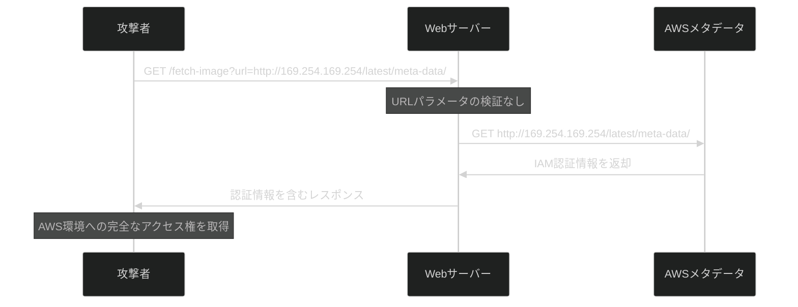
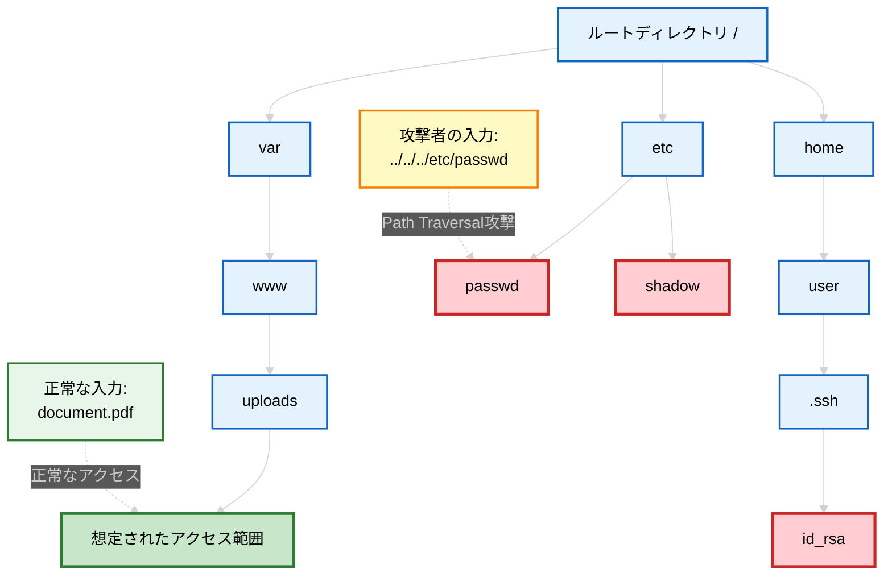
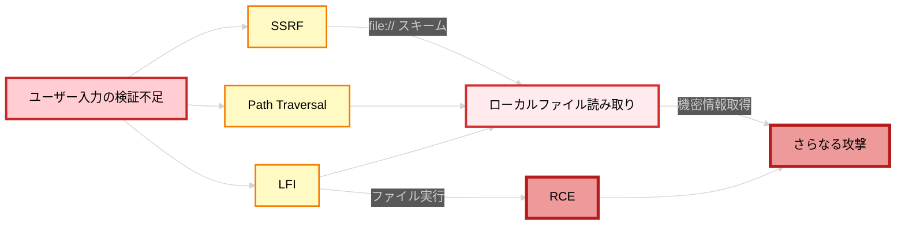
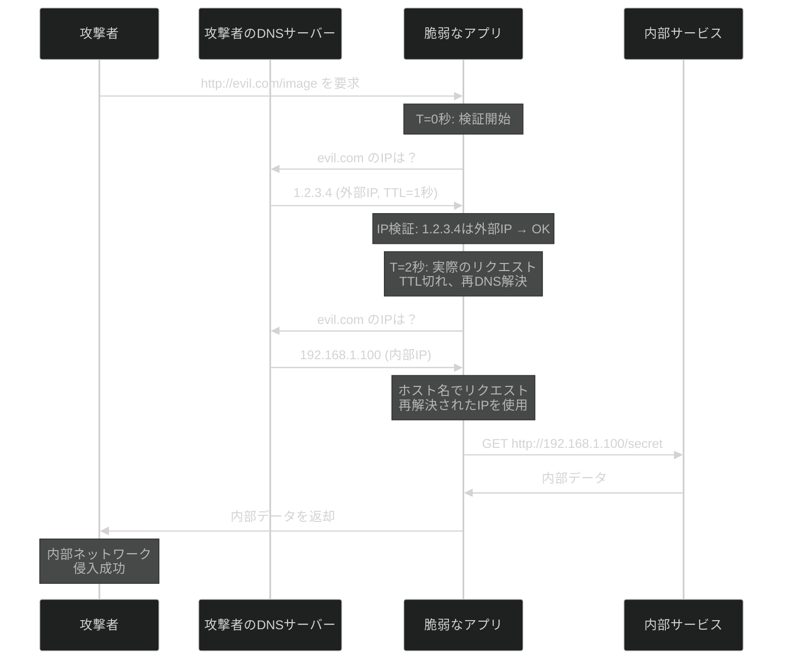

# SSRFとPath traversal

:::message alert
**重要な法的注意事項**

本記事で紹介する技術は、セキュリティ教育および自身が管理するシステムでの脆弱性診断を目的としたものです。**許可なく他者のシステムに対してこれらの技術を使用することは、不正アクセス禁止法等の法律に違反し、刑事罰の対象となります。**

- 必ず事前に書面による許可を得てください
- 自身が所有・管理するシステム、または許可されたテスト環境でのみ使用してください
- 本記事の内容を悪用した場合、筆者は一切の責任を負いません
  :::

## はじめに

Webアプリケーションのセキュリティにおいて、SSRF（Server-Side Request Forgery）とPath Traversal（Directory Traversal）は、どちらも「本来アクセスできないはずのリソースへの不正アクセス」を可能にする重要な脆弱性です。これらは攻撃対象こそ異なりますが、根本的な原因は共通しています。それは、信頼できないユーザー入力を用いてリソースにアクセスする際の検証不足です。

SSRFは主にネットワークリソース（URLベース）への不正アクセスを、Path Traversalはファイルシステム上のリソース（パスベース）への不正アクセスを可能にします。攻撃者の視点から見ると、どちらも入力値を操作することで開発者が想定していないリソースへアクセスするという同じ戦略を使っています。

OWASP Top 10 2021では、SSRFが新たに独立したカテゴリとしてランクインしました。Path TraversalはBroken Access Controlに分類されます。両方とも実際の被害事例が多数報告されており、AWSのメタデータAPIへの攻撃やシステムファイルの漏洩など、深刻な影響をもたらす可能性があります。

## SSRF（Server-Side Request Forgery）

### SSRFとは何か

SSRFは、攻撃者がサーバーに対して意図しないリクエストを送信させることができる脆弱性です。Webアプリケーションがユーザーの要求に応じて外部リソースを取得する機能において、適切な制限がない場合、攻撃者はサーバーを「踏み台」として利用し、本来アクセスできないリソースにアクセスできてしまいます。

SSRFの危険性は、サーバーからのリクエストが持つ特権的な位置づけにあります。サーバーは通常、外部からは直接アクセスできない内部ネットワークに配置されており、内部サービス（データベース、管理画面、APIなど）へのアクセス権限を持っています。また、クラウド環境ではインスタンスメタデータAPI（`http://169.254.169.254/`）から認証情報を取得でき、localhostからのリクエストを信頼するアプリケーションでは認証を回避できる場合があります。

### 脆弱なコード例

以下は、ユーザーが指定したURLの画像を取得して表示する機能を持つNode.jsのコード例です。この実装には重大な脆弱性が含まれています。

```javascript
// 脆弱な実装例
const express = require("express");
const axios = require("axios");
const app = express();

app.get("/fetch-image", async (req, res) => {
  // ユーザーから提供されたURLをそのまま使用
  const imageUrl = req.query.url;

  try {
    // 検証なしに外部リクエストを実行
    const response = await axios.get(imageUrl, {
      responseType: "arraybuffer",
    });

    res.set("Content-Type", "image/jpeg");
    res.send(response.data);
  } catch (error) {
    res.status(500).send("画像の取得に失敗しました");
  }
});

app.listen(3000);
```

このコードの問題点は、ユーザーが指定した`url`パラメータに対して何の検証も行わずに、サーバーがそのURLにリクエストを送信している点です。攻撃者はこの仕組みを悪用して、様々な攻撃を実行できます。

### 実践的な攻撃手法

**内部ネットワークのスキャン**

攻撃者は、内部IPアドレス範囲に対してポートスキャンを実行できます。

```
# 内部サービスの探索
GET /fetch-image?url=http://192.168.1.1:80
GET /fetch-image?url=http://192.168.1.1:22
GET /fetch-image?url=http://192.168.1.1:3306
GET /fetch-image?url=http://192.168.1.1:6379
```

レスポンスの違い（エラーメッセージ、応答時間など）から、どのポートが開いているか、どのようなサービスが動いているかを推測できます。

**AWSメタデータAPIへのアクセス**

クラウド環境で最も危険な攻撃の一つが、メタデータAPIへのアクセスです。

```
# AWSのメタデータエンドポイント
GET /fetch-image?url=http://169.254.169.254/latest/meta-data/

# IAMロールの認証情報を取得
GET /fetch-image?url=http://169.254.169.254/latest/meta-data/iam/security-credentials/role-name
```

これにより、攻撃者はAWSのアクセスキー、シークレットキー、セッショントークンを取得でき、AWS環境全体を侵害できる可能性があります。

**localhost経由での認証バイパス**

一部のアプリケーションは、localhostからのアクセスを信頼します。

```
# 管理者パネルへのアクセス（外部からは制限されているが、localhostからは許可されている）
GET /fetch-image?url=http://localhost:8080/admin

# 内部APIへのアクセス
GET /fetch-image?url=http://127.0.0.1:5000/internal-api/users
```

**プロトコルスキームの悪用**

HTTPだけでなく、他のプロトコルスキームも利用できる場合があります。

```
# ローカルファイルの読み取り（SSRFとLFIの組み合わせ）
GET /fetch-image?url=file:///etc/passwd

# Gopher プロトコルを使った攻撃（Redisなどへの任意コマンド実行）
GET /fetch-image?url=gopher://localhost:6379/_FLUSHALL
```

### SSRFの攻撃フロー



## Path Traversal（Directory Traversal）

### Path Traversalとは何か

Path Traversalは、ファイルパスの操作により、アプリケーションが想定していないディレクトリのファイルにアクセスできてしまう脆弱性です。Webアプリケーションがユーザーの入力を元にファイルパスを構築する際、適切な検証や正規化を行わないと、攻撃者は特殊な文字列（主に`../`）を使って親ディレクトリに移動し、任意のファイルを読み取ったり書き込んだりできてしまいます。

この脆弱性が特に危険なのは、アプリケーションが動作しているユーザーの権限で、システム上のあらゆるファイルにアクセスできる可能性があるためです。Linux環境では`/etc/passwd`、秘密鍵ファイル、アプリケーションの設定ファイル（データベースの認証情報を含む）などが標的になります。

### 脆弱なコード例

以下は、ユーザーが指定したファイル名を読み込んで表示する機能を持つPythonのコード例です。

```python
# 脆弱な実装例
from flask import Flask, request, send_file
import os

app = Flask(__name__)
UPLOAD_DIR = '/var/www/uploads/'

@app.route('/download')
def download_file():
    # ユーザーから提供されたファイル名をそのまま使用
    filename = request.args.get('file')

    # 単純な文字列結合でパスを構築
    filepath = UPLOAD_DIR + filename

    # 検証なしにファイルを返す
    return send_file(filepath)

if __name__ == '__main__':
    app.run()
```

このコードは、ユーザーが指定した`file`パラメータをそのままディレクトリパスに連結しています。これにより、攻撃者は`../`を使って親ディレクトリに移動し、任意のファイルにアクセスできてしまいます。

### 実践的な攻撃手法

**基本的な親ディレクトリ移動**

最も基本的な攻撃は、`../`を使った親ディレクトリへの移動です。

```
# /etc/passwdファイルへのアクセス
GET /download?file=../../../etc/passwd

# アプリケーションの設定ファイルへのアクセス
GET /download?file=../../config/database.yml

# SSHの秘密鍵の取得
GET /download?file=../../../home/user/.ssh/id_rsa
```

`../`を繰り返すことで、ルートディレクトリまで遡り、そこから目的のファイルへのパスを指定します。`../`を多めに指定しても（例えば`../../../../../../../../etc/passwd`）、ルートディレクトリより上には行けないため、確実にルートに到達できます。

**絶対パスの直接指定**

パスの結合方法によっては、絶対パスを直接指定できる場合があります。

```
# 絶対パスの指定
GET /download?file=/etc/passwd

# Windowsの場合
GET /download?file=C:\Windows\System32\config\SAM
```

**URLエンコーディングによる検証回避**

アプリケーションが`../`をフィルタリングしている場合、URLエンコーディングを使って回避できることがあります。

```
# 標準的なURLエンコード
GET /download?file=%2e%2e%2f%2e%2e%2f%2e%2e%2fetc%2fpasswd

# 二重エンコード（デコードを二回行うアプリケーション向け）
GET /download?file=%252e%252e%252f%252e%252e%252fetc%252fpasswd

# Unicodeエンコード
GET /download?file=..%c0%af..%c0%af..%c0%afetc%c0%afpasswd
```

**バックスラッシュの使用**

Windowsシステムや、パス処理に問題があるアプリケーションでは、バックスラッシュが機能することがあります。

```
GET /download?file=..\..\..\windows\system32\config\SAM

# スラッシュとバックスラッシュの混在
GET /download?file=../../../windows\system32\config\SAM
```

**Null Byte Injection**

古いバージョンのプログラミング言語やライブラリでは、Null Byte（`%00`）を使って拡張子チェックを回避できる場合がありました。

```
# 拡張子チェックを回避（PHP < 5.3.4など）
GET /download?file=../../../etc/passwd%00.jpg
```

現在の多くのシステムではこの脆弱性は修正されていますが、レガシーシステムでは依然として有効な場合があります。

### Path Traversalの攻撃フロー



## 両者の比較とLFI（Local File Inclusion）

### SSRFとPath Traversalの比較

ここまで、SSRFとPath Traversalについて個別に見てきました。両者の類似点と相違点を整理することで、これらの脆弱性に対する理解を深めることができます。

| 比較項目                 | SSRF                                                               | Path Traversal                                            |
| ------------------------ | ------------------------------------------------------------------ | --------------------------------------------------------- |
| **攻撃対象**             | ネットワークリソース（URL）                                        | ファイルシステム上のファイル                              |
| **主な操作**             | HTTP/その他プロトコルリクエスト                                    | ファイルの読み取り/書き込み                               |
| **典型的な入力**         | `http://169.254.169.254/...`<br>`http://localhost:8080/admin`      | `../../../etc/passwd`<br>`../../config/database.yml`      |
| **主な標的**             | 内部API、メタデータエンドポイント、<br/>内部サービス、管理画面     | システムファイル、設定ファイル、<br/>秘密鍵、ソースコード |
| **影響範囲**             | ネットワーク全体<br/>（内部・外部問わず）                          | サーバーのファイルシステム内                              |
| **利用可能なプロトコル** | HTTP, HTTPS, FTP, FILE, GOPHER, etc.                               | ファイルシステムパス                                      |
| **検証回避手法**         | IPアドレスのエンコーディング<br/>リダイレクト、DNSリバインディング | URLエンコーディング<br/>Null Byte、パス正規化の悪用       |
| **典型的な被害**         | 認証情報の窃取、内部ネットワーク侵害、<br/>サービス妨害            | 機密ファイル漏洩、認証情報窃取、<br/>ソースコード露出     |

### 共通する根本原因

両方の脆弱性に共通する根本的な問題は、入力検証の不足（ユーザーからの入力を信頼し、適切な検証を行わない）、アクセス制御の不備（アプリケーションがアクセスできるリソースの範囲を適切に制限していない）、信頼境界の誤解（「サーバーからのリクエスト」が常に安全だと誤解している）の三つに集約できます。

### LFI（Local File Inclusion）との関連性

Path TraversalとSSRFに関連して、LFI（Local File Inclusion）について理解しておく必要があります。LFIは、これらの脆弱性と組み合わせて利用されることが多い重要な脆弱性です。

**LFIとは**

LFIは、アプリケーションがローカルファイルを動的にインクルード（読み込み・実行）する機能を持つ場合に発生する脆弱性です。Path Traversalとの主な違いは、LFIではファイルの内容が単に読み取られるだけでなく、**実行される可能性がある**点です。主にPHP、Python、Rubyなどのスクリプト言語で、ファイルインクルード機能を使用する際に問題が生じます。

**LFIの脆弱なコード例**

```php
<?php
// 脆弱な実装例（PHP）
$page = $_GET['page'];
include($page . '.php');  // ユーザー入力を直接includeに使用
?>
```

**主な攻撃パターン**

LFIには複数の攻撃パターンがあります。Path Traversalとの組み合わせ（`../../../etc/passwd%00`でNull Byteを使い拡張子を無効化）、ログファイルポイズニング（ログにPHPコードを埋め込み、そのログをインクルードしてコード実行）、セッションファイルの悪用、Procファイルシステムの利用（`/proc/self/environ`で環境変数を取得）などです。

**LFIからRCEへの発展**

LFIが特に危険なのは、RCE（リモートコード実行）に発展する可能性があるためです。PHPのデータラッパー（`data://text/plain,<?php system('whoami'); ?>`）や、ファイルアップロード機能との組み合わせにより、任意のコードを実行できてしまいます。

**三つの脆弱性の関係性**



## 防御策

SSRF、Path Traversal、LFIから システムを守るためには、多層的な防御アプローチが必要です。単一の対策に頼るのではなく、複数の防御層を組み合わせることで、攻撃者が一つの防御を突破しても、次の防御層で阻止できる可能性が高まります。

### SSRF対策

**1. URLのホワイトリスト検証**

最も効果的な対策は、アクセスを許可するURLやドメインをホワイトリスト方式で厳格に制限することです。ブラックリスト方式（禁止するURLを列挙する）は、回避手法が多数存在するため推奨されません。

```javascript
// 安全な実装例（Node.js）
const express = require("express");
const axios = require("axios");
const { URL } = require("url");
const app = express();

// 許可するドメインのホワイトリスト
const ALLOWED_DOMAINS = [
  "api.example.com",
  "images.example.com",
  "cdn.example.com",
];

app.get("/fetch-image", async (req, res) => {
  const imageUrl = req.query.url;

  try {
    // URLのパースと検証
    const parsedUrl = new URL(imageUrl);

    // プロトコルの検証（HTTPSのみ許可）
    if (parsedUrl.protocol !== "https:") {
      return res.status(400).send("HTTPSのみ許可されています");
    }

    // ドメインのホワイトリストチェック
    if (!ALLOWED_DOMAINS.includes(parsedUrl.hostname)) {
      return res
        .status(403)
        .send("このドメインへのアクセスは許可されていません");
    }

    // 内部IPアドレスへのアクセスを禁止
    if (isPrivateIP(parsedUrl.hostname)) {
      return res
        .status(403)
        .send("内部IPアドレスへのアクセスは禁止されています");
    }

    const response = await axios.get(imageUrl, {
      responseType: "arraybuffer",
      timeout: 5000, // タイムアウトを設定
      maxRedirects: 0, // リダイレクトを無効化
    });

    res.set("Content-Type", "image/jpeg");
    res.send(response.data);
  } catch (error) {
    console.error("エラー:", error.message);
    res.status(500).send("画像の取得に失敗しました");
  }
});

// プライベートIPアドレスの判定関数
function isPrivateIP(hostname) {
  const privateRanges = [
    /^127\./, // Loopback
    /^10\./, // Private Class A
    /^172\.(1[6-9]|2[0-9]|3[0-1])\./, // Private Class B
    /^192\.168\./, // Private Class C
    /^169\.254\./, // Link-local
    /^::1$/, // IPv6 loopback
    /^fc00:/, // IPv6 private
    /^fe80:/, // IPv6 link-local
  ];

  return privateRanges.some((range) => range.test(hostname));
}

app.listen(3000);
```

**2. DNSリバインディング攻撃への対策**

DNSリバインディングは、攻撃者が管理するDNSサーバーを使用して、最初は許可されたIPアドレスを返し、その後内部IPアドレスに変更する攻撃手法です。これに対抗するには、以下の対策が有効です。



```python
# 安全な実装例（Python）
import socket
import ipaddress
import requests
from urllib.parse import urlparse

ALLOWED_DOMAINS = ['api.example.com', 'images.example.com']

def validate_and_resolve_url(url):
    """URLを検証し、安全なIPアドレスを返す"""
    try:
        parsed = urlparse(url)

        # プロトコルチェック
        if parsed.scheme not in ['http', 'https']:
            raise ValueError('HTTP/HTTPSのみ許可されています')

        # ドメインのホワイトリストチェック
        if parsed.hostname not in ALLOWED_DOMAINS:
            raise ValueError('このドメインは許可されていません')

        # DNS解決（1回のみ）
        ip_addresses = socket.getaddrinfo(parsed.hostname, None)
        resolved_ip = ip_addresses[0][4][0]

        # すべての解決されたIPをチェック
        for ip_info in ip_addresses:
            ip = ipaddress.ip_address(ip_info[4][0])
            if ip.is_private or ip.is_loopback or ip.is_link_local:
                raise ValueError('内部IPアドレスへのアクセスは禁止されています')

        return parsed, resolved_ip
    except Exception as e:
        raise ValueError(f'URL検証エラー: {str(e)}')

def fetch_external_resource(url):
    """外部リソースを安全に取得"""
    # 検証とDNS解決を同時に実行（1回のみ）
    parsed, resolved_ip = validate_and_resolve_url(url)

    # 検証済みIPでURLを構築（仮想ホストに対応できるようにヘッダーを設定）
    url_with_ip = url.replace(parsed.hostname, resolved_ip)
    headers = {'Host': parsed.hostname}

    response = requests.get(
        url_with_ip,
        headers=headers,
        allow_redirects=False,
        timeout=5
    )

    # リダイレクトチェック
    if response.status_code in [301, 302, 303, 307, 308]:
        raise ValueError('リダイレクトは許可されていません')

    return response.content
```

**3. ネットワークレベルの分離**

アプリケーションレベルの対策に加えて、ネットワークレベルでの防御も重要です。

Webサーバーを専用のセグメントに配置し、内部サービスへのアクセスをファイアウォールで制限します。アウトバウンドトラフィックも必要最小限に制限し、プロキシサーバーを経由させることで、直接的な外部アクセスを防ぎます。

クラウド環境では、セキュリティグループやネットワークACLを適切に設定し、メタデータエンドポイントへのアクセスをアプリケーションレベルで制御します。AWS IMDSv2（Session-Oriented）の使用も推奨されます。

### Path Traversal対策

**1. ホワイトリストベースの検証**

ユーザーにファイル選択を許可する場合、ファイル名そのものを受け取るのではなく、IDや インデックスを使用する方法が安全です。

```python
# 安全な実装例（Python Flask）
import os
from flask import Flask, request, send_file, abort

app = Flask(__name__)

# ファイルIDと実際のパスのマッピング（ホワイトリスト）
ALLOWED_FILES = {
    'doc1': '/var/www/uploads/document1.pdf',
    'doc2': '/var/www/uploads/document2.pdf',
    'img1': '/var/www/uploads/image1.jpg',
}

@app.route('/download')
def download_file():
    # ユーザーからはIDのみを受け取る
    file_id = request.args.get('id')

    # ホワイトリストに存在するかチェック
    if file_id not in ALLOWED_FILES:
        abort(404)

    filepath = ALLOWED_FILES[file_id]

    # ファイルが実際に存在するか確認
    if not os.path.exists(filepath):
        abort(404)

    return send_file(filepath)
```

**2. パスの正規化と検証**

ファイル名を直接扱う必要がある場合は、パスの正規化と厳格な検証が必須です。

```python
# 安全な実装例（パス正規化を使用）
import os
from pathlib import Path
from flask import Flask, request, send_file, abort

app = Flask(__name__)
BASE_DIR = Path('/var/www/uploads').resolve()

@app.route('/download')
def download_file():
    filename = request.args.get('file')

    if not filename:
        abort(400)

    # 危険な文字列のチェック
    dangerous_patterns = ['..', '/', '\\', '\x00']
    if any(pattern in filename for pattern in dangerous_patterns):
        abort(400)

    # パスを構築（シンボリックリンクも解決）
    requested_path = (BASE_DIR / filename).resolve()

    # パスがベースディレクトリ内にあるか確認
    try:
        requested_path.relative_to(BASE_DIR)
    except ValueError:
        # ベースディレクトリの外にある場合
        abort(403)

    # ファイルが存在し、通常のファイルであることを確認
    if not requested_path.exists() or not requested_path.is_file():
        abort(404)

    return send_file(str(requested_path))
```

**3. Chroot環境やコンテナの使用**

アプリケーションをchroot環境やコンテナ内で実行することで、ファイルシステムへのアクセス範囲を物理的に制限できます。

```dockerfile
# Dockerfileの例
FROM python:3.9-slim

# 非rootユーザーで実行
RUN useradd -m -u 1000 appuser

WORKDIR /app

# 必要最小限のファイルのみをコピー
COPY requirements.txt .
RUN pip install --no-cache-dir -r requirements.txt

COPY app.py .
COPY uploads /app/uploads

# 適切なパーミッション設定
RUN chown -R appuser:appuser /app && \
    chmod -R 750 /app/uploads

USER appuser

CMD ["python", "app.py"]
```

### LFI対策

**1. 動的なファイルインクルードの回避**

最も効果的な対策は、ユーザー入力に基づく動的なファイルインクルードを完全に避けることです。

```php
<?php
// 危険な実装
// $page = $_GET['page'];
// include($page . '.php');

// 安全な実装：マッピングを使用
$allowed_pages = [
    'home' => 'pages/home.php',
    'about' => 'pages/about.php',
    'contact' => 'pages/contact.php'
];

$page = $_GET['page'] ?? 'home';

if (!array_key_exists($page, $allowed_pages)) {
    http_response_code(404);
    include('pages/404.php');
    exit;
}

include($allowed_pages[$page]);
?>
```

**2. ファイルインクルード機能の制限**

どうしても動的インクルードが必要な場合は、PHPの設定で機能を制限します。

```ini
; php.iniでの設定
; リモートファイルのインクルードを無効化
allow_url_fopen = Off
allow_url_include = Off

; open_basedirで許可するディレクトリを制限
open_basedir = /var/www/html:/tmp
```

### 共通する防御原則

個別の対策に加えて、三つの脆弱性すべてに共通する防御原則があります。

最小権限の原則として、アプリケーションは必要最小限の権限で動作させ、ファイルには適切なパーミッションを設定します。入力検証では、すべてのユーザー入力を信頼できないものとして扱い、ホワイトリスト方式で許可する値を明示的に定義します。セキュアなデフォルト設定として、不要な機能は無効化し、本番環境ではデバッグモードをオフにし、エラーメッセージに機密情報を含めないようにします。

多層防御（Defense in Depth）として、アプリケーションレベル、ネットワークレベル、システムレベルでそれぞれ対策を実装し、一つの防御が破られても次の層で攻撃を阻止できるようにします。また、不審なアクセスパターンを検出するため、適切なロギングと監視を実装します。

### 対策の比較表

以下の表は、各脆弱性に対する主要な防御策をまとめたものです。

| 防御策                 | SSRF | Path Traversal | LFI | 実装難易度 |
| ---------------------- | ---- | -------------- | --- | ---------- |
| ホワイトリスト検証     | ◎    | ◎              | ◎   | 中         |
| 入力サニタイゼーション | △    | △              | △   | 低         |
| パス正規化             | -    | ◎              | ◎   | 中         |
| プロトコル制限         | ◎    | -              | -   | 低         |
| ネットワーク分離       | ◎    | -              | -   | 高         |
| ファイルシステム制限   | -    | ◎              | ◎   | 中         |
| 最小権限の原則         | ◎    | ◎              | ◎   | 中         |
| リダイレクト無効化     | ◎    | -              | -   | 低         |
| IPアドレスチェック     | ◎    | -              | -   | 中         |
| chroot/コンテナ        | ○    | ◎              | ◎   | 高         |

◎: 非常に効果的 ○: 効果的 △: 補助的 -: 該当なし

## まとめ

SSRF、Path Traversal、LFIは、いずれも信頼できないユーザー入力の不適切な処理という共通の根本原因を持ちながら、異なるリソースを標的とし、異なる影響をもたらします。

実際の攻撃では複数の脆弱性が組み合わせて利用されるため、個々の脆弱性に対する対策だけでなく、システム全体のセキュリティ設計を考慮する必要があります。効果的な防御策は、ホワイトリスト方式による入力検証、パスの正規化と範囲チェック、最小権限の原則の適用、そして多層防御アプローチの採用です。

### 開発・テスト時のチェックリスト

セキュリティレビューやテスト時に活用できる簡潔なチェックリストです。

**SSRF対策チェックリスト**

- [x] URLのプロトコルをHTTP/HTTPSに制限している
- [x] 許可するドメインをホワイトリストで管理している
- [x] プライベートIPアドレス（127.0.0.1, 192.168.x.x, 10.x.x.x等）へのアクセスをブロックしている
- [x] リダイレクトを無効化または適切に検証している
- [x] DNS解決後のIPアドレスも検証している（DNSリバインディング対策）
- [x] メタデータエンドポイント（169.254.169.254）へのアクセスを制限している
- [x] タイムアウトを設定している
- [x] リクエストをログに記録している

**Path Traversal・LFI対策チェックリスト**

- [x] ユーザー入力をそのままファイルパスに使用していない
- [x] ファイルIDやインデックスベースのアプローチを採用している
- [x] やむを得ずファイル名を受け取る場合、ホワイトリストで検証している
- [x] パスに`..`、`/`、`\`などの危険な文字が含まれていないかチェックしている
- [x] パスの正規化（`resolve()`、`realpath()`等）を行っている
- [x] 正規化後のパスがベースディレクトリ内に収まっているか検証している
- [x] シンボリックリンクの扱いを考慮している
- [x] アプリケーションを最小権限で実行している
- [x] ファイル操作をログに記録している

**参考資料：**

- [OWASP Server-Side Request Forgery Prevention Cheat Sheet](https://cheatsheetseries.owasp.org/cheatsheets/Server_Side_Request_Forgery_Prevention_Cheat_Sheet.html)
- [CWE-918: Server-Side Request Forgery (SSRF)](https://cwe.mitre.org/data/definitions/918.html)
- [CWE-22: Improper Limitation of a Pathname to a Restricted Directory ('Path Traversal')](https://cwe.mitre.org/data/definitions/22.html)
- [CWE-98: Improper Control of Filename for Include/Require Statement in PHP Program ('PHP Remote File Inclusion')](https://cwe.mitre.org/data/definitions/98.html)
- [PortSwigger Web Security Academy](https://portswigger.net/web-security)
- [【HackTheBox】Previous Writeup(Medium/Linux)](https://zenn.dev/hanacus87/articles/htb_previous_writeup)

:::message
セキュリティは攻撃と防御の両面を理解することで向上します。本記事で学んだ知識を、より安全なシステム構築に活かしてください。
:::
